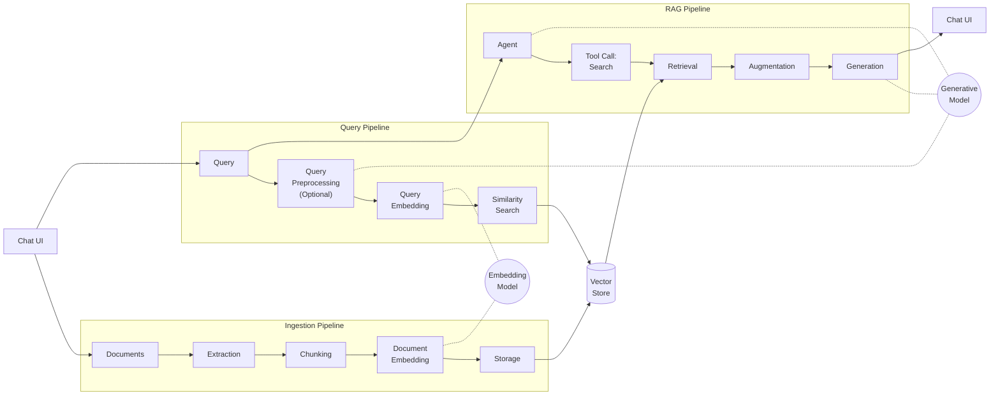

# AI RAG Agent

A chatbot that answers questions from your own documents using Retrieval-Augmented Generation (RAG).

## What's included

- Q&A agent with source citation
- Embedding-based semantic search (OpenAI text-embedding-3-small)
- Document upload supporting PDF, DOCX, CSV, TXT, and Markdown
- JSON-based vector store — no external database required
- Sample content in `/content` directory auto-indexed on first search

## Getting started

1. Set your OpenAI API key:

   ```bash
   export OPENAI_API_KEY=sk-...
   ```

2. Start the dev server:

   ```bash
   npx veryfront dev
   ```

3. Open the app and upload a document or ask a question — the sample docs in `content/` are indexed automatically.

## Architecture

RAG grounds LLM responses in your documents through three pipelines — **Ingestion**, **Query**, and **RAG** — orchestrated around a shared vector store and an agent that decides when to retrieve context.



### Pipelines

**Ingestion** — Documents are parsed into plain text (PDF via `pdf-parse`, DOCX via ZIP/XML, text formats directly), split into overlapping chunks (~1000 chars, 200 char overlap), and stored with their embeddings in `data/index.json`. Embeddings are generated lazily on first search to keep uploads fast.

**Query** — The user's query is embedded into the same vector space as the documents, then compared against all stored chunks using cosine similarity to find the top-*k* most relevant results.

**RAG** — An agent receives the query and decides whether to search (not all queries need documents). It can call the search tool multiple times, refining queries based on initial results. Retrieved chunks are assembled into context, and the generative model produces a cited response streamed back to the user.

## Structure

```
store.ts                        Document store config (embedding model, storage path)
agents/rag.ts                   Q&A agent with citation instructions
tools/search-docs.ts            Semantic search over indexed documents
content/
  getting-started.md            Sample document
  architecture.md               Sample document
app/
  api/chat/route.ts             Chat API endpoint
  api/documents/route.ts        Upload (POST) and list (GET) documents
  api/documents/[id]/route.ts   Delete document
  page.tsx                      Chat UI with document upload panel
  layout.tsx                    Root layout with header
```

## Framework usage

| What | Framework | Template code |
|------|-----------|---------------|
| Chat UI + streaming | `Chat`, `useChat` | `page.tsx` |
| Document management | `useDocuments` hook | `page.tsx` |
| Source display | `showSources` prop on `Chat` | `page.tsx` |
| Document API routes | `createDocumentHandler` | 1-line per route file |
| Chat API route | `createChatHandler` | 1 line in `route.ts` |
| Agent definition | `agent()` | Config object in `agents/rag.ts` |
| Tool definition | `tool()` | Config + execute in `tools/search-docs.ts` |
| Vector store | `documentStore()` | Config in `store.ts` |

## Adding documents

- Drop files into `content/` — they're indexed automatically on first search
- Or use the upload panel in the UI for PDF, DOCX, CSV, TXT, and MD files

## npm packages

This template uses `pdf-parse` for PDF text extraction. Any npm package you install in your project works in API routes — the framework automatically detects your `package.json` dependencies and handles bundling.

## Production notes

This is a starter template — not a production-ready setup. For production, consider:

- **Vector store** — Replace the JSON store with pgvector, Pinecone, or Qdrant for datasets beyond ~10k chunks
- **DOCX parser** — The built-in extractor handles basic documents; use the `mammoth` package for complex formatting
- **Reranking** — Add a cross-encoder reranker (e.g. Cohere Rerank) after retrieval to improve precision
- **Hybrid search** — Combine dense vectors with BM25 keyword matching for better recall
