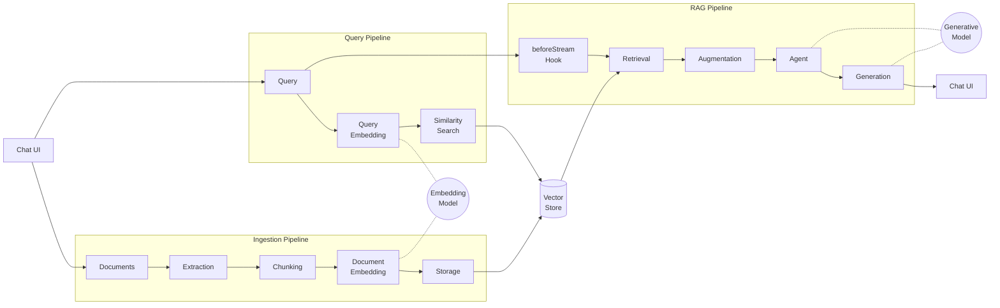

# Docs Agent

A chatbot that answers questions from your own documents using Retrieval-Augmented Generation (RAG).

## What's included

- Q&A agent with source citation
- Embedding-based semantic search with convention-based model selection
- Document upload supporting PDF, DOCX, XLSX, PPTX, CSV, HTML, RTF, EPUB, TXT, and Markdown
- `ragStore()` with local JSON storage by default, and Veryfront Cloud RAG when bootstrap is present
- Veryfront Cloud AI Gateway routing for generation and embeddings when bootstrap is present
- Original uploaded files stored in Veryfront Cloud project uploads when cloud bootstrap is present
- Sample content in `/content` indexed through a dedicated ingestion route

## Getting started

1. Set your Veryfront Cloud bootstrap vars:

   ```bash
   export VERYFRONT_API_TOKEN=vf_...
   export VERYFRONT_PROJECT_SLUG=my-project
   ```

2. Start the dev server:

   ```bash
   npx veryfront dev
   ```

3. Index the sample docs in `content/`:

   ```bash
   curl -X POST http://localhost:3000/api/ingest
   ```

4. Open the app and upload a document or ask a question.

If you are using a self-hosted Veryfront API, also set `VERYFRONT_API_URL`.

## Cloud mode

With `VERYFRONT_API_TOKEN` and `VERYFRONT_PROJECT_SLUG` set, the template uses
Veryfront Cloud automatically:

- Agent generation routes through Veryfront Cloud model routing.
- Query and document embeddings route through Veryfront Cloud embedding routing.
- `veryfront-cloud/openai/...` and `veryfront-cloud/google/...` models use AI Gateway.
- RAG documents, chunks, and embeddings are stored in the target project.

The default cloud embedding model is
`veryfront-cloud/openai/text-embedding-3-small`. Set
`VERYFRONT_DEFAULT_EMBEDDING_MODEL` only when you need a different embedding
model.

## Architecture

RAG grounds LLM responses in your documents through three pipelines: **Ingestion**, **Query**, and **RAG**. These pipelines are orchestrated around a shared vector store.



### Pipelines

**Ingestion**: Documents are parsed into plain text via the built-in kreuzberg extraction engine (supporting PDF, DOCX, XLSX, PPTX, HTML, RTF, EPUB, and 76+ formats), split into overlapping chunks (~1000 chars, 200 char overlap), and stored in the default `ragStore()`. In local mode that means `data/index.json`; with Veryfront Cloud bootstrap it upgrades to the cloud RAG backend automatically. The original uploaded binary is also stored in the project's Veryfront Cloud uploads store so remote projects retain the source file, not just the extracted text. Uploaded files are ingested by the upload route. Bundled files in `content/` are ingested by the `/api/ingest` route.

**Query**: The user's query is embedded into the same vector space as the documents, then compared against all stored chunks using cosine similarity to find the top-*k* most relevant results.

**RAG**: The `beforeStream` hook in the AG-UI route intercepts each message before it reaches the agent. It searches the document store for relevant chunks, assembles them into context, and prepends them as retrieved reference data. The agent then generates a cited response streamed back to the user.

## Structure

```
store.ts                        RAG store config
agents/rag.ts                   Q&A agent with citation instructions
content/
  getting-started.md            Sample document
  architecture.md               Sample document
app/
  api/ag-ui/route.ts             AG-UI endpoint
  api/ingest/route.ts            Bundled content ingestion
  api/uploads/route.ts           Upload (POST) and list (GET) uploads
  api/uploads/[id]/route.ts     Delete upload
  page.tsx                      Chat UI with document upload panel
  layout.tsx                    Root layout with header
```

## Framework usage

| What | Framework | Template code |
|------|-----------|---------------|
| Chat UI + streaming | `Chat`, `useChat` | `page.tsx` |
| Upload management | `useUploads` hook | `page.tsx` |
| Source display | `showSources` prop on `Chat` | `page.tsx` |
| Upload API routes | `createUploadHandler` | 1-line per route file |
| AG-UI route | `createAgUiHandler` | 1 line in `route.ts` |
| Agent definition | `agent()` | Config object in `agents/rag.ts` |
| RAG retrieval | `beforeStream` hook | Context injection in `api/ag-ui/route.ts` |
| Vector store | `ragStore()` | Config in `store.ts` |

## Adding documents

- Drop files into `content/`, then run `curl -X POST http://localhost:3000/api/ingest`
- Or use the upload panel in the UI for PDF, DOCX, XLSX, PPTX, CSV, HTML, RTF, EPUB, TXT, and MD files

## Production notes

This is a starter template, not a production-ready setup. For production, consider:

- **Vector store**: Replace the default store with pgvector, Pinecone, or Qdrant for datasets beyond ~10k chunks
- **Reranking**: Add a cross-encoder reranker (e.g. Cohere Rerank) after retrieval to improve precision
- **Hybrid search**: Combine dense vectors with BM25 keyword matching for better recall
