# Veryfront Modular Monolith Refactoring Plan

## Executive Summary

This document outlines the strategic refactoring of Veryfront from its current structure into a well-organized modular monolith. The goal is to improve maintainability, testability, and developer experience while preserving the framework's powerful features.

## Current State Analysis

### Pain Points

1. **Inconsistent schema patterns** - Mix of Zod schemas, TypeScript interfaces, and manual validation across the codebase
2. **Limited runtime validation** - Many modules rely solely on TypeScript types without runtime checks
3. **Mixed responsibilities** - Some modules handle multiple concerns (e.g., config loading + validation + caching)
4. **Implicit dependencies** - Module boundaries are not always clear, leading to circular dependencies
5. **Testing challenges** - Integration tests are difficult to write due to tight coupling
6. **Configuration complexity** - Multiple configuration sources with unclear precedence
7. **Error handling inconsistency** - Different error formats and handling strategies across modules

### Strengths to Preserve

1. **Powerful SSR capabilities** - Current rendering pipeline is robust
2. **Flexible routing** - Both App Router and Pages Router support
3. **MDX integration** - Comprehensive MDX processing with plugins
4. **Build system** - Production builds work well
5. **Developer experience** - Hot reload and dev mode are solid

## Target Architecture

### Core Framework Modules

A modular monolith where each module has:
- Clear, single responsibility
- Well-defined public API
- Minimal dependencies on other modules
- Comprehensive test coverage

### Current Module Inventory (As-Is)

This section provides a complete breakdown of all modules in the codebase as they exist today, organized by layer. The target grouping and moves are defined later in "Proposed Organizational Structure."

#### Layer 1: Platform & Runtime (Foundation)

1. **platform/compat/** - Runtime abstraction layer (fs, path, process, stdio)
   - Cross-platform primitives for Deno/Node/Bun
   - File system adapters with virtual FS support
   - Path manipulation and normalization
   - Process utilities (cwd, env, exit)
   - **65 files** | **Has README**

2. **platform/adapters/** - Runtime adapters (Deno, Node, Bun, Workers)
   - Concrete adapter implementations
   - Runtime detection and feature flags
   - **Has README**

3. **utils/** - Shared utilities (logging, hashing, cache, versioning)
   - Logger implementation (ConsoleLogger, structured logging)
   - Hash utilities, LRU cache wrapper
   - Version detection, constant-time comparison
   - **103 files**

#### Layer 2: Core Framework Services

4. **config/** - Configuration loading, validation, caching, and merging
   - Config file discovery and parsing
   - Schema validation (partial - needs completion per plan)
   - Cache management for config
   - Environment variable integration
   - **18 files**

5. **errors/** - Centralized error handling with codes and user-friendly formatting
   - Error catalog (build, config, runtime, server, etc.)
   - Error codes and categorization
   - User-friendly error formatting
   - Context tracking and stack traces
   - **50+ files** | **Has README**

6. **observability/** - OpenTelemetry tracing, metrics, and logging
   - OTLP exporter configuration
   - Trace spans and context propagation
   - Metrics collection (Prometheus format)
   - **59 files** | **Has README**

7. **security/** - Input validation, sanitization, CSP, CORS, rate limiting
   - Input validation with Zod schemas
   - Path validation and traversal prevention
   - CORS middleware and preflight handling
   - Rate limiting with memory store
   - Sandbox/permission system
   - **80+ files** | **Has README**

8. **cache/** - Caching layer (memory, Redis, distributed)
   - LRU cache implementation
   - Redis integration for distributed caching
   - Cache key generation and invalidation
   - **12 files**

#### Layer 3: Content & Transformation

9. **transforms/** - Code transformation pipeline (MDX, JSX/TSX, ESM)
   - MDX compilation with remark/rehype plugins
   - TypeScript/JSX → ESM transformation
   - HTTP module bundling and caching
   - Import rewriting and resolution
   - Pipeline stages (syntax, imports, bundling, SSR modules)
   - **137 files** | **Has README**

10. **modules/** - Dynamic module loading, React component resolution, import maps
    - React component loader (SSR module loader)
    - Import map loading, merging, and resolution
    - Component registry for tracking loaded components
    - Module server for development
    - **65 files** | **Has README**

11. **react/** - React integration, framework components, SSR adapters
    - React version compatibility (17/18/19)
    - Framework-provided components (Chat, primitives)
    - Head collector for meta tags
    - Context providers
    - **70+ files** | **Has README**

12. **html/** - HTML document generation, meta tags, hydration scripts
    - HTML shell generation
    - Meta tag injection (OG, Twitter, SEO)
    - Script and style tag generation
    - HTML escaping and sanitization
    - **57 files** | **Has README**

#### Layer 4: Routing & Request Handling

13. **routing/** - Route discovery, matching, parameter extraction (App + Pages Router)
    - File-based route discovery
    - Dynamic route matching (`[id]`, `[...slug]`)
    - API route handling
    - Client-side navigation
    - **79 files** | **Has README**

14. **middleware/** - Composable middleware pipeline (Hono-inspired)
    - Middleware execution engine
    - Built-in middleware (CORS, logger, security headers, rate limiting)
    - Request/response context with helpers
    - **37 files** | **Has README**

15. **data/** - Data fetching (getServerData, getStaticProps, getStaticPaths)
    - Server-side data fetching (SSR)
    - Static data fetching (SSG)
    - Static path generation
    - Caching and ISR support
    - **16 files** | **Has README**

#### Layer 5: Rendering & Server

16. **rendering/** - SSR orchestration, layout application, component handling
    - SSR orchestrator
    - Layout discovery and nesting
    - Component registry and caching
    - Virtual module system
    - **166 files** | **Has README**

17. **server/** - HTTP server implementations (dev + production)
    - Development server with HMR and file watching
    - Production server (universal + static)
    - Request handlers (SSR, API, static files)
    - WebSocket support
    - **197 files** | **Has README**

18. **build/** - Production build system (SSG, bundling, manifests)
    - Static site generation
    - Asset bundling and optimization
    - Client runtime generation
    - Build manifest creation
    - Code splitting
    - **119 files** | **Has README**

#### Layer 6: AI & Agent Features

19. **agent/** - AI agent integration (tools, streaming, execution)
    - Agent tools (filesystem, git, catalog, etc.)
    - Streaming responses
    - Tool execution and validation
    - Agent configuration
    - **51 files**

20. **ai/** - AI utilities (separate from agent/)
    - AI helper utilities
    - **2 files** | *Potential merge with agent/*

21. **workflow/** - Workflow engine for multi-step agent tasks
    - Workflow definition and execution
    - Step orchestration
    - State management
    - **74 files**

22. **prompt/** - Prompt template management
    - Template storage and rendering
    - **4 files** | *Potential merge with agent/*

23. **embeddings/** - Vector embeddings for semantic search
    - Embedding generation and storage
    - **6 files**

#### Layer 7: CLI & Developer Tools

24. **cli/** - Command-line interface (dev, build, deploy, MCP server)
    - Dev/build/deploy commands
    - TUI dashboard for multi-project dev
    - MCP server for coding agents
    - Authentication and OAuth
    - Project templates and scaffolding
    - **860+ files** | **Has README**

25. **mcp/** - Model Context Protocol integration
    - MCP server implementation
    - **4 files** | *Overlaps with cli/mcp*

26. **studio/** - Studio/dashboard utilities
    - **6 files**

#### Layer 8: Supporting Modules

27. **client/** - Client-side runtime and hydration
    - Client runtime initialization
    - Hydration logic
    - **6 files**

28. **oauth/** - OAuth authentication flows
    - OAuth provider integrations
    - Token management
    - **13 files** | *Overlaps with cli/auth*

29. **proxy/** - Proxy functionality for remote content sources
    - Proxy server implementation
    - **19 files**

30. **repositories/** - Repository pattern implementations
    - Data access abstractions
    - **9 files**

31. **resource/** - Resource management and registry
    - Resource factory and registry
    - **4 files**

32. **tool/** - Tool definitions (may overlap with agent/tools)
    - **10 files**

33. **provider/** - Provider system (context/dependency injection)
    - **10 files**

34. **issues/** - Issue tracking utilities
    - **7 files**

35. **exports/** - Export utilities for framework APIs
    - **7 files**

36. **testing/** - Testing utilities and assertions
    - Custom assertions
    - Test helpers
    - **11 files**

37. **types/** - Shared type definitions
    - Cross-module types
    - Entity definitions
    - **11 files**

### Module Analysis Summary

**Total Modules Identified**: 37 modules across 8 architectural layers (current layout)

**Module Distribution by Layer**:
- **Layer 1 (Foundation)**: 3 modules - platform/compat, platform/adapters, utils
- **Layer 2 (Core Services)**: 5 modules - config, errors, observability, security, cache
- **Layer 3 (Content & Transformation)**: 4 modules - transforms, modules, react, html
- **Layer 4 (Routing & Request)**: 3 modules - routing, middleware, data
- **Layer 5 (Rendering & Server)**: 3 modules - rendering, server, build
- **Layer 6 (AI & Agent)**: 5 modules - agent, ai, workflow, prompt, embeddings
- **Layer 7 (CLI & Developer Tools)**: 3 modules - cli, mcp, studio
- **Layer 8 (Supporting Modules)**: 11 modules - client, oauth, proxy, repositories, resource, tool, provider, issues, exports, testing, types

**Proposed Consolidations** (reduce 37 → ~28 modules):
- **ai/** (2 files) → Merge into `ai/agent/`
- **prompt/** (4 files) → Merge into `ai/prompts/`
- **oauth/** (13 files) → Merge into `cli/auth/oauth/`
- **mcp/** (4 files) → Consolidate with `cli/mcp/`
- **tool/** (10 files) → Merge into `ai/agent/tools/`
- **repositories/**, **resource/**, **provider/**, **issues/**, **studio/** → Review for removal or consolidation

**New Modules to Create**:
- `core/schemas/` - Centralized schema definitions (extract from existing modules)

### Detailed Module Breakdown

#### 1. modules/ - Dynamic Module Loading & Resolution

**Location**: `src/modules/` (65 files)

**Purpose**: Dynamic module loading, resolution, and React component discovery. This is a **CRITICAL** module that handles:

1. **React Component Loading** (`react-loader/`)
   - SSR module loader with caching
   - Component extraction and path resolution
   - Temporary directory management
   - Unified loader interface

2. **Import Map Management** (`import-map/`)
   - Loading import maps from `deno.json` or `import_map.json`
   - Merging multiple import maps (framework + project)
   - Resolving import specifiers (bare specifiers, path aliases)
   - Transforming module paths for different environments

3. **Component Registry** (`component-registry/`)
   - Tracking loaded React components
   - Component registration and retrieval
   - Cache invalidation for HMR

4. **Module Server** (`server/`)
   - Development-time module serving
   - Batch module handling
   - WebSocket support for HMR
   - Rate limiting

5. **Module Resolution** (`module-resolver.ts`)
   - Resolving relative and absolute imports
   - npm package resolution via CDN (esm.sh)
   - File extension handling (.ts, .tsx, .js, .jsx)

**Why It's Critical**:
- Used by `rendering/` for SSR component loading
- Used by `build/` for production bundling
- Used by `transforms/` for import rewriting
- Central to the framework's dynamic module system

**Proposed Organization**: Layer 3 (Content & Transformation) - keep as `content/modules/`

---

#### 2. cli/ - Command-Line Interface

**Location**: `src/cli/` (860+ files)

**Purpose**: Developer-facing command-line interface with:

1. **Core Commands** (`commands/`)
   - `dev` - Development server
   - `build` - Production build
   - `deploy` - Deployment to Veryfront cloud
   - `init` - Project initialization
   - `generate` - Scaffolding (pages, APIs, components)
   - `doctor` - Diagnostics

2. **TUI Dashboard** (`app/`)
   - Multi-project development dashboard
   - Interactive UI with keyboard navigation
   - Project state management
   - Startup screen and views

3. **Authentication** (`auth/`)
   - OAuth login flow
   - Token storage
   - Callback server

4. **MCP Server** (`mcp/`)
   - Model Context Protocol server for coding agents
   - Tools for agents (filesystem, git, catalog, etc.)
   - Standalone and integrated modes

5. **Templates** (`templates/`)
   - Project templates (minimal, blog, docs, AI)
   - Integration templates (50+ SaaS integrations)
   - Feature templates

6. **UI Components** (`ui/`)
   - ANSI colors and box drawing
   - Progress bars and animated text
   - Keyboard handling

**Why It's Critical**:
- Primary developer interface to the framework
- Orchestrates all other modules (server, build, agent)
- Massive codebase (860+ files)

**Proposed Organization**: Layer 7 (CLI & Developer Tools) - restructure with `cli/tui/`, merge `oauth/` into `cli/auth/oauth/`

---

#### 3. middleware/ - HTTP Middleware Pipeline

**Location**: `src/middleware/` (37 files)

**Purpose**: Hono-inspired composable middleware for HTTP request/response handling:

1. **Core Pipeline** (`core/pipeline/`)
   - Middleware execution engine
   - Context management
   - Next() handler chaining

2. **Built-in Middleware** (`builtin/`)
   - CORS handling
   - Request logging
   - Security headers (CSP, HSTS, etc.)
   - Rate limiting
   - Response compression
   - Error handling

**Integration Points**:
- Used by `server/` for request processing
- Works with `security/` for CORS and headers
- Integrates with `observability/` for logging

**Proposed Organization**: Layer 4 (Routing & Request Handling) - move to `routing/middleware/`

---

#### 4. data/ - Data Fetching (Next.js-like)

**Location**: `src/data/` (16 files)

**Purpose**: Server-side and static data fetching API (Next.js-compatible):

1. **API Functions**
   - `getServerData()` - SSR data fetching (like `getServerSideProps`)
   - `getStaticProps()` - Static data fetching
   - `getStaticPaths()` - Static path generation
   - `notFound()` and `redirect()` helpers

2. **Features**
   - Data fetching cache
   - ISR (Incremental Static Regeneration)
   - Fallback modes
   - Type inference

**Integration Points**:
- Used by `rendering/` for SSR data
- Used by `build/` for static generation
- Provides data context to page components

**Proposed Organization**: Layer 4 (Routing & Request Handling) - move to `routing/data/`

---

#### 5. react/ - React Integration Layer

**Location**: `src/react/` (70+ files)

**Purpose**: React version compatibility and framework components:

1. **Compatibility Layer** (`compat/`)
   - React 17/18/19 support
   - Feature detection
   - Polyfills

2. **Framework Components** (`components/`)
   - AI components (Chat, primitives)
   - Built-in UI components

3. **Context Providers** (`context/`)
   - Framework context
   - Provider setup

4. **Utilities**
   - Head collector for meta tags
   - Font utilities

**Integration Points**:
- Used by `rendering/` for SSR
- Used by `modules/` for component loading
- Provides framework-level React APIs

**Proposed Organization**: Layer 3 (Content & Transformation) - move to `content/react/`

---

#### 6. html/ - HTML Generation

**Location**: `src/html/` (57 files)

**Purpose**: HTML document generation and manipulation:

1. **HTML Shell Generation**
   - Document structure
   - DOCTYPE and HTML tag
   - Head section management

2. **Meta Tag Injection**
   - Open Graph tags
   - Twitter cards
   - SEO metadata

3. **Script/Style Generation**
   - Hydration scripts
   - CSS link tags
   - Inline scripts/styles

4. **Security**
   - HTML escaping
   - XSS prevention

**Integration Points**:
- Used by `rendering/` for SSR HTML output
- Used by `build/` for static HTML generation

**Proposed Organization**: Layer 3 (Content & Transformation) - move to `content/html/`

---

#### 7. workflow/ - Workflow Engine

**Location**: `src/workflow/` (74 files)

**Purpose**: Multi-step agent task orchestration:

1. **Workflow Definition**
   - Step definitions
   - Workflow configuration

2. **Execution Engine**
   - Step orchestration
   - State management
   - Error handling

3. **Integration with Agent**
   - Tool execution
   - Context passing

**Proposed Organization**: Layer 6 (AI & Agent Features) - keep as `ai/workflow/`

---

#### 8. cache/ - Caching Layer

**Location**: `src/cache/` (12 files)

**Purpose**: Caching infrastructure:

1. **Memory Cache**
   - LRU implementation
   - TTL support

2. **Redis Integration**
   - Distributed caching
   - Cache invalidation

**Integration Points**:
- Used by `config/` for config caching
- Used by `modules/` for component caching
- Used by `data/` for data caching

**Proposed Organization**: Layer 2 (Core Framework Services) - keep as `core/cache/`

---

#### 9. client/ - Client Runtime

**Location**: `src/client/` (6 files)

**Purpose**: Client-side runtime and hydration:

1. **Client Initialization**
   - Runtime setup
   - Hydration logic

2. **Client APIs**
   - Client-side navigation
   - State management

**Integration Points**:
- Used by `build/` to generate client bundles
- Works with `react/` for hydration

**Proposed Organization**: Layer 8 (Supporting Modules) - move to `runtime/client/`

---

#### 10. proxy/ - Proxy Server

**Location**: `src/proxy/` (19 files)

**Purpose**: Proxy functionality for remote content sources:

**Proposed Organization**: Layer 8 (Supporting Modules) - review if still needed, otherwise keep or remove

---

#### 11. testing/ - Test Utilities

**Location**: `src/testing/` (11 files)

**Purpose**: Testing utilities and custom assertions:

**Proposed Organization**: Layer 8 (Supporting Modules) - move to `runtime/testing/`

---

## Proposed Organizational Structure

This section outlines the recommended target structure for organizing the 37 modules identified in the codebase. The goal is to create clear boundaries, reduce duplication, and establish a maintainable architecture.

### Proposed Module Structure

```
src/
├── platform/               # Layer 1: Platform Abstraction (NO CHANGES)
│   ├── compat/            # Runtime primitives (fs, path, process, stdio)
│   └── adapters/          # Runtime adapters (Deno, Node, Bun, Workers)
│
├── core/                   # Layer 2: Core Framework Services (NEW STRUCTURE)
│   ├── config/            # Configuration management (KEEP)
│   ├── errors/            # Error handling & catalog (KEEP)
│   ├── cache/             # Caching infrastructure (KEEP)
│   ├── observability/     # OpenTelemetry integration (KEEP)
│   ├── security/          # Security primitives (KEEP)
│   ├── schemas/           # Centralized schema definitions (NEW)
│   └── utils/             # Core utilities (REFACTOR - see below)
│
├── content/               # Layer 3: Content & Transformation (NEW GROUPING)
│   ├── transforms/        # Code transformation pipeline (KEEP)
│   ├── modules/           # Dynamic module loading (KEEP)
│   ├── react/             # React integration layer (KEEP)
│   └── html/              # HTML generation (KEEP)
│
├── routing/               # Layer 4: Routing & Request Handling (RESTRUCTURE)
│   ├── router/            # Route discovery & matching (CURRENT: routing/)
│   ├── middleware/        # HTTP middleware pipeline (KEEP)
│   └── data/              # Data fetching (SSR/SSG/ISR) (KEEP)
│
├── rendering/             # Layer 5: Rendering (KEEP)
├── server/                # HTTP servers (dev + prod) (KEEP)
├── build/                 # Production build system (KEEP)
│
├── ai/                    # Layer 6: AI & Agent Features (CONSOLIDATE)
│   ├── agent/             # Agent integration & tools (KEEP)
│   ├── workflow/          # Multi-step orchestration (KEEP)
│   ├── embeddings/        # Vector embeddings (KEEP)
│   └── prompts/           # Prompt templates (MERGE: prompt/ → prompts/)
│
├── cli/                   # Layer 7: CLI & Developer Tools (RESTRUCTURE)
│   ├── commands/          # CLI commands (dev, build, deploy, etc.)
│   ├── tui/               # Terminal UI dashboard (CURRENT: app/)
│   ├── mcp/               # Model Context Protocol server (KEEP)
│   ├── auth/              # Authentication & OAuth (MERGE: oauth/)
│   ├── templates/         # Project templates
│   └── ui/                # UI components (colors, progress, etc.)
│
└── runtime/               # Layer 8: Runtime Support (NEW GROUPING)
    ├── client/            # Client-side runtime (KEEP)
    ├── testing/           # Test utilities (KEEP)
    ├── types/             # Shared type definitions (KEEP)
    ├── exports/           # Public API exports (KEEP)
    └── proxy/             # Proxy server (REVIEW)
```

### Key Organizational Changes

#### 1. **Consolidate AI Modules** 🔄

**Current State**: Fragmented across `agent/`, `workflow/`, `ai/`, `embeddings/`, `prompt/`

**Proposed Structure**:
```
ai/
├── agent/
│   ├── tools/              # Agent tools (filesystem, git, etc.)
│   ├── streaming/          # Streaming responses
│   └── execution/          # Tool execution & validation
├── workflow/
│   ├── engine/             # Workflow orchestration
│   ├── steps/              # Step definitions
│   └── state/              # State management
├── embeddings/
│   ├── generator/          # Embedding generation
│   └── store/              # Embedding storage
└── prompts/                # Prompt template management (merge prompt/)
    ├── templates/
    └── renderer/
```

**Actions**:
- ✅ **Keep** `agent/`, `workflow/`, `embeddings/` as-is
- 🔄 **Merge** `prompt/` → `ai/prompts/`
- 🗑️ **Remove** `ai/` (2 files) - merge utilities into `agent/`

**Benefits**:
- Single namespace for all AI features
- Clear separation of concerns
- Easier to find AI-related code

---

#### 2. **Restructure CLI Module** 🔄

**Current State**: Massive 860+ file module with mixed concerns

**Proposed Structure**:
```
cli/
├── core/                   # Core CLI framework
│   ├── command.ts         # Command base class
│   ├── context.ts         # CLI context
│   └── runner.ts          # Command runner
├── commands/              # Command implementations
│   ├── dev/              # Development server
│   ├── build/            # Production build
│   ├── deploy/           # Deployment
│   ├── init/             # Project initialization
│   ├── generate/         # Scaffolding
│   └── doctor/           # Diagnostics
├── tui/                   # Terminal UI (current: app/)
│   ├── dashboard/        # Multi-project dashboard
│   ├── views/            # View components
│   └── keyboard/         # Keyboard handling
├── mcp/                   # MCP server
│   ├── server/           # MCP server implementation
│   └── tools/            # MCP tools
├── auth/                  # Authentication (merge oauth/)
│   ├── oauth/            # OAuth flows
│   ├── token/            # Token management
│   └── callback/         # Callback server
├── templates/             # Project templates
│   ├── projects/         # Project templates
│   ├── integrations/     # Integration templates
│   └── features/         # Feature templates
└── ui/                    # UI primitives
    ├── colors/           # ANSI colors
    ├── components/       # Box drawing, progress bars
    └── text/             # Text formatting
```

**Actions**:
- 🔄 **Rename** `cli/app/` → `cli/tui/`
- 🔄 **Merge** `oauth/` → `cli/auth/oauth/`
- ✅ **Keep** `cli/mcp/` (already well-structured)
- 📦 **Extract** CLI framework core into `cli/core/`

**Benefits**:
- Clearer separation between CLI framework and commands
- OAuth merged with auth concerns
- TUI renamed for clarity

---

#### 3. **Unify Routing Concerns** 🔄

**Current State**: `routing/`, `middleware/`, `data/` are separate

**Proposed Structure**:
```
routing/
├── router/                # Route discovery & matching
│   ├── discovery/        # File-based route discovery
│   ├── matching/         # Dynamic route matching
│   ├── params/           # Parameter extraction
│   └── api/              # API route handling
├── middleware/            # Middleware pipeline
│   ├── core/             # Pipeline engine
│   ├── builtin/          # Built-in middleware (CORS, logging, etc.)
│   └── types.ts          # Middleware types
└── data/                  # Data fetching
    ├── server/           # getServerData (SSR)
    ├── static/           # getStaticProps, getStaticPaths (SSG)
    └── cache/            # Data caching & ISR
```

**Actions**:
- 🔄 **Rename** `routing/` → `routing/router/`
- 🔄 **Move** `middleware/` → `routing/middleware/`
- 🔄 **Move** `data/` → `routing/data/`

**Benefits**:
- All request handling in one namespace
- Clearer relationship between routing, middleware, and data
- Easier to understand the request lifecycle

---

#### 4. **Create Content Namespace** 🔄

**Current State**: `transforms/`, `modules/`, `react/`, `html/` at top-level

**Proposed Structure**:
```
content/
├── transforms/            # Code transformation pipeline
│   ├── mdx/              # MDX compilation
│   ├── jsx/              # JSX/TSX transformation
│   ├── esm/              # ESM bundling
│   └── pipeline/         # Pipeline stages
├── modules/               # Module loading & resolution
│   ├── loader/           # React component loader
│   ├── import-map/       # Import map management
│   ├── registry/         # Component registry
│   └── server/           # Module server
├── react/                 # React integration
│   ├── compat/           # React 17/18/19 support
│   ├── components/       # Framework components
│   └── context/          # Context providers
└── html/                  # HTML generation
    ├── shell/            # Document shell
    ├── meta/             # Meta tags (OG, Twitter, SEO)
    ├── scripts/          # Script/style injection
    └── escape/           # HTML escaping
```

**Actions**:
- 🔄 **Group** `transforms/`, `modules/`, `react/`, `html/` → `content/`
- ✅ **Keep** internal structure unchanged

**Benefits**:
- Logical grouping of content processing
- Clear namespace for "content → HTML" pipeline
- Easier to understand the transformation flow

---

#### 5. **Refactor Utils Module** 🔄

**Current State**: 103 files with mixed utilities

**Proposed Actions**:
- 📦 **Extract** `utils/logger/` → `core/observability/logger/`
- 📦 **Extract** `utils/cache/` → `core/cache/lru/`
- 📦 **Extract** `utils/versioning/` → `platform/compat/version/`
- ✅ **Keep** general utilities (hashing, strings, etc.) in `core/utils/`

**Benefits**:
- Utilities colocated with their domain
- Smaller, more focused utils module
- Clearer dependencies

---

#### 6. **Runtime Support Namespace** 🆕

**Current State**: `client/`, `testing/`, `types/`, `exports/` scattered

**Proposed Structure**:
```
runtime/
├── client/                # Client-side runtime
│   ├── hydration/        # Hydration logic
│   └── navigation/       # Client-side navigation
├── testing/               # Test utilities
│   ├── assertions/       # Custom assertions
│   └── helpers/          # Test helpers
├── types/                 # Shared type definitions
│   ├── entities/         # Entity types
│   └── contracts/        # API contracts
└── exports/               # Public API exports
    └── index.ts          # Framework public API
```

**Actions**:
- 🔄 **Group** `client/`, `testing/`, `types/`, `exports/` → `runtime/`
- ✅ **Keep** internal structure unchanged

**Benefits**:
- Clear separation of runtime concerns
- Easier to manage public API surface
- Centralized testing utilities

---

#### 7. **Modules to Remove or Merge** 🗑️

| Module | Action | Reason | Merge Target |
|--------|--------|--------|-------------|
| `ai/` (2 files) | 🗑️ Remove | Duplicate of agent utilities | `ai/agent/` |
| `prompt/` (4 files) | 🔄 Merge | Too small, overlaps with agent | `ai/prompts/` |
| `mcp/` (4 files) | 🔄 Merge | Overlaps with cli/mcp | `cli/mcp/` |
| `oauth/` (13 files) | 🔄 Merge | Auth concern, used by CLI | `cli/auth/oauth/` |
| `proxy/` (19 files) | ⚠️ Review | Unclear if still needed | TBD - analyze usage |
| `repositories/` (9 files) | ⚠️ Review | Data access pattern | Consider moving to `core/` or removing |
| `resource/` (4 files) | ⚠️ Review | Resource management | Consider moving to `core/` or removing |
| `provider/` (10 files) | ⚠️ Review | Dependency injection | Consider moving to `core/` or removing |
| `tool/` (10 files) | 🔄 Merge | Overlaps with agent/tools | `ai/agent/tools/` |
| `issues/` (7 files) | ⚠️ Review | Issue tracking | Consider moving to `cli/` or removing |
| `studio/` (6 files) | ⚠️ Review | Dashboard utilities | Consider moving to `cli/tui/` or removing |

---

### Import Path Strategy

#### Current State
```typescript
import { foo } from "#veryfront/utils/logger";
import { bar } from "#veryfront/agent/tools";
```

#### Proposed Target
```typescript
// Layer-based imports
import { foo } from "#veryfront/core/observability/logger";
import { bar } from "#veryfront/ai/agent/tools";

// Namespace re-exports for convenience
import { logger } from "#veryfront/core";
import { AgentTool } from "#veryfront/ai";
```

**Benefits**:
- Clear module hierarchy in imports
- Namespace re-exports for common utilities
- Easier to see dependencies

---

### Success Criteria

After reorganization, each module should have:

1. ✅ **Single Responsibility** - One clear purpose
2. ✅ **Clear Boundaries** - Well-defined public API
3. ✅ **Minimal Dependencies** - Only necessary imports
4. ✅ **Complete Documentation** - README.md with examples
5. ✅ **Test Coverage** - >80% coverage
6. ✅ **Type Safety** - Full TypeScript types
7. ✅ **No Circular Dependencies** - Clean dependency graph

### Dependency Graph Visualization (Target State)

This graph reflects the proposed target structure after consolidation and namespace moves.

```mermaid
graph TD
  %% Layer 1: Foundation
  platform[platform/*] --> core_utils[core/utils]
  platform --> core_errors[core/errors]

  %% Layer 2: Core Services
  core_utils --> core_errors
  core_utils --> core_config[core/config]
  core_utils --> core_cache[core/cache]
  core_utils --> core_observability[core/observability]
  core_errors --> core_config
  core_config --> core_security[core/security]

  %% Layer 3: Content & Transformation
  platform --> content_transforms[content/transforms]
  core_utils --> content_transforms
  core_config --> content_transforms
  core_errors --> content_transforms

  platform --> content_modules[content/modules]
  core_utils --> content_modules
  core_config --> content_modules
  content_transforms --> content_modules

  platform --> content_react[content/react]
  core_utils --> content_react
  content_modules --> content_react

  core_utils --> content_html[content/html]
  content_react --> content_html

  %% Layer 4: Routing & Request
  platform --> routing_router[routing/router]
  core_utils --> routing_router
  core_config --> routing_router
  core_errors --> routing_router
  
  core_utils --> routing_middleware[routing/middleware]
  core_errors --> routing_middleware
  core_security --> routing_middleware

  platform --> routing_data[routing/data]
  core_utils --> routing_data
  core_config --> routing_data
  core_errors --> routing_data

  %% Layer 5: Rendering & Server
  platform --> rendering
  core_utils --> rendering
  core_config --> rendering
  routing_router --> rendering
  content_transforms --> rendering
  content_modules --> rendering
  content_react --> rendering
  content_html --> rendering
  routing_data --> rendering
  core_errors --> rendering

  platform --> server
  core_utils --> server
  core_config --> server
  routing_router --> server
  rendering --> server
  content_transforms --> server
  content_modules --> server
  routing_middleware --> server
  core_security --> server
  core_errors --> server
  core_observability --> server

  platform --> build
  core_utils --> build
  core_config --> build
  routing_router --> build
  rendering --> build
  content_transforms --> build
  content_modules --> build
  server --> build
  core_errors --> build

  %% Layer 6: AI & Agent
  platform --> ai_agent[ai/agent]
  core_utils --> ai_agent
  core_config --> ai_agent
  core_errors --> ai_agent
  
  core_utils --> ai_workflow[ai/workflow]
  ai_agent --> ai_workflow
  
  core_utils --> ai_embeddings[ai/embeddings]
  
  core_utils --> ai_prompts[ai/prompts]
  ai_agent --> ai_prompts

  %% Layer 7: CLI
  platform --> cli
  core_utils --> cli
  core_config --> cli
  core_errors --> cli
  server --> cli
  build --> cli
  ai_agent --> cli
  core_security --> cli

  %% Layer 8: Runtime Support
  platform --> runtime_client[runtime/client]
  core_utils --> runtime_client
  content_modules --> runtime_client
  content_react --> runtime_client

  core_utils --> runtime_testing[runtime/testing]
  core_utils --> runtime_types[runtime/types]
  core_utils --> runtime_exports[runtime/exports]

  core_utils --> runtime_proxy[runtime/proxy]
  server --> runtime_proxy

  %% Styling
  classDef foundation fill:#e1f5ff,stroke:#01579b,stroke-width:2px
  classDef core fill:#fff4e1,stroke:#e65100,stroke-width:2px
  classDef content fill:#e8f5e9,stroke:#2e7d32,stroke-width:2px
  classDef routing fill:#f3e5f5,stroke:#6a1b9a,stroke-width:2px
  classDef server fill:#fce4ec,stroke:#c2185b,stroke-width:2px
  classDef ai fill:#e0f2f1,stroke:#00695c,stroke-width:2px
  classDef cli fill:#fff9c4,stroke:#f57f17,stroke-width:2px
  classDef support fill:#eeeeee,stroke:#424242,stroke-width:2px

  class platform foundation
  class core_utils,core_errors,core_config,core_cache,core_observability,core_security core
  class content_transforms,content_modules,content_react,content_html content
  class routing_router,routing_middleware,routing_data routing
  class rendering,server,build server
  class ai_agent,ai_workflow,ai_embeddings,ai_prompts ai
  class cli cli
  class runtime_client,runtime_testing,runtime_types,runtime_exports,runtime_proxy support
```



**Legend**:
- **Blue (Foundation)**: Platform abstraction
- **Orange (Core)**: Core utilities, config, cache, observability, security
- **Green (Content)**: Transforms, modules, React, HTML
- **Purple (Routing)**: Routing, middleware, data fetching
- **Pink (Server)**: Rendering, server, build
- **Teal (AI)**: Agent, workflow, embeddings, prompts
- **Yellow (CLI)**: Command-line interface
- **Gray (Support)**: Runtime client, testing, types, exports, proxy

## Refactoring Strategy

### Phase 1: Foundation (Weeks 1-2)

#### 1.1 Establish Module Boundaries

**Goal**: Define clear module interfaces and dependencies

**Tasks**:
- Document each module's responsibilities
- Create `index.ts` barrel files for each module
- Define internal vs external APIs
- Map current dependencies between modules

**Success Criteria**:
- Each module has a documented public API
- Dependency graph is visualized and understood
- No circular dependencies

#### 1.2 Standardize Error Handling

**Goal**: Unified error types and handling across all modules

**Tasks**:
- Create centralized error classes in `errors/`
- Define error codes and categories
- Implement consistent error transformation
- Add error context tracking

**Files to Create**:
- `src/errors/base.ts` - Base error classes
- `src/errors/codes.ts` - Error code enumeration
- `src/errors/handlers.ts` - Error handling utilities

**Success Criteria**:
- All modules use standard error classes
- Errors include stack traces and context
- User-facing error messages are consistent

#### 1.3 Centralize Core Schemas

**Goal**: Create a single source of truth for core data structures

**Proposed Structure**:
```
src/core/schemas/
├── index.ts           # Re-exports all schemas
├── primitives/
│   ├── common.ts      # CommonSchemas from security module
│   ├── url.ts         # URL validation schemas
│   └── file-path.ts   # File path schemas
├── config/
│   ├── index.ts       # Main config schema
│   ├── fs.ts          # Filesystem config
│   ├── router.ts      # Router config
│   └── build.ts       # Build config
└── entities/
    ├── page.ts        # Page entity schemas
    ├── route.ts       # Route entity schemas
    └── layout.ts      # Layout entity schemas
```

**Tasks**:
1. Move `CommonSchemas` from `security/input-validation/schemas.ts` to `core/schemas/primitives/common.ts`
2. Complete the main config schema in `config/schema.ts`
3. Use `z.infer<>` consistently instead of duplicate TypeScript types
4. Move entity schemas from `types/entities.ts` to `core/schemas/entities/`

**Success Criteria**:
- Core/shared schemas live in `core/schemas/`
- Module-specific schemas live in each module's `schemas/` directory
- Types are inferred from schemas using `z.infer<>`
- No duplicate schema-backed type definitions

#### 1.4 Validation Rollout Strategy

**Goal**: Introduce runtime validation safely without performance regressions

**Tasks**:
- Add feature flags for request/response validation and agent schema validation
- Default validation to `dev`/`staging` and allow opt-in per route in production
- Define validation performance budgets (e.g., <3ms P95 overhead per request)
- Capture validation errors in tracing spans for observability

**Success Criteria**:
- Validation can be enabled/disabled without code changes
- Performance impact stays within defined budgets
- Validation errors are visible in logs and traces

### Phase 2: Configuration Module (Week 3)

#### 2.1 Extract Configuration Logic

**Goal**: Isolate all configuration-related code

**Tasks**:
- Move config loading to `config/loaders/`
- Extract validation to `config/validators/`
- Separate caching logic to `config/cache/`
- Create config merging utilities

**Files to Refactor**:
- `src/config/index.ts` → Split into multiple files
- `src/config/loader.ts` → Move to `config/loaders/file.ts`

**Success Criteria**:
- Config loading is side-effect free
- All config sources are explicit
- Config can be loaded in any order

#### 2.2 Implement Config Schema

**Goal**: Full runtime validation of configuration

**Tasks**:
- Define Zod schema for entire config object
- Add validation for all config fields
- Provide helpful error messages for invalid config
- Support partial config for testing

**Success Criteria**:
- Invalid config is rejected at startup
- Error messages clearly identify the problem
- Tests can easily provide minimal config

### Phase 3: Routing Module (Week 4)

#### 3.0 Consolidate Routing Namespace

**Goal**: Align routing structure with the proposed `routing/` grouping

**Tasks**:
- Move `routing/` → `routing/router/` (route discovery + matching)
- Move `middleware/` → `routing/middleware/`
- Move `data/` → `routing/data/`
- Add `routing/index.ts` barrel exports
- Update `#veryfront/*` imports to new paths

**Success Criteria**:
- Routing, middleware, and data live under `routing/`
- No broken imports after namespace move
- Routing tests still pass

#### 3.1 Separate Route Discovery

**Goal**: Clean separation between finding routes and handling them

**Tasks**:
- Extract route discovery to `routing/router/discovery/`
- Create clear interfaces for route information
- Separate App Router and Pages Router discovery
- Add caching for discovered routes

**Success Criteria**:
- Route discovery can run independently
- Discovery results are cacheable
- Tests can easily mock route discovery

#### 3.2 Simplify Route Matching

**Goal**: Fast, predictable route matching

**Tasks**:
- Implement dedicated route matching algorithm
- Add support for dynamic segments
- Handle catch-all routes properly
- Optimize for common cases

**Success Criteria**:
- Route matching is O(log n) or better
- All route patterns are supported
- Performance tests pass

#### 3.3 Add Routing Request Validation

**Goal**: Runtime validation of incoming requests

**Proposed Structure**:
```
src/routing/schemas/
├── index.ts
├── request/
│   ├── headers.ts       # Request header schemas
│   ├── query.ts         # Query parameter schemas
│   └── body.ts          # Request body schemas
└── response/
    ├── headers.ts       # Response header schemas
    └── status.ts        # Status code validation
```

**Files to Create**:
- `src/routing/middleware/validate-request.ts` - Request validation middleware

**Tasks**:
1. Create schema directories for requests/responses
2. Build validation middleware
3. Enable runtime validation in `route-executor.ts`
4. Add optional response validation
5. Gate validation with environment flags and per-route opt-in

**Success Criteria**:
- Requests are validated before reaching handlers
- Invalid requests return proper 400 responses
- Response validation is opt-in per route

### Phase 4: Rendering Module (Week 5)

#### 4.0 Consolidate Content Namespace

**Goal**: Align content pipeline with the proposed `content/` grouping

**Tasks**:
- Move `transforms/` → `content/transforms/`
- Move `modules/` → `content/modules/`
- Move `react/` → `content/react/`
- Move `html/` → `content/html/`
- Update `#veryfront/*` imports and barrel exports

**Success Criteria**:
- Content-related modules live under `content/`
- Rendering/build imports updated to new paths
- Content and rendering tests still pass

#### 4.1 Extract Layout System

**Goal**: Clean separation of layout logic

**Tasks**:
- Move layout discovery to `rendering/layouts/`
- Separate layout application logic
- Create layout composition utilities
- Handle layout inheritance properly

**Success Criteria**:
- Layout logic is independent
- Nested layouts work correctly
- Tests can easily mock layouts

#### 4.2 Simplify Component Loading

**Goal**: Single, clear component loading path

**Tasks**:
- Unify SSR and client component loading
- Remove duplicate loading logic
- Add clear caching strategy
- Improve error messages

**Success Criteria**:
- Component loading is predictable
- Cache hits/misses are logged
- Loading errors are descriptive

### Phase 5: AI & CLI Consolidation (Week 6)

#### 5.0 Consolidate AI and CLI Modules

**Goal**: Match AI and CLI structure to the proposed organization

**Tasks**:
- Merge `prompt/` → `ai/prompts/`
- Merge `ai/` utilities → `ai/agent/`
- Move `tool/` → `ai/agent/tools/`
- Merge `mcp/` → `cli/mcp/`
- Merge `oauth/` → `cli/auth/oauth/`
- Rename `cli/app/` → `cli/tui/`
- Create `cli/core/` for shared CLI framework utilities
- Update `#veryfront/*` imports and CLI entrypoints

**Success Criteria**:
- AI modules live under `ai/` with clear boundaries
- CLI structure matches proposed layout
- CLI and agent commands run without path breakage

#### 5.1 Standardize Agent Types

**Goal**: Clear, type-safe agent interfaces

**Tasks**:
- Define agent message types
- Create tool call schemas
- Standardize response formats
- Add validation for agent outputs

**Success Criteria**:
- All agent types are documented
- Runtime validation catches errors
- Tests can easily mock agents

#### 5.2 Extract Agent Workflow

**Goal**: Reusable agent execution logic

**Tasks**:
- Create workflow engine
- Define step interfaces
- Add error recovery
- Implement retry logic

**Success Criteria**:
- Workflows are composable
- Errors are handled gracefully
- Tests can verify workflows

#### 5.3 Agent Schema Validation

**Goal**: Runtime validation of agent messages and tool calls

**Proposed Structure**:
```
src/agent/schemas/
├── index.ts
├── messages/
│   ├── user.ts          # User message schema
│   ├── assistant.ts     # Assistant message schema
│   └── system.ts        # System message schema
├── stream/
│   ├── events.ts        # Stream event schemas
│   └── chunks.ts        # Chunk schemas
├── tools/
│   ├── call.ts          # Tool call schema
│   ├── result.ts        # Tool result schema
│   └── definitions.ts   # Tool definition schemas
└── config/
    ├── model.ts         # Model configuration
    └── parameters.ts    # Generation parameters
```

**Tasks**:
1. Create Zod schemas for core AI types (messages, tool calls, etc.)
2. Add `ToolCallSchema` for runtime validation
3. Replace manual parsing with Zod in `agent/streaming/`
4. Add `AgentConfigSchema` for configuration validation

**Success Criteria**:
- All agent messages are validated
- Tool calls are type-safe
- Invalid agent outputs are caught early
- Streaming events have proper schemas

### Phase 6: Testing Infrastructure (Week 7)

#### 6.0 Consolidate Runtime Namespace

**Goal**: Align runtime support modules with the proposed `runtime/` grouping

**Tasks**:
- Move `client/` → `runtime/client/`
- Move `testing/` → `runtime/testing/`
- Move `types/` → `runtime/types/`
- Move `exports/` → `runtime/exports/`
- Move `proxy/` → `runtime/proxy/` (if retained)
- Update `#veryfront/*` imports and public export barrels

**Success Criteria**:
- Runtime support modules live under `runtime/`
- Test utilities referenced from their final location
- Public exports updated with new paths

#### 6.1 Create Test Utilities

**Goal**: Make testing easy and consistent

**Tasks**:
- Create test fixtures for common scenarios
- Add utilities for mocking modules
- Implement test database helpers
- Add integration test helpers

**Files to Create**:
- `tests/fixtures/` - Test data
- `tests/helpers/` - Test utilities
- `tests/mocks/` - Mock implementations

**Test Discovery Plan**:
- Unit tests: `src/**/**.test.ts`
- Integration tests: `tests/integration/**/**.test.ts`
- E2E tests: `tests/e2e/**/**.test.ts`
- Central helpers: `tests/_helpers/` (no duplication in modules)

**Success Criteria**:
- Tests are easy to write
- Mocking is straightforward
- Test data is realistic

#### 6.2 Add Module Tests

**Goal**: Comprehensive test coverage

**Tasks**:
- Write unit tests for each module
- Add integration tests for module interactions
- Create end-to-end tests for key workflows
- Measure and improve coverage

**Success Criteria**:
- Each module has >80% coverage
- Critical paths have integration tests
- Tests run quickly (<30s)

### Phase 7: Documentation (Week 8)

#### 7.1 API Documentation

**Goal**: Complete API documentation for all modules

**Tasks**:
- Document public APIs for each module
- Add usage examples
- Create architecture diagrams
- Write migration guide

**Success Criteria**:
- Every public function is documented
- Examples cover common use cases
- Architecture is clear

#### 7.2 Developer Guide

**Goal**: Onboarding documentation

**Tasks**:
- Write getting started guide
- Document development workflow
- Create troubleshooting guide
- Add contribution guidelines

**Success Criteria**:
- New developers can contribute quickly
- Common issues are documented
- Best practices are clear

## Schema Organization Strategy

### Current State

The codebase uses a mix of schema and type definition approaches:

1. **Zod + z.infer<>** (Preferred)
   - Examples: `security/input-validation/schemas.ts`, `workflow/schemas.ts`
   - Runtime validation + compile-time types
   - Single source of truth

2. **Zod in types.ts files**
   - Example: `config/types.ts`
   - Schemas defined alongside or instead of interfaces
   - Sometimes duplicates TypeScript definitions

3. **Separate types.ts + schemas.ts**
   - Example: `routing/types.ts` + potential schemas
   - Parallel type and schema definitions
   - Risk of drift between types and schemas

4. **Manual TypeScript only**
   - Example: `types/entities.ts`, `types/http.ts`
   - No runtime validation
   - Compile-time only

5. **Co-located tool schemas**
   - Example: `agent/tools/*/schema.ts`
   - Tool-specific validation
   - Well-organized per tool

### Patterns Identified

**Good Patterns**:
- `security/input-validation/schemas.ts`: Centralized common validations
- `agent/tools/`: Tool schemas co-located with tool implementation
- `workflow/schemas.ts`: Comprehensive workflow validation

**Issues**:
- Config validation incomplete (missing recursive validation)
- Entity types lack runtime validation
- Inconsistent use of Zod vs plain TypeScript

### Proposed Architecture

#### Core Schemas (`core/schemas/`)

Centralized schemas for framework-wide types:

```typescript
// core/schemas/primitives/common.ts
export const SlugSchema = z.string().regex(/^[a-z0-9-]+$/);
export const PathSchema = z.string().min(1);
export const UrlSchema = z.string().url();

// core/schemas/config/index.ts
export const VeryfrontConfigSchema = z.object({
  title: z.string().optional(),
  description: z.string().optional(),
  fs: FsConfigSchema,
  // ... complete all fields
});
export type VeryfrontConfig = z.infer<typeof VeryfrontConfigSchema>;

// core/schemas/entities/page.ts
export const PageEntitySchema = z.object({
  slug: SlugSchema,
  path: PathSchema,
  // ... all page fields
});
export type PageEntity = z.infer<typeof PageEntitySchema>;
```

#### Module-Specific Schemas

Each module that needs validation keeps schemas in a `schemas/` subdirectory:

```
src/routing/
├── schemas/
│   ├── route.ts       # Route-specific validation
│   └── params.ts      # Parameter extraction schemas
└── ...

src/agent/
├── schemas/
│   ├── messages.ts    # Message validation
│   └── tools.ts       # Tool call validation
└── ...
```

#### Schema Guidelines

**When to use Zod**:
1. Data from external sources (user input, config files, API responses)
2. Runtime validation needed (agent outputs, HTTP requests)
3. Complex nested structures that benefit from schema composition
4. When you want to generate TypeScript types from schemas

**When TypeScript types are sufficient**:
1. Internal interfaces between well-typed modules
2. Simple data structures with no validation logic
3. Type-only abstractions (e.g., branded types)
4. When runtime validation would be redundant

**Best Practices**:
1. Use `z.infer<>` to derive types from schemas
2. Keep schemas close to where they're used
3. Export both schema and inferred type
4. Add JSDoc comments to schemas for better IDE support
5. Use schema composition to avoid duplication

## Quick Wins (No Major Refactoring)

These can be done immediately without waiting for phases:

1. **Complete Config Schema**
   - File: `src/config/schema.ts`
   - Add missing fields (router, theme, build, cache, dev, resolve, client)
   - Use `z.infer<>` instead of separate interface

2. **Map Error Codes**
   - File: `src/errors/codes.ts`
   - Document all error codes
   - Add categories (VALIDATION, AUTH, NOT_FOUND, etc.)

3. **Fix Missing Exports**
   - Files: Various `index.ts` files
   - Export public APIs from barrel files
   - Mark internal functions with underscore prefix

4. **Move Unit Tests**
   - Move unit tests next to source files
   - Example: `config/__tests__/loader.test.ts` → `config/loader.test.ts`
   - Use `*.test.ts` convention consistently

## Cross-Cutting Concerns

### Observability Consolidation

**Current Issues**:
- Dual tracing systems (OpenTelemetry + custom)
- Dual metrics systems (Prometheus + custom counters)
- Inconsistent initialization order

**Proposed Solution**:
1. Choose OpenTelemetry as primary system
2. Wrap custom metrics as OTel metrics
3. Create single initialization function
4. Add helper functions for common patterns

**Action Items**:
- [ ] Audit all `logger.*` calls for consistency
- [ ] Consolidate trace span creation
- [ ] Create metrics registry
- [ ] Add observability guide to docs

### Error Handling Unification

**Current Issues**:
- Dual error systems (`errors/` + `VeryfrontError`)
- Dual error code systems
- Context loss across module boundaries
- Missing OTel integration for errors

**Proposed Solution**:
1. Migrate to single `VeryfrontError` base class
2. Unified error code enum
3. Attach error context to trace spans
4. Create error transformation utilities

**Action Items**:
- [ ] Map all error codes to categories
- [ ] Create error conversion functions
- [ ] Add error context to all throws
- [ ] Integrate errors with tracing

### Test Organization Improvements

**Current Issues**:
- Inconsistent unit test location (some in `__tests__/`, some next to source)
- Inconsistent naming (`*.test.ts` vs `*_test.ts`)
- Test directories scattered (`tests/`, `src/testing/`, module `__tests__/`)

**Proposed Solution**:
1. Unit tests: Next to source file (e.g., `config/loader.test.ts`)
2. Integration tests: `tests/integration/`
3. E2E tests: `tests/e2e/`
4. Test helpers: `tests/_helpers/`

**Action Items**:
- [ ] Move all unit tests next to source
- [ ] Standardize on `*.test.ts` naming
- [ ] Consolidate test helpers
- [ ] Update test documentation

## API Stability & Deprecation Strategy

### Public API Surface

Define what constitutes the public API:
1. Exported functions/classes from `index.ts` barrel files
2. CLI commands and flags
3. Configuration options
4. Agent tool interfaces

### Deprecation Process

1. **Mark as deprecated** - Add `@deprecated` JSDoc tag
2. **Add warning** - Log warning when used
3. **Document alternative** - Provide migration path
4. **Wait period** - Minimum 2 minor versions
5. **Remove** - Delete in next major version

### Version Strategy

Follow semantic versioning:
- **Major**: Breaking changes to public API
- **Minor**: New features, internal refactors
- **Patch**: Bug fixes only

## Documentation Improvements


### Proposed Structure

```
docs/
├── README.md              # Overview
├── architecture/
│   ├── overview.md        # System architecture
│   ├── modules.md         # Module descriptions
│   └── decisions/         # ADRs
├── guides/
│   ├── getting-started.md
│   ├── development.md
│   ├── testing.md
│   └── deployment.md
└── api/
    ├── config.md
    ├── routing.md
    └── ...
```

## Performance Benchmarking

### Critical Paths

1. **Cold start** - First request after deployment
2. **Route matching** - Finding handler for URL
3. **Component loading** - Loading and transforming components
4. **SSR rendering** - Rendering to HTML
5. **Build time** - Production build duration

### Metrics to Track

- P50, P95, P99 latencies
- Memory usage
- CPU usage
- Cache hit rates
- Bundle sizes

### Implementation

1. Add performance tests to CI
2. Track metrics over time
3. Alert on regressions
4. Optimize hot paths

## Technical Debt Tracking

### High Priority

1. **Circular dependencies** - Break cycles between modules
2. **Type safety gaps** - Add types to any casts
3. **Error handling gaps** - Ensure all errors are caught
4. **Test coverage gaps** - Cover critical paths
5. **Documentation gaps** - Document all public APIs

### Debt Reduction Strategy

1. **No new debt** - Prevent new issues in PRs
2. **Fix on touch** - Improve code when modifying
3. **Dedicated time** - Allocate time for debt reduction
4. **Track progress** - Measure and report debt metrics

## Dependency Management

### External Dependencies

**Rules**:
1. Minimize dependencies
2. Pin versions in `deno.json`
3. Regular security audits
4. Document why each dep is needed

**Key Dependencies**:
- React 19 - UI framework
- Zod - Runtime validation
- OpenTelemetry - Observability
- MDX - Content transformation

### Internal Dependencies

**Rules**:
1. `platform/compat` is foundational and should not depend on higher-level modules
2. `core` and `utils` are foundational and should not depend on feature modules
3. Feature modules can depend on foundational modules
4. No circular dependencies
5. Document module dependencies

## Implementation Roadmap

### Phase Dependencies

- Phase 1.3 (Centralize Core Schemas) is a prerequisite for 3.3 (Routing Request Validation)
- Phase 1.3 (Centralize Core Schemas) is a prerequisite for 5.3 (Agent Schema Validation)
- Phase 1.2 (Error Handling) should complete before introducing validation errors in 3.3/5.3
- Phase 2 (Config) should complete before Phase 3 (Routing) to avoid config drift
- Phase 3.0 (Routing Namespace Consolidation) precedes 3.1/3.2/3.3
- Phase 4.0 (Content Namespace Consolidation) precedes 4.1/4.2
- Phase 5.0 (AI & CLI Consolidation) precedes 5.1–5.3
- Phase 6.0 (Runtime Consolidation) precedes 6.1/6.2

### Sprint 1 (Phase 1: Foundation)
- Week 1: Module boundaries + documentation
- Week 2: Error handling + Schema centralization + Validation rollout strategy

### Sprint 2 (Phase 2: Config)
- Week 3: Config module refactor

### Sprint 3 (Phase 3: Routing)
- Week 4: Routing namespace consolidation + request validation

### Sprint 4 (Phase 4: Rendering)
- Week 5: Content namespace consolidation + rendering refactor

### Sprint 5 (Phase 5: AI & CLI)
- Week 6: AI/CLI consolidation + agent refactor + agent schema validation

### Sprint 6 (Phase 6: Testing)
- Week 7: Runtime consolidation + test infrastructure

### Sprint 7 (Phase 7: Documentation)
- Week 8: Documentation

## Success Metrics

### Code Quality
- Test coverage > 80%
- No circular dependencies
- All public APIs documented
- `deno lint` and `deno check` passing
- `deno task verify` passing in CI

### Performance
- Cold start < 500ms
- Hot path latency < 50ms P95
- Build time < 2 minutes

## Glossary

- **Modular Monolith**: Single deployable unit with well-defined internal modules
- **Barrel File**: `index.ts` that re-exports public API
- **Runtime Validation**: Checking data types/values at runtime (vs compile time)
- **Schema**: Zod schema that defines structure and validation rules
- **SSR**: Server-Side Rendering
- **MDX**: Markdown + JSX
- **OTel**: OpenTelemetry (observability framework)
- **ADR**: Architecture Decision Record

## Next Steps

1. Review and approve this plan
2. Create GitHub issues for each task
3. Assign initial sprint work
4. Set up tracking metrics
5. Begin Phase 1

---

**Document Version**: 2.0
**Last Updated**: 2026-02-04
**Owner**: Engineering Team
