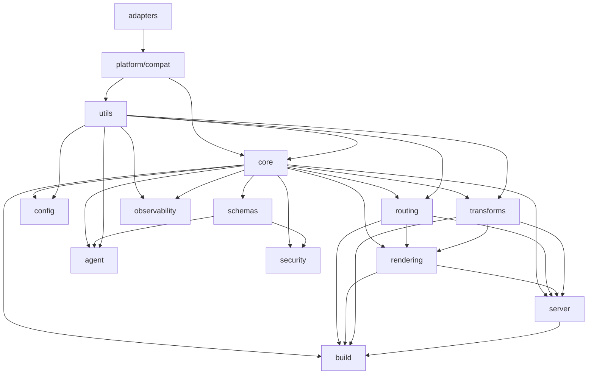

# Veryfront Modular Monolith Refactoring Plan

## Executive Summary

This document outlines the strategic refactoring of Veryfront from its current structure into a well-organized modular monolith. The goal is to improve maintainability, testability, and developer experience while preserving the framework's powerful features.

## Current State Analysis

### Pain Points

1. **Inconsistent schema patterns** - Mix of Zod schemas, TypeScript interfaces, and manual validation across the codebase
2. **Limited runtime validation** - Many modules rely solely on TypeScript types without runtime checks
3. **Mixed responsibilities** - Some modules handle multiple concerns (e.g., config loading + validation + caching)
4. **Implicit dependencies** - Module boundaries are not always clear, leading to circular dependencies
5. **Testing challenges** - Integration tests are difficult to write due to tight coupling
6. **Configuration complexity** - Multiple configuration sources with unclear precedence
7. **Error handling inconsistency** - Different error formats and handling strategies across modules

### Strengths to Preserve

1. **Powerful SSR capabilities** - Current rendering pipeline is robust
2. **Flexible routing** - Both App Router and Pages Router support
3. **MDX integration** - Comprehensive MDX processing with plugins
4. **Build system** - Production builds work well
5. **Developer experience** - Hot reload and dev mode are solid

## Target Architecture

### Core Framework Modules

A modular monolith where each module has:
- Clear, single responsibility
- Well-defined public API
- Minimal dependencies on other modules
- Comprehensive test coverage

### Modules

1. **core/** - Shared primitives, schemas, and foundational types
2. **config/** - Configuration loading, validation, and caching
3. **routing/** - Route discovery, matching, and parameter extraction
4. **rendering/** - SSR orchestration and layout application
5. **transforms/** - Code transformation pipeline (MDX, TypeScript, etc.)
6. **server/** - HTTP server and request handling
7. **build/** - Production build system
8. **agent/** - AI agent integration
9. **security/** - Input validation and sanitization
10. **observability/** - Logging, tracing, and metrics
11. **platform/compat/** - Runtime abstraction (fs, path, process)
12. **adapters/** - Runtime adapters (Deno, Node, Bun)
13. **utils/** - Shared utilities (logging, hashing, cache, etc.)
14. **schemas/** - Centralized schema definitions and validation (public API surface)

### Dependency Graph Visualization



## Refactoring Strategy

### Phase 1: Foundation (Weeks 1-2)

#### 1.1 Establish Module Boundaries

**Goal**: Define clear module interfaces and dependencies

**Tasks**:
- Document each module's responsibilities
- Create `index.ts` barrel files for each module
- Define internal vs external APIs
- Map current dependencies between modules

**Success Criteria**:
- Each module has a documented public API
- Dependency graph is visualized and understood
- No circular dependencies

#### 1.2 Standardize Error Handling

**Goal**: Unified error types and handling across all modules

**Tasks**:
- Create centralized error classes in `errors/`
- Define error codes and categories
- Implement consistent error transformation
- Add error context tracking

**Files to Create**:
- `src/errors/base.ts` - Base error classes
- `src/errors/codes.ts` - Error code enumeration
- `src/errors/handlers.ts` - Error handling utilities

**Success Criteria**:
- All modules use standard error classes
- Errors include stack traces and context
- User-facing error messages are consistent

#### 1.3 Centralize Core Schemas

**Goal**: Create a single source of truth for core data structures

**Proposed Structure**:
```
src/core/schemas/
├── index.ts           # Re-exports all schemas
├── primitives/
│   ├── common.ts      # CommonSchemas from security module
│   ├── url.ts         # URL validation schemas
│   └── file-path.ts   # File path schemas
├── config/
│   ├── index.ts       # Main config schema
│   ├── fs.ts          # Filesystem config
│   ├── router.ts      # Router config
│   └── build.ts       # Build config
└── entities/
    ├── page.ts        # Page entity schemas
    ├── route.ts       # Route entity schemas
    └── layout.ts      # Layout entity schemas
```

**Tasks**:
1. Move `CommonSchemas` from `security/input-validation/schemas.ts` to `core/schemas/primitives/common.ts`
2. Complete the main config schema in `config/schema.ts`
3. Use `z.infer<>` consistently instead of duplicate TypeScript types
4. Move entity schemas from `types/entities.ts` to `core/schemas/entities/`

**Success Criteria**:
- All schemas are in `core/schemas/`
- Types are inferred from schemas using `z.infer<>`
- No duplicate type definitions

#### 1.4 Validation Rollout Strategy

**Goal**: Introduce runtime validation safely without performance regressions

**Tasks**:
- Add feature flags for request/response validation and agent schema validation
- Default validation to `dev`/`staging` and allow opt-in per route in production
- Define validation performance budgets (e.g., <3ms P95 overhead per request)
- Capture validation errors in tracing spans for observability

**Success Criteria**:
- Validation can be enabled/disabled without code changes
- Performance impact stays within defined budgets
- Validation errors are visible in logs and traces

### Phase 2: Configuration Module (Week 3)

#### 2.1 Extract Configuration Logic

**Goal**: Isolate all configuration-related code

**Tasks**:
- Move config loading to `config/loaders/`
- Extract validation to `config/validators/`
- Separate caching logic to `config/cache/`
- Create config merging utilities

**Files to Refactor**:
- `src/config/index.ts` → Split into multiple files
- `src/config/loader.ts` → Move to `config/loaders/file.ts`

**Success Criteria**:
- Config loading is side-effect free
- All config sources are explicit
- Config can be loaded in any order

#### 2.2 Implement Config Schema

**Goal**: Full runtime validation of configuration

**Tasks**:
- Define Zod schema for entire config object
- Add validation for all config fields
- Provide helpful error messages for invalid config
- Support partial config for testing

**Success Criteria**:
- Invalid config is rejected at startup
- Error messages clearly identify the problem
- Tests can easily provide minimal config

### Phase 3: Routing Module (Week 4)

#### 3.1 Separate Route Discovery

**Goal**: Clean separation between finding routes and handling them

**Tasks**:
- Extract route discovery to `routing/discovery/`
- Create clear interfaces for route information
- Separate App Router and Pages Router discovery
- Add caching for discovered routes

**Success Criteria**:
- Route discovery can run independently
- Discovery results are cacheable
- Tests can easily mock route discovery

#### 3.2 Simplify Route Matching

**Goal**: Fast, predictable route matching

**Tasks**:
- Implement dedicated route matching algorithm
- Add support for dynamic segments
- Handle catch-all routes properly
- Optimize for common cases

**Success Criteria**:
- Route matching is O(log n) or better
- All route patterns are supported
- Performance tests pass

#### 3.3 Add Server Request Validation

**Goal**: Runtime validation of incoming requests

**Proposed Structure**:
```
src/server/schemas/
├── index.ts
├── request/
│   ├── headers.ts       # Request header schemas
│   ├── query.ts         # Query parameter schemas
│   └── body.ts          # Request body schemas
└── response/
    ├── headers.ts       # Response header schemas
    └── status.ts        # Status code validation
```

**Files to Create**:
- `src/server/middleware/validate-request.ts` - Request validation middleware

**Tasks**:
1. Create schema directories for requests/responses
2. Build validation middleware
3. Enable runtime validation in `route-executor.ts`
4. Add optional response validation
5. Gate validation with environment flags and per-route opt-in

**Success Criteria**:
- Requests are validated before reaching handlers
- Invalid requests return proper 400 responses
- Response validation is opt-in per route

### Phase 4: Rendering Module (Week 5)

#### 4.1 Extract Layout System

**Goal**: Clean separation of layout logic

**Tasks**:
- Move layout discovery to `rendering/layouts/`
- Separate layout application logic
- Create layout composition utilities
- Handle layout inheritance properly

**Success Criteria**:
- Layout logic is independent
- Nested layouts work correctly
- Tests can easily mock layouts

#### 4.2 Simplify Component Loading

**Goal**: Single, clear component loading path

**Tasks**:
- Unify SSR and client component loading
- Remove duplicate loading logic
- Add clear caching strategy
- Improve error messages

**Success Criteria**:
- Component loading is predictable
- Cache hits/misses are logged
- Loading errors are descriptive

### Phase 5: Agent Module (Week 6)

#### 5.1 Standardize Agent Types

**Goal**: Clear, type-safe agent interfaces

**Tasks**:
- Define agent message types
- Create tool call schemas
- Standardize response formats
- Add validation for agent outputs

**Success Criteria**:
- All agent types are documented
- Runtime validation catches errors
- Tests can easily mock agents

#### 5.2 Extract Agent Workflow

**Goal**: Reusable agent execution logic

**Tasks**:
- Create workflow engine
- Define step interfaces
- Add error recovery
- Implement retry logic

**Success Criteria**:
- Workflows are composable
- Errors are handled gracefully
- Tests can verify workflows

#### 5.3 Agent Schema Validation

**Goal**: Runtime validation of agent messages and tool calls

**Proposed Structure**:
```
src/agent/schemas/
├── index.ts
├── messages/
│   ├── user.ts          # User message schema
│   ├── assistant.ts     # Assistant message schema
│   └── system.ts        # System message schema
├── stream/
│   ├── events.ts        # Stream event schemas
│   └── chunks.ts        # Chunk schemas
├── tools/
│   ├── call.ts          # Tool call schema
│   ├── result.ts        # Tool result schema
│   └── definitions.ts   # Tool definition schemas
└── config/
    ├── model.ts         # Model configuration
    └── parameters.ts    # Generation parameters
```

**Tasks**:
1. Create Zod schemas for core AI types (messages, tool calls, etc.)
2. Add `ToolCallSchema` for runtime validation
3. Replace manual parsing with Zod in `agent/streaming/`
4. Add `AgentConfigSchema` for configuration validation

**Success Criteria**:
- All agent messages are validated
- Tool calls are type-safe
- Invalid agent outputs are caught early
- Streaming events have proper schemas

### Phase 6: Testing Infrastructure (Week 7)

#### 6.1 Create Test Utilities

**Goal**: Make testing easy and consistent

**Tasks**:
- Create test fixtures for common scenarios
- Add utilities for mocking modules
- Implement test database helpers
- Add integration test helpers

**Files to Create**:
- `tests/fixtures/` - Test data
- `tests/helpers/` - Test utilities
- `tests/mocks/` - Mock implementations

**Test Discovery Plan**:
- Unit tests: `src/**/**.test.ts`
- Integration tests: `tests/integration/**/**.test.ts`
- E2E tests: `tests/e2e/**/**.test.ts`
- Central helpers: `tests/_helpers/` (no duplication in modules)

**Success Criteria**:
- Tests are easy to write
- Mocking is straightforward
- Test data is realistic

#### 6.2 Add Module Tests

**Goal**: Comprehensive test coverage

**Tasks**:
- Write unit tests for each module
- Add integration tests for module interactions
- Create end-to-end tests for key workflows
- Measure and improve coverage

**Success Criteria**:
- Each module has >80% coverage
- Critical paths have integration tests
- Tests run quickly (<30s)

### Phase 7: Documentation (Week 8)

#### 7.1 API Documentation

**Goal**: Complete API documentation for all modules

**Tasks**:
- Document public APIs for each module
- Add usage examples
- Create architecture diagrams
- Write migration guide

**Success Criteria**:
- Every public function is documented
- Examples cover common use cases
- Architecture is clear

#### 7.2 Developer Guide

**Goal**: Onboarding documentation

**Tasks**:
- Write getting started guide
- Document development workflow
- Create troubleshooting guide
- Add contribution guidelines

**Success Criteria**:
- New developers can contribute quickly
- Common issues are documented
- Best practices are clear

## Schema Organization Strategy

### Current State

The codebase uses a mix of schema and type definition approaches:

1. **Zod + z.infer<>** (Preferred)
   - Examples: `security/input-validation/schemas.ts`, `workflow/schemas.ts`
   - Runtime validation + compile-time types
   - Single source of truth

2. **Zod in types.ts files**
   - Example: `config/types.ts`
   - Schemas defined alongside or instead of interfaces
   - Sometimes duplicates TypeScript definitions

3. **Separate types.ts + schemas.ts**
   - Example: `routing/types.ts` + potential schemas
   - Parallel type and schema definitions
   - Risk of drift between types and schemas

4. **Manual TypeScript only**
   - Example: `types/entities.ts`, `types/http.ts`
   - No runtime validation
   - Compile-time only

5. **Co-located tool schemas**
   - Example: `agent/tools/*/schema.ts`
   - Tool-specific validation
   - Well-organized per tool

### Patterns Identified

**Good Patterns**:
- `security/input-validation/schemas.ts`: Centralized common validations
- `agent/tools/`: Tool schemas co-located with tool implementation
- `workflow/schemas.ts`: Comprehensive workflow validation

**Issues**:
- Config validation incomplete (missing recursive validation)
- Entity types lack runtime validation
- Inconsistent use of Zod vs plain TypeScript

### Proposed Architecture

#### Core Schemas (`core/schemas/`)

Centralized schemas for framework-wide types:

```typescript
// core/schemas/primitives/common.ts
export const SlugSchema = z.string().regex(/^[a-z0-9-]+$/);
export const PathSchema = z.string().min(1);
export const UrlSchema = z.string().url();

// core/schemas/config/index.ts
export const VeryfrontConfigSchema = z.object({
  title: z.string().optional(),
  description: z.string().optional(),
  fs: FsConfigSchema,
  // ... complete all fields
});
export type VeryfrontConfig = z.infer<typeof VeryfrontConfigSchema>;

// core/schemas/entities/page.ts
export const PageEntitySchema = z.object({
  slug: SlugSchema,
  path: PathSchema,
  // ... all page fields
});
export type PageEntity = z.infer<typeof PageEntitySchema>;
```

#### Module-Specific Schemas

Each module that needs validation keeps schemas in a `schemas/` subdirectory:

```
src/routing/
├── schemas/
│   ├── route.ts       # Route-specific validation
│   └── params.ts      # Parameter extraction schemas
└── ...

src/agent/
├── schemas/
│   ├── messages.ts    # Message validation
│   └── tools.ts       # Tool call validation
└── ...
```

#### Schema Guidelines

**When to use Zod**:
1. Data from external sources (user input, config files, API responses)
2. Runtime validation needed (agent outputs, HTTP requests)
3. Complex nested structures that benefit from schema composition
4. When you want to generate TypeScript types from schemas

**When TypeScript types are sufficient**:
1. Internal interfaces between well-typed modules
2. Simple data structures with no validation logic
3. Type-only abstractions (e.g., branded types)
4. When runtime validation would be redundant

**Best Practices**:
1. Use `z.infer<>` to derive types from schemas
2. Keep schemas close to where they're used
3. Export both schema and inferred type
4. Add JSDoc comments to schemas for better IDE support
5. Use schema composition to avoid duplication

## Quick Wins (No Major Refactoring)

These can be done immediately without waiting for phases:

1. **Complete Config Schema**
   - File: `src/config/schema.ts`
   - Add missing fields (router, theme, build, cache, dev, resolve, client)
   - Use `z.infer<>` instead of separate interface

2. **Map Error Codes**
   - File: `src/errors/codes.ts`
   - Document all error codes
   - Add categories (VALIDATION, AUTH, NOT_FOUND, etc.)

3. **Fix Missing Exports**
   - Files: Various `index.ts` files
   - Export public APIs from barrel files
   - Mark internal functions with underscore prefix

4. **Move Unit Tests**
   - Move unit tests next to source files
   - Example: `config/__tests__/loader.test.ts` → `config/loader.test.ts`
   - Use `*.test.ts` convention consistently

## Cross-Cutting Concerns

### Observability Consolidation

**Current Issues**:
- Dual tracing systems (OpenTelemetry + custom)
- Dual metrics systems (Prometheus + custom counters)
- Inconsistent initialization order

**Proposed Solution**:
1. Choose OpenTelemetry as primary system
2. Wrap custom metrics as OTel metrics
3. Create single initialization function
4. Add helper functions for common patterns

**Action Items**:
- [ ] Audit all `logger.*` calls for consistency
- [ ] Consolidate trace span creation
- [ ] Create metrics registry
- [ ] Add observability guide to docs

### Error Handling Unification

**Current Issues**:
- Dual error systems (`errors/` + `VeryfrontError`)
- Dual error code systems
- Context loss across module boundaries
- Missing OTel integration for errors

**Proposed Solution**:
1. Migrate to single `VeryfrontError` base class
2. Unified error code enum
3. Attach error context to trace spans
4. Create error transformation utilities

**Action Items**:
- [ ] Map all error codes to categories
- [ ] Create error conversion functions
- [ ] Add error context to all throws
- [ ] Integrate errors with tracing

### Test Organization Improvements

**Current Issues**:
- Inconsistent unit test location (some in `__tests__/`, some next to source)
- Inconsistent naming (`*.test.ts` vs `*_test.ts`)
- Test directories scattered (`tests/`, `src/testing/`, module `__tests__/`)

**Proposed Solution**:
1. Unit tests: Next to source file (e.g., `config/loader.test.ts`)
2. Integration tests: `tests/integration/`
3. E2E tests: `tests/e2e/`
4. Test helpers: `tests/_helpers/`

**Action Items**:
- [ ] Move all unit tests next to source
- [ ] Standardize on `*.test.ts` naming
- [ ] Consolidate test helpers
- [ ] Update test documentation

## API Stability & Deprecation Strategy

### Public API Surface

Define what constitutes the public API:
1. Exported functions/classes from `index.ts` barrel files
2. CLI commands and flags
3. Configuration options
4. Agent tool interfaces

### Deprecation Process

1. **Mark as deprecated** - Add `@deprecated` JSDoc tag
2. **Add warning** - Log warning when used
3. **Document alternative** - Provide migration path
4. **Wait period** - Minimum 2 minor versions
5. **Remove** - Delete in next major version

### Version Strategy

Follow semantic versioning:
- **Major**: Breaking changes to public API
- **Minor**: New features, internal refactors
- **Patch**: Bug fixes only

## Documentation Improvements

### Missing Documentation

1. **Architecture Decision Records (ADRs)**
   - Why modular monolith over microservices?
   - Why Zod for runtime validation?
   - Why OpenTelemetry for observability?

2. **API Reference**
   - Generated from JSDoc comments
   - Examples for each public function
   - Type signatures and parameters

3. **Guides**
   - Adding a new module
   - Testing best practices
   - Performance optimization
   - Security considerations

### Proposed Structure

```
docs/
├── README.md              # Overview
├── architecture/
│   ├── overview.md        # System architecture
│   ├── modules.md         # Module descriptions
│   └── decisions/         # ADRs
├── guides/
│   ├── getting-started.md
│   ├── development.md
│   ├── testing.md
│   └── deployment.md
└── api/
    ├── config.md
    ├── routing.md
    └── ...
```

## Performance Benchmarking

### Critical Paths

1. **Cold start** - First request after deployment
2. **Route matching** - Finding handler for URL
3. **Component loading** - Loading and transforming components
4. **SSR rendering** - Rendering to HTML
5. **Build time** - Production build duration

### Metrics to Track

- P50, P95, P99 latencies
- Memory usage
- CPU usage
- Cache hit rates
- Bundle sizes

### Implementation

1. Add performance tests to CI
2. Track metrics over time
3. Alert on regressions
4. Optimize hot paths

## Technical Debt Tracking

### High Priority

1. **Circular dependencies** - Break cycles between modules
2. **Type safety gaps** - Add types to any casts
3. **Error handling gaps** - Ensure all errors are caught
4. **Test coverage gaps** - Cover critical paths
5. **Documentation gaps** - Document all public APIs

### Debt Reduction Strategy

1. **No new debt** - Prevent new issues in PRs
2. **Fix on touch** - Improve code when modifying
3. **Dedicated time** - Allocate time for debt reduction
4. **Track progress** - Measure and report debt metrics

## Dependency Management

### External Dependencies

**Rules**:
1. Minimize dependencies
2. Pin versions in `deno.json`
3. Regular security audits
4. Document why each dep is needed

**Key Dependencies**:
- React 19 - UI framework
- Zod - Runtime validation
- OpenTelemetry - Observability
- MDX - Content transformation

### Internal Dependencies

**Rules**:
1. `platform/compat` is foundational and should not depend on higher-level modules
2. `core` and `utils` are foundational and should not depend on feature modules
3. Feature modules can depend on foundational modules
4. No circular dependencies
5. Document module dependencies

## Implementation Roadmap

### Phase Dependencies

- Phase 1.3 (Centralize Core Schemas) is a prerequisite for 3.3 (Server Request Validation)
- Phase 1.3 (Centralize Core Schemas) is a prerequisite for 5.3 (Agent Schema Validation)
- Phase 1.2 (Error Handling) should complete before introducing validation errors in 3.3/5.3
- Phase 2 (Config) should complete before Phase 3 (Routing) to avoid config drift

### Sprint 1 (Phase 1: Foundation)
- Week 1: Module boundaries + documentation
- Week 2: Error handling + Schema centralization + Validation rollout strategy

### Sprint 2 (Phase 2: Config)
- Week 3: Config module refactor

### Sprint 3 (Phase 3: Routing)
- Week 4: Routing module refactor + Request validation

### Sprint 4 (Phase 4: Rendering)
- Week 5: Rendering module refactor

### Sprint 5 (Phase 5: Agent)
- Week 6: Agent module refactor + Agent schema validation

### Sprint 6 (Phase 6: Testing)
- Week 7: Test infrastructure

### Sprint 7 (Phase 7: Documentation)
- Week 8: Documentation

## Success Metrics

### Code Quality
- Test coverage > 80%
- No circular dependencies
- All public APIs documented
- `deno lint` and `deno check` passing
- `deno task verify` passing in CI

### Performance
- Cold start < 500ms
- Hot path latency < 50ms P95
- Build time < 2 minutes

## Glossary

- **Modular Monolith**: Single deployable unit with well-defined internal modules
- **Barrel File**: `index.ts` that re-exports public API
- **Runtime Validation**: Checking data types/values at runtime (vs compile time)
- **Schema**: Zod schema that defines structure and validation rules
- **SSR**: Server-Side Rendering
- **MDX**: Markdown + JSX
- **OTel**: OpenTelemetry (observability framework)
- **ADR**: Architecture Decision Record

## Next Steps

1. Review and approve this plan
2. Create GitHub issues for each task
3. Assign initial sprint work
4. Set up tracking metrics
5. Begin Phase 1

---

**Document Version**: 2.0
**Last Updated**: 2026-02-04
**Owner**: Engineering Team
