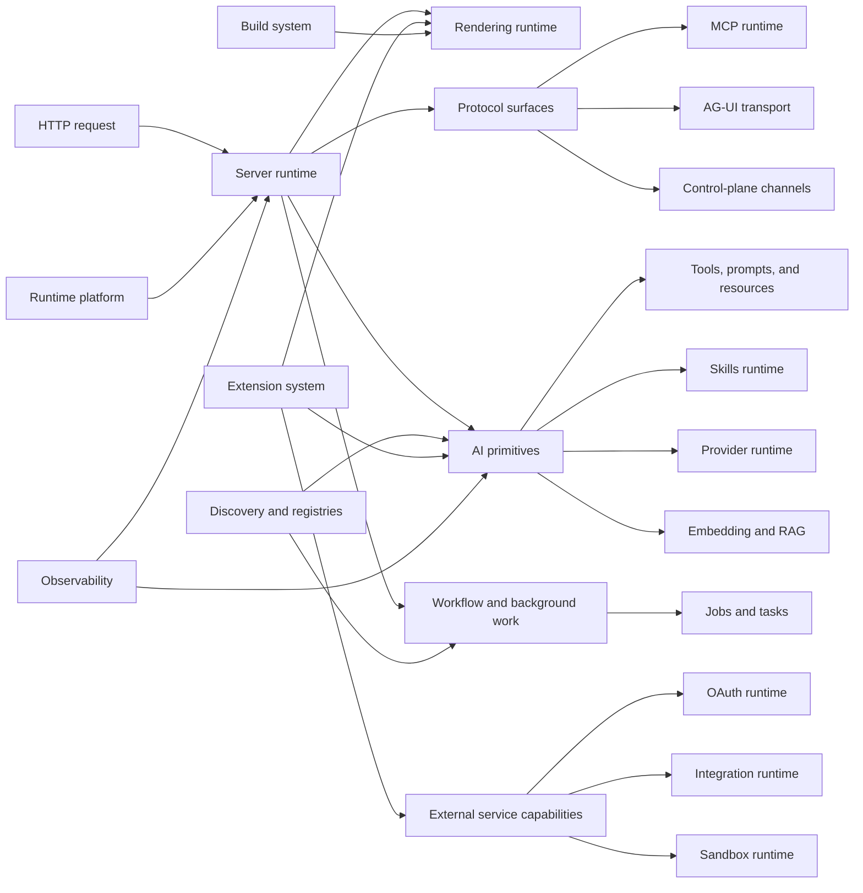

# System overview

Veryfront Code is a Deno-first framework and runtime package for full-stack AI
apps. It combines application routing, rendering, native agent primitives,
workflow execution, MCP support, jobs, tasks, extensions, and deployment
runtime support.

This page is the domain map. Focused runtime and transport details live in the
linked architecture pages.

## Domain map

## Domains

| Domain                         | Source areas                                                                                                                                                                                                                                                     | Focused docs                                                                                                                                                                                                     |
| ------------------------------ | ---------------------------------------------------------------------------------------------------------------------------------------------------------------------------------------------------------------------------------------------------------------- | ---------------------------------------------------------------------------------------------------------------------------------------------------------------------------------------------------------------- |
| App framework                  | [`src/routing/`](../../src/routing/), [`src/middleware/`](../../src/middleware/), [`src/react/`](../../src/react/), [`src/html/`](../../src/html/), [`src/data/`](../../src/data/)                                                                               | [server runtime](./11-server-runtime.md), [rendering runtime](./12-rendering-runtime.md)                                                                                                                         |
| AI primitives                  | [`src/agent/`](../../src/agent/), [`src/tool/`](../../src/tool/), [`src/prompt/`](../../src/prompt/), [`src/resource/`](../../src/resource/), [`src/skill/`](../../src/skill/), [`src/provider/`](../../src/provider/), [`src/embedding/`](../../src/embedding/) | [agent runtime](./03-agent-runtime.md), [AI primitives](./24-ai-primitives.md), [skill runtime](./25-skill-runtime.md), [provider runtime](./04-provider-runtime.md), [embedding and RAG](./06-embedding-rag.md) |
| Workflow and background work   | [`src/workflow/`](../../src/workflow/), [`src/jobs/`](../../src/jobs/), [`src/task/`](../../src/task/)                                                                                                                                                           | [workflow runtime](./05-workflow-runtime.md), [jobs and tasks](./20-jobs-and-tasks.md)                                                                                                                           |
| Protocol surfaces              | [`src/mcp/`](../../src/mcp/), [`src/agent/ag-ui/`](../../src/agent/ag-ui/), [`src/channels/`](../../src/channels/)                                                                                                                                               | [MCP runtime](./07-mcp-runtime.md), [AG-UI transport](./10-ag-ui-transport.md), [control-plane channels](./09-control-plane-channels.md)                                                                         |
| External service capabilities  | [`src/oauth/`](../../src/oauth/), [`src/integrations/`](../../src/integrations/), [`src/sandbox/`](../../src/sandbox/)                                                                                                                                           | [OAuth runtime](./21-oauth-runtime.md), [integration runtime](./22-integration-runtime.md), [sandbox runtime](./23-sandbox-runtime.md)                                                                           |
| Runtime platform               | [`src/platform/`](../../src/platform/), [`src/fs/`](../../src/fs/), [`src/server/project-env/`](../../src/server/project-env/)                                                                                                                                   | [runtime adapters](./13-runtime-adapters.md)                                                                                                                                                                     |
| Build system                   | [`src/build/`](../../src/build/), [`src/transforms/`](../../src/transforms/), [`src/modules/`](../../src/modules/)                                                                                                                                               | [build pipeline](./14-build-pipeline.md)                                                                                                                                                                         |
| Discovery and extension points | [`src/discovery/`](../../src/discovery/), [`src/registry/`](../../src/registry/), [`src/extensions/`](../../src/extensions/)                                                                                                                                     | [discovery and registries](./15-discovery-and-registries.md), [extension system](./16-extension-system.md)                                                                                                       |
| Cross-cutting systems          | [`src/security/`](../../src/security/), [`src/cache/`](../../src/cache/), [`src/observability/`](../../src/observability/), [`src/errors/`](../../src/errors/)                                                                                                   | [observability](./17-observability.md), [runtime boundaries](./19-runtime-boundaries.md)                                                                                                                         |

## Bridge modules

Some source areas intentionally connect domains:

- [`src/chat/`](../../src/chat/) connects UI components, agent streaming, and runtime hooks.
- [`src/internal-agents/`](../../src/internal-agents/) connects Studio-facing agent surfaces with runtime
  primitives.
- [`src/discovery/`](../../src/discovery/) connects project source files with registries.
- [`src/server/`](../../src/server/) composes routing, rendering, protocols, static files, and
  runtime services.
- [`src/build/`](../../src/build/) composes route collection, transforms, bundling, and production
  output.

Bridge modules stay thin. When they grow domain-specific behavior, move
that behavior to the owning domain and keep the bridge as composition code.

## Dependency posture

- Shared contracts and utilities stay broadly reusable.
- Runtime adapters avoid owning app, agent, or workflow behavior.
- Entrypoints compose domains instead of becoming hidden owners.
- Protocol surfaces keep MCP, AG-UI, and control-plane channels separate.
- Public terminology matches the guide and reference docs.
