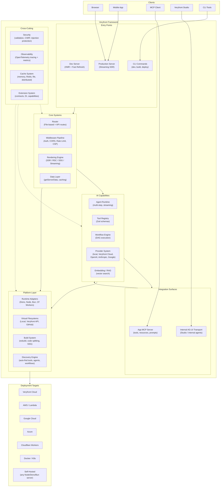
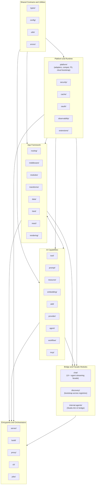
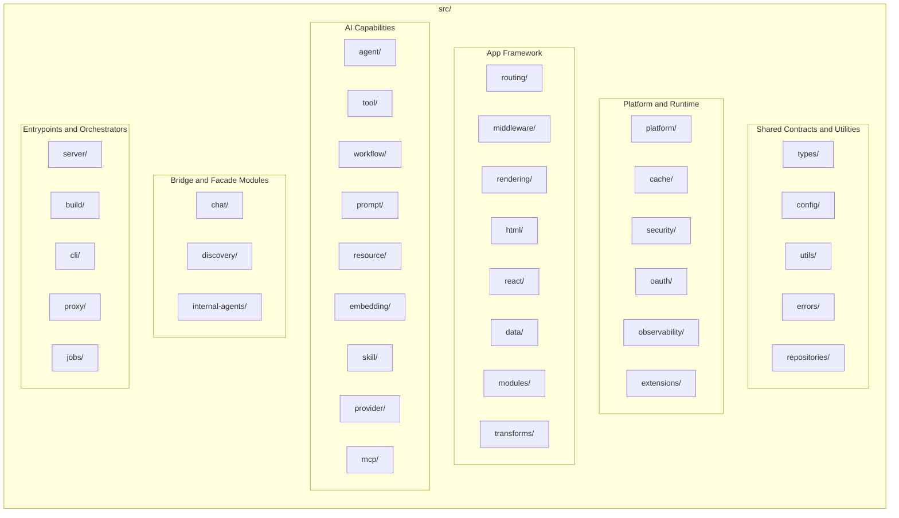

# System Overview

## High-Level Architecture

Veryfront Code is a full-stack TypeScript app framework that combines rendering (SSR/RSC/SSG), AI capabilities, and multi-runtime deployment. It is the open core of the Veryfront platform. AI is part of the core framework model, not a separate addon layer. Veryfront Cloud is the primary managed path, and the same runtime can also be self-hosted or deployed to other cloud environments.

### Description

The diagram shows veryfront's layered architecture:

- **Entry Points** are how users interact with the framework: dev server with HMR for development, production server for deployment, and CLI commands for build/deploy operations.
- **Core Systems** handle traditional app framework responsibilities: routing, middleware, rendering, and data fetching.
- **AI Capabilities** include agents, tools, workflows, model providers, and RAG as native framework capabilities.
- **Integration Surfaces** include the App MCP server for exposing tools/resources/prompts to MCP clients, plus a separate internal AG-UI transport used by Veryfront Studio and internal agent control-plane flows. These are related but distinct surfaces.
- **Platform Layer** abstracts away the runtime and deployment target. Runtime adapters support Deno, Node.js, Bun, and Cloudflare Workers. Virtual filesystems allow reading project files from local disk, Veryfront API, or GitHub.
- **Cross-Cutting Concerns** (security, observability, caching, extensions) are wired throughout all layers.
- **Deployment Targets** are centered on Veryfront Cloud as the primary managed path, while the open-core runtime/build layer also supports self-hosted and other cloud deployments without provider lock-in.

---

## Architectural Domains and Bridges

The codebase is better described as a set of native domains plus explicit bridge modules than as a perfectly strict layer stack.

This is intentional: AI is native to the framework, not bolted on, and some modules exist specifically to connect domains. The useful rule is preferred dependency direction, not a fake-clean claim that lower layers never import upward.

### Description

This model reflects the current architecture more accurately:

- **Shared Contracts and Utilities:** `types/`, `config/`, `utils/`, and `errors/` provide the common language of the framework.
- **Platform and Runtime:** `platform/`, security, cache, OAuth, observability, and extension plumbing support portability, runtime capabilities, and platform-aware integration. This area is foundational, but not purely low-level in every file.
- **App Framework:** Rendering, routing, middleware, module loading, transforms, data, HTML, and React form the core application runtime.
- **AI Capabilities:** Tools, prompts, resources, embeddings, skills, providers, agents, workflows, and MCP are native framework capabilities, not optional add-ons.
- **Bridge and Facade Modules:** `chat/`, `discovery/`, and internal AG-UI surfaces intentionally span multiple domains. They should be treated as explicit bridges, kept thin, and documented as such.
- **Entrypoints and Orchestrators:** `server/`, `build/`, `proxy/`, `cli/`, and related operational surfaces wire the system together for runtime, build, and operator workflows.

Preferred dependency direction:

- shared contracts should stay broadly reusable,
- platform/runtime code should avoid unnecessary reach into higher-level domains,
- bridge modules are allowed to cross boundaries when that is their explicit job,
- and entrypoints/orchestrators should compose domains rather than become hidden owners of them.

This is a better description of the current codebase than a strict clean-layer claim. If the project later adds real dependency-boundary enforcement, the diagrams can become stricter too.

---

## Source Directory Map

### Description

The `src/` directory is better understood as six functional groups:

- **Shared Contracts and Utilities:** `types/`, `config/`, `utils/`, `errors/`, and repository abstractions provide common contracts and reusable primitives.
- **Platform and Runtime:** `platform/`, cache, security, OAuth, observability, and extensions support runtime portability, framework infrastructure, and platform-aware integration.
- **App Framework:** Routing, middleware, rendering (SSR/RSC/SSG), HTML generation, React integration, data fetching, module loading, and transforms form the application runtime.
- **AI Capabilities:** Agents, tools, workflows, prompts, resources, embeddings, skills, providers, and MCP are native framework capabilities.
- **Bridge and Facade Modules:** `chat/`, `discovery/`, and `internal-agents/` intentionally connect multiple domains and should be treated as explicit cross-domain surfaces.
- **Entrypoints and Orchestrators:** `server/`, `build/`, `cli/`, `proxy/`, and `jobs/` wire the rest of the system together for runtime, build, operational, and multi-project workflows.

These groups describe the codebase more accurately than a strict layered stack. Some modules are intentionally cross-domain, and those should be documented as bridges rather than treated as accidental violations.
