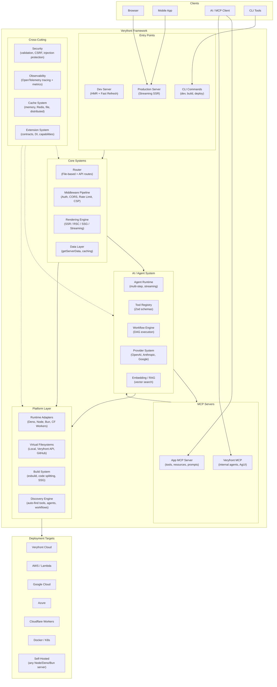
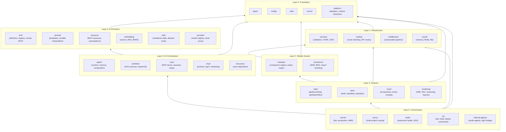
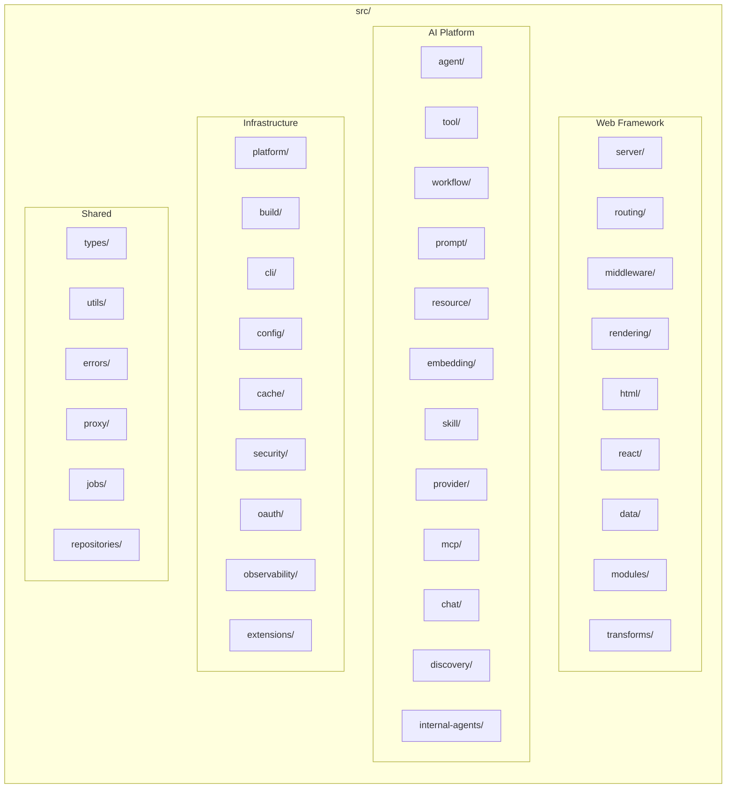

# System Overview

## High-Level Architecture

Veryfront is a full-stack TypeScript framework that combines web rendering (SSR/RSC/SSG), an AI agent system, and multi-runtime deployment into a single cohesive platform. It can be deployed to **any cloud provider** via runtime adapters -- not just Veryfront Cloud.

### Description

The diagram shows veryfront's layered architecture:

- **Entry Points** are how users interact with the framework: dev server with HMR for development, production server for deployment, and CLI commands for build/deploy operations.
- **Core Systems** handle traditional web framework responsibilities: routing, middleware, rendering, and data fetching.
- **AI / Agent System** provides a complete AI development platform with agents, tools, workflows, model providers, and RAG -- all discoverable at startup.
- **MCP Servers** expose AI primitives via the Model Context Protocol. "App MCP" lets user applications expose tools/resources/prompts to MCP clients. "Veryfront MCP" provides internal platform agents with AgUI streaming for studio integration.
- **Platform Layer** abstracts away the runtime and deployment target. Runtime adapters support Deno, Node.js, Bun, and Cloudflare Workers. Virtual filesystems allow reading project files from local disk, Veryfront API, or GitHub.
- **Cross-Cutting Concerns** (security, observability, caching, extensions) are wired throughout all layers.
- **Deployment Targets** are any cloud provider or self-hosted environment -- the adapter pattern means veryfront is not locked to Veryfront Cloud.

---

## Module Dependency Layers

The codebase is organized into strict dependency layers. Lower layers never import from higher layers.

### Description

The layer architecture enforces a strict dependency direction (bottom-up only):

- **Layer 0 (Foundation):** Zero-dependency modules providing types, configuration, utilities, error handling, and platform abstraction. Every other layer can import from here.
- **Layer 1 (Infrastructure):** Security, routing, middleware, and caching -- depends only on foundation.
- **Layer 2 (Module System):** Component registry, import maps, and code transforms (ESM, MDX, import rewriting). Depends on infrastructure for path resolution and caching.
- **Layer 3 (Features):** The web rendering stack -- data fetching, HTML generation, React integration, and the SSR/RSC/streaming engine.
- **Layer 4 (AI Primitives):** Individual AI building blocks -- tools, prompts, resources, embeddings, skills, and model providers. These are self-contained and depend only on foundation.
- **Layer 5 (AI Orchestration):** Combines primitives into higher-level constructs -- agents (with memory and composition), workflow DAG execution, MCP server, chat protocol, and the discovery engine.
- **Layer 6 (Orchestrators):** Top-level entry points that wire everything together -- servers, proxy, build system, CLI, and internal agents.

All internal imports use `#veryfront/*` hash aliases. Circular dependencies are prohibited.

---

## Source Directory Map

### Description

The `src/` directory is organized into four functional groups:

- **Web Framework:** Traditional full-stack web concerns -- server, routing, middleware, rendering (SSR/RSC/SSG), HTML generation, React integration, data fetching, module system, and code transforms.
- **AI Platform:** The AI development platform -- agents, tools, workflows, prompts, resources, embeddings, skills, model providers, MCP server, chat protocol, discovery engine, and internal studio agents.
- **Infrastructure:** Platform abstraction, build system, CLI, configuration, caching, security, OAuth, observability (OpenTelemetry), and the extension system.
- **Shared:** Cross-cutting types, utilities, error definitions, proxy (multi-project), background jobs, and data repositories.
