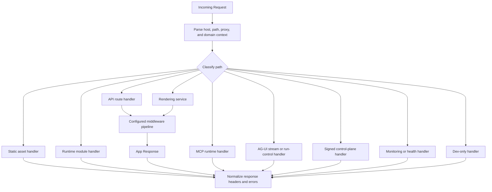

# Request pipeline

This page describes how an HTTP request reaches the right runtime handler. It
does not describe rendering internals, MCP JSON-RPC dispatch, AG-UI chunk
encoding, or build output generation.

## Responsibility

The request pipeline classifies incoming requests, applies the appropriate
middleware and handler path, and returns a normalized `Response`.

Primary source areas:

- [`src/server/handlers/`](../../src/server/handlers/)
- [`src/server/handlers/request/`](../../src/server/handlers/request/)
- [`src/server/handlers/dev/`](../../src/server/handlers/dev/)
- [`src/routing/`](../../src/routing/)
- [`src/middleware/`](../../src/middleware/)

## Request classes

| Request class         | Handler ownership                           |
| --------------------- | ------------------------------------------- |
| Static assets         | Static file handlers                        |
| Runtime modules       | Module request handlers                     |
| API routes            | API route handlers and route resolver       |
| Page routes           | Rendering service entrypoints               |
| MCP endpoint          | MCP runtime handler                         |
| AG-UI endpoint        | Agent stream and run-control handlers       |
| Control-plane channel | Signed channel dispatch and invoke handlers |
| Monitoring and health | Monitoring handlers                         |
| Dev-only endpoints    | Dev server and dashboard handlers           |

## Flow

1. The runtime server receives a `Request`.
2. Request helpers parse host, path, proxy, and domain context.
3. Routing helpers classify the request path.
4. Public app paths pass through the configured middleware pipeline.
5. Protocol and control-plane paths enter their dedicated handlers.
6. Response helpers normalize headers, CORS, errors, and not-found behavior.

## Boundaries

- Rendering details belong in [rendering runtime](./12-rendering-runtime.md).
- MCP dispatch belongs in [MCP runtime](./07-mcp-runtime.md).
- AG-UI stream encoding belongs in [AG-UI transport](./10-ag-ui-transport.md).
- Control-plane signature handling belongs in
  [control-plane channels](./09-control-plane-channels.md).

## Change checks

- Add handler tests for any route classification or response shape change.
- Keep dev-only endpoints out of production request paths.
- Keep public app routes, protocol routes, and control-plane routes separate.
