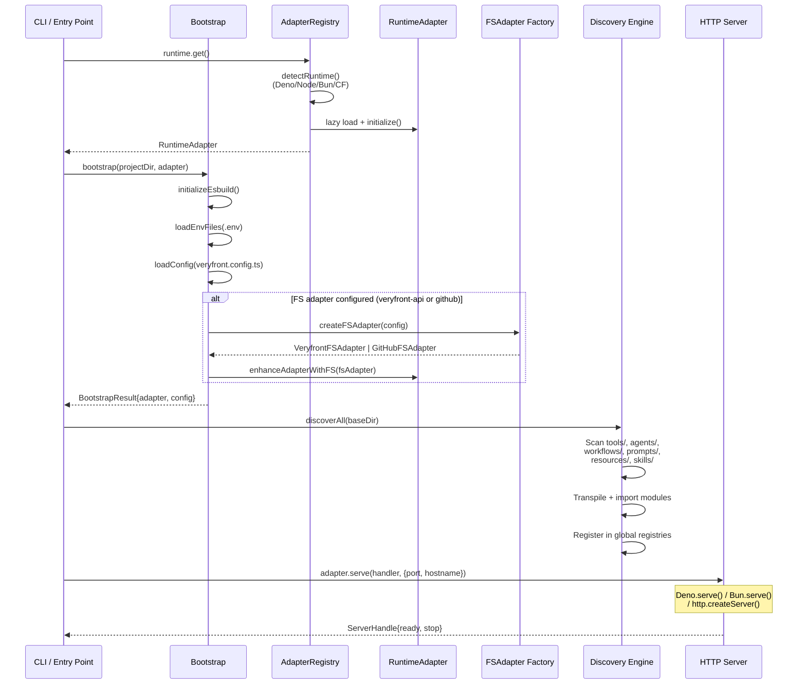
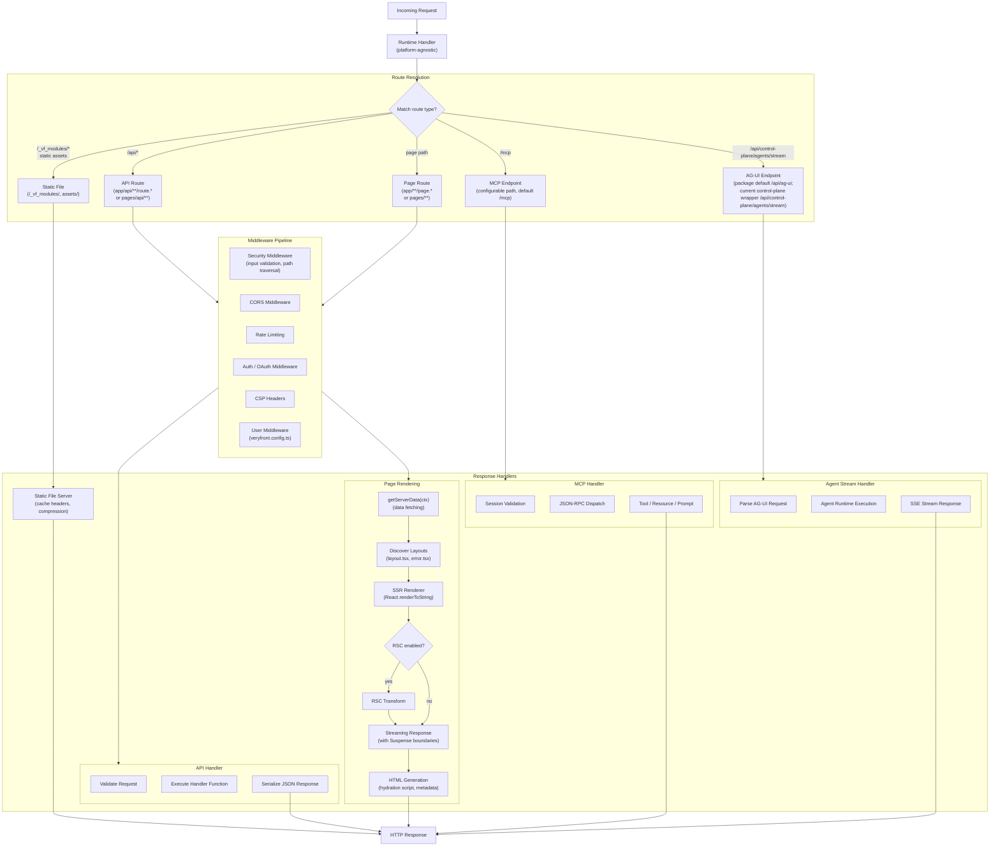
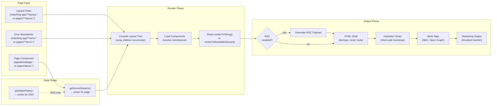
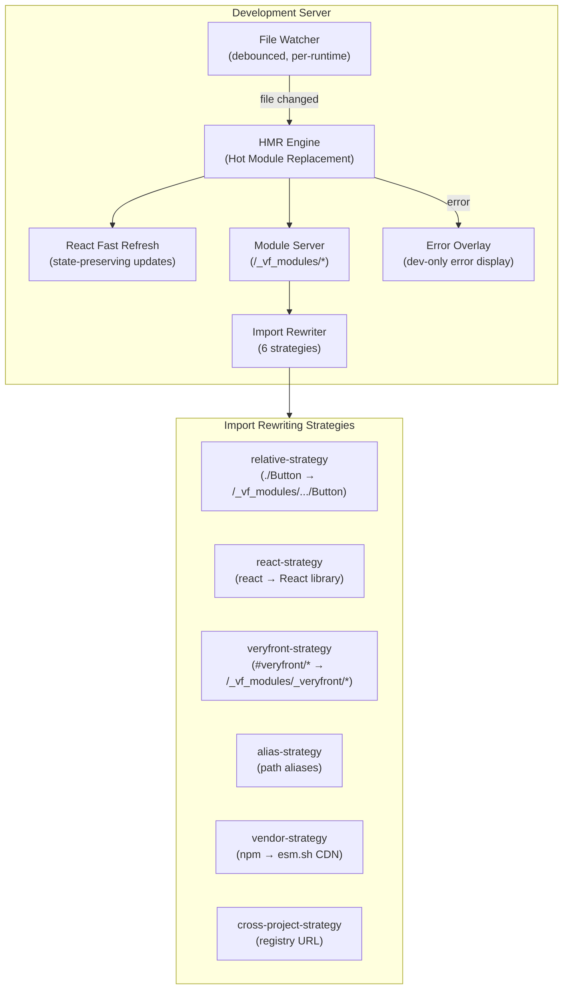

# Request Handling & Server Pipeline

## Production Server Bootstrap

The production server follows a deterministic startup sequence that works identically across all supported runtimes.

### Description

1. **Runtime Detection:** The `AdapterRegistry` singleton detects the current runtime (Deno, Node.js, Bun, or Cloudflare Workers) by checking for global objects (`Deno`, `Bun`, `process.versions.node`, `caches`).
2. **Bootstrap:** Initializes esbuild, loads `.env` files, and reads `veryfront.config.ts`. If a virtual filesystem is configured (Veryfront API or GitHub), the adapter is enhanced with the FS layer.
3. **Discovery:** The discovery engine scans convention-based directories (`tools/`, `agents/`, `workflows/`, etc.), transpiles TypeScript modules, dynamically imports them, and registers them in global registries.
4. **Server Start:** The runtime adapter starts the HTTP server using the platform-native API. All runtimes expose a standard `Request => Response` handler interface.

---

## Request Handling Pipeline

Every incoming HTTP request passes through the same pipeline regardless of runtime.

### Description

The request pipeline has five route categories:

- **Static Files:** Served directly with cache headers and optional compression. No middleware needed.
- **API Routes:** Pass through the full middleware pipeline, then execute the user-defined handler function. Depending on router mode, these come from `app/api/**/route.*` or `pages/api/**`. Input is validated and output is serialized as JSON.
- **Page Routes:** The most complex path. After middleware, the rendering engine fetches data via `getServerData()`, resolves the active router mode, runs SSR, optionally applies RSC transforms, and streams the HTML response with Suspense boundaries and hydration scripts. Both router modes can apply matching `layout.tsx` and `error.tsx` files, but the composition rules differ between app-router and pages-router projects.
- **MCP Endpoints:** Handle JSON-RPC requests for the MCP protocol. Session validation, dispatch to tools/resources/prompts, and support for async tasks.
- **AG-UI Endpoints:** The package-level AG-UI handlers are designed around host-configurable routes such as `/api/ag-ui`, but the current Studio/control-plane path uses the signed compatibility wrapper at `/api/control-plane/agents/stream`. This transport is separate from MCP and streams AG-UI SSE events back to the client.

---

## Rendering Pipeline Detail

### Description

The rendering pipeline converts page components into streamed HTML:

1. **Data Phase:** `getServerData(ctx)` runs server-side to fetch props. For SSG, `getStaticPaths()` enumerates routes at build time.
2. **Render Phase:** The renderer resolves the active route file, then applies router-specific composition. In app-router mode it compiles nested `layout.tsx` and `error.tsx` files along the route tree. In pages-router mode it applies matching `pages/**/layout.tsx` and `pages/**/error.tsx` wrappers when present. Components are then resolved as client or server components and rendered via React's streaming API.
3. **Output Phase:** If RSC is enabled, an RSC payload is generated alongside the HTML. The output includes the HTML shell, hydration scripts for client-side bootstrapping, and SEO meta tags. The response is streamed using chunked transfer encoding with Suspense boundary support.

---

## Dev Server Architecture

### Description

The dev server provides a fast feedback loop:

- **File Watcher:** Monitors the project directory for changes. Uses platform-native watching (Deno poll-based due to limitations, Node `fs.watch`, Bun native watcher).
- **HMR Engine:** Processes file changes and sends updates to the browser via WebSocket.
- **React Fast Refresh:** Preserves React component state during hot updates.
- **Module Server:** Serves transformed modules at `/_vf_modules/*`, applying import rewriting on-the-fly.
- **Import Rewriter:** Applies six strategies to resolve imports: relative paths, React library, veryfront internals, path aliases, npm packages via CDN, and cross-project registry URLs.
