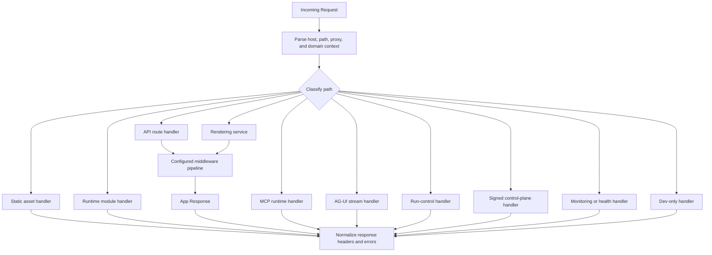

# Request pipeline

This page describes how an HTTP request reaches the right runtime handler. It
does not describe rendering internals, MCP JSON-RPC dispatch, AG-UI chunk
encoding, or build output generation.

## Responsibility

The request pipeline classifies incoming requests, applies the appropriate
middleware and handler path, and returns a normalized `Response`.

Primary source areas:

- [`src/server/handlers/`](../../src/server/handlers/)
- [`src/server/handlers/request/`](../../src/server/handlers/request/)
- [`src/server/handlers/dev/`](../../src/server/handlers/dev/)
- [`src/routing/`](../../src/routing/)
- [`src/middleware/`](../../src/middleware/)

## Request classes

| Request class         | Handler ownership                            |
| --------------------- | -------------------------------------------- |
| Static assets         | Static file handlers                         |
| Runtime modules       | Module request handlers                      |
| API routes            | API route handlers and route resolver        |
| Page routes           | Rendering service entrypoints                |
| MCP endpoint          | MCP runtime handler                          |
| AG-UI endpoint        | Agent stream handlers                        |
| Run-control endpoint  | Agent run start, resume, and cancel handlers |
| Control-plane channel | Signed channel dispatch and invoke handlers  |
| Monitoring and health | Monitoring handlers                          |
| Dev-only endpoints    | Dev server and dashboard handlers            |

## Flow

1. The runtime server receives a `Request`.
2. Request helpers parse host, path, proxy, and domain context.
3. Routing helpers classify the request path.
4. Public app paths pass through the configured middleware pipeline.
5. Protocol and control-plane paths enter their dedicated handlers.
6. Response helpers normalize headers, CORS, errors, and not-found behavior.

## Runtime caches

The split proxy caches successful project metadata lookups for service and
static-token requests. The cache is per proxy handler, bounded, and short lived.
It does not cache lookup misses, preview user-token lookups, signed internal
request lookups, or protected-access decisions. Protected environments still run
their access check on every request.

Default proxy lookup cache controls:

| Environment variable                               | Default |
| -------------------------------------------------- | ------- |
| `VERYFRONT_PROXY_PROJECT_LOOKUP_CACHE_TTL_MS`      | `30000` |
| `VERYFRONT_PROXY_PROJECT_LOOKUP_CACHE_MAX_ENTRIES` | `1000`  |

Set either value to `0` to disable the proxy project lookup cache.

Release-backed production page-data requests use a fresh cache window plus a
bounded stale-while-revalidate window. The cache key includes the project,
environment, release content source, slug, and sorted query. Requests with
cache-sensitive state are not cached. Preview branch page data keeps the fresh
TTL cache but does not serve stale responses after expiry.

Default page-data cache controls:

| Environment variable                    | Default   |
| --------------------------------------- | --------- |
| `VERYFRONT_PAGE_DATA_CACHE_TTL_MS`      | `60000`   |
| `VERYFRONT_PAGE_DATA_CACHE_STALE_MS`    | `1800000` |
| `VERYFRONT_PAGE_DATA_CACHE_MAX_ENTRIES` | `500`     |

Set `VERYFRONT_PAGE_DATA_CACHE_MAX_ENTRIES` to `0` to disable the page-data
endpoint cache.

## Boundaries

- Rendering details belong in [rendering runtime](./03-rendering-runtime.md).
- MCP dispatch belongs in [MCP runtime](./10-mcp-runtime.md).
- AG-UI stream encoding belongs in [AG-UI transport](./06-ag-ui-transport.md).
- `/api/runs*` run-control handlers are sibling runtime APIs, not child routes
  under `/api/ag-ui`.
- Control-plane signature handling belongs in
  [control-plane channels](./11-control-plane-channels.md).

## Change checks

- Add handler tests for any route classification or response shape change.
- Keep dev-only endpoints out of production request paths.
- Keep public app routes, protocol routes, and control-plane routes separate.

## Related guides

- [API routes](../guides/api-routes.md)
- [Middleware](../guides/middleware.md)
- [Pages and routing](../guides/pages-and-routing.md)

## Related reference

- [`veryfront/middleware`](../api-reference/veryfront/middleware.md)
- [`veryfront/router`](../api-reference/veryfront/router.md)
- [`veryfront/server`](../api-reference/veryfront/server.md)
