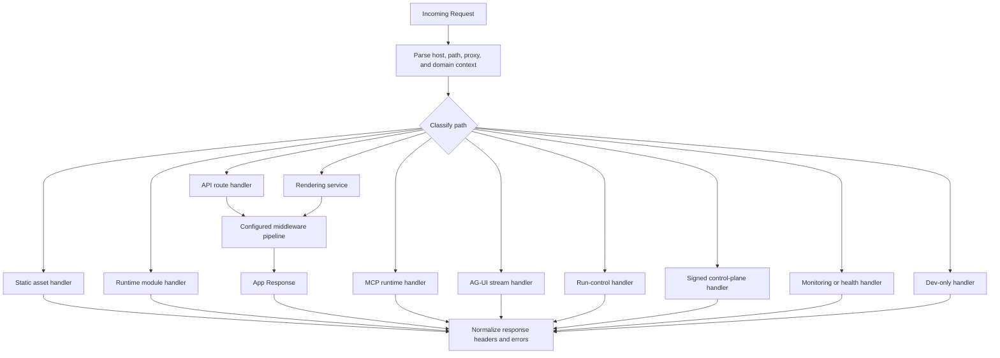

# Request pipeline

This page describes how an HTTP request reaches the right runtime handler. It
does not describe rendering internals, MCP JSON-RPC dispatch, AG-UI chunk
encoding, or build output generation.

## Responsibility

The request pipeline classifies incoming requests, applies the appropriate
middleware and handler path, and returns a normalized `Response`.

Primary source areas:

- [`src/server/handlers/`](../../src/server/handlers/)
- [`src/server/handlers/request/`](../../src/server/handlers/request/)
- [`src/server/handlers/dev/`](../../src/server/handlers/dev/)
- [`src/routing/`](../../src/routing/)
- [`src/middleware/`](../../src/middleware/)

## Request classes

| Request class         | Handler ownership                            |
| --------------------- | -------------------------------------------- |
| Static assets         | Static file handlers                         |
| Runtime modules       | Module request handlers                      |
| API routes            | API route handlers and route resolver        |
| Page routes           | Rendering service entrypoints                |
| MCP endpoint          | MCP runtime handler                          |
| AG-UI endpoint        | Agent stream handlers                        |
| Run-control endpoint  | Agent run start, resume, and cancel handlers |
| Control-plane channel | Signed channel dispatch and invoke handlers  |
| Monitoring and health | Monitoring handlers                          |
| Dev-only endpoints    | Dev server and dashboard handlers            |

## Flow

```mermaid
flowchart TD
  request[Incoming Request] --> context[Parse host, path, proxy, and domain context]
  context --> classify{Classify path}
  classify --> assets[Static asset handler]
  classify --> modules[Runtime module handler]
  classify --> api[API route handler]
  classify --> page[Rendering service]
  classify --> mcp[MCP runtime handler]
  classify --> agui[AG-UI stream handler]
  classify --> runctl[Run-control handler]
  classify --> channel[Signed control-plane handler]
  classify --> health[Monitoring or health handler]
  classify --> dev[Dev-only handler]

  api --> middleware[Configured middleware pipeline]
  page --> middleware
  middleware --> appResponse[App Response]

  assets --> normalize[Normalize response headers and errors]
  modules --> normalize
  appResponse --> normalize
  mcp --> normalize
  agui --> normalize
  runctl --> normalize
  channel --> normalize
  health --> normalize
  dev --> normalize
```

1. The runtime server receives a `Request`.
2. Request helpers parse host, path, proxy, and domain context.
3. Routing helpers classify the request path.
4. Public app paths pass through the configured middleware pipeline.
5. Protocol and control-plane paths enter their dedicated handlers.
6. Response helpers normalize headers, CORS, errors, and not-found behavior.

## Proxy topology boundary

In split deployments, routing-sensitive forwarded headers are trusted only
when the runtime operator sets `VERYFRONT_TRUST_FORWARDED_HEADERS=1`. This
setting means the runtime is behind a private, sanitizing proxy that replaces
untrusted forwarding metadata. The value is matched exactly; alternative
spellings and whitespace-padded values fail closed.

Local combined CLI mode has no network hop between its proxy and renderer.
Instead, the proxy replaces the inbound `Request` after sanitizing and deriving
its context, then binds that replacement to the source request's immutable
native peer provenance in an internal weak reference. A direct request, a
constructed replacement without native provenance, and a copied header set
cannot reproduce that capability. Tokenless routing is limited to a local path
that both came from this same-process proxy and exactly matches the host-seeded
local-project map.

WebSocket upgrades are the sole identity-preserving variant: Deno requires the
exact native `Request` for the handshake. The combined server still runs the
sanitizing proxy, verifies that its replacement was derived from that exact
transport-authenticated request, and privately binds the replacement as routing
context while passing the untouched native request to the upgrade API. Local
HMR admission additionally requires that resolution selected a host-seeded
local project. Neither headers nor dispatch credentials can create this binding.

In deployed shared proxy mode, the runtime rejects every non-monitoring request
when that topology setting is absent, including module assets and WebSocket
requests. When it is present, all proxy-owned project, release, branch,
environment, content-source, token, forwarded-host, and local-path metadata may
be consumed as one edge-established routing context. The built-in proxy removes
incoming `Forwarded`, `Via`, `x-forwarded-*`, `x-real-ip`, and `x-project-*`
values before adding its authoritative context. Direct client address and
protocol come from immutable native transport provenance. When a TLS terminator
or ingress sits in front of the built-in proxy, operators must list its exact
native peer IP in `VERYFRONT_PROXY_TRUSTED_INGRESS_IPS`. Only those peers may
provide `x-forwarded-for` and `x-forwarded-proto`, and they must replace both
headers with one canonical client IP and exactly `http` or `https`; missing,
appended, or malformed values fail closed. Never list a public client network
or an address from which direct requests can arrive.

The renderer resolves the resulting public origin and content-source identity
once into `HandlerContext`; downstream handlers must use that context instead
of re-reading forwarding headers. For the HMR WebSocket bridge, the proxy also
replaces the `x-project-slug` and `x-environment` query parameters with
proxy-resolved values. Trusted third-party proxies must provide the same header
and query rewrite guarantees.

A signed channel or control-plane request does not establish proxy topology.
Those signatures authorize only the request surface and claims they bind; they
do not authorize unrelated `x-forwarded-host`, `x-project-path`, project, or
environment metadata. This separation prevents a valid signed request from
being replayed to promote attacker-selected routing headers.

Verified control-plane handlers likewise consume execution identity from the
verified body/claims and the already-resolved handler context. They do not
re-read unbound routing headers after signature verification.

## Runtime caches

The proxy caches routing-only project metadata from the control plane. That
payload contains project identity, environments, domains, and active release
ids, but it does not contain `protected` flags or project members. Protection
state and project membership are fetched through a separate access metadata
lookup on every request, so protection toggles and membership changes stay
fresh while release routing avoids the full project relation query on warm
paths.

Default routing cache controls:

| Environment variable                        | Default |
| ------------------------------------------- | ------- |
| `VERYFRONT_PROXY_ROUTING_CACHE_TTL_MS`      | `60000` |
| `VERYFRONT_PROXY_ROUTING_CACHE_MAX_ENTRIES` | `1000`  |

After a deployment pointer commits, the control plane sends an authenticated,
project-scoped invalidation through the proxy-owned Redis bus. Every subscribed
proxy evicts the matching routing entries, refreshes the authoritative metadata,
and acknowledges only after observing the expected environment and release.
Generation fencing prevents an older in-flight lookup from repopulating the
cache. The TTL remains a recovery path when immediate fan-out cannot converge.

Release-backed production page-data requests use a fresh cache window plus a
bounded stale-while-revalidate window. The cache key includes the project,
environment, release content source, slug, and canonical query. The canonical
query uses the same `config.cache.queryParams` policy as HTML rendering, so
default tracking and cache-busting parameters do not fragment the cache.
Requests with cache-sensitive state are not cached. Preview branch page data
keeps the fresh TTL cache but does not serve stale responses after expiry.

Default page-data cache controls:

| Environment variable                    | Default   |
| --------------------------------------- | --------- |
| `VERYFRONT_PAGE_DATA_CACHE_TTL_MS`      | `60000`   |
| `VERYFRONT_PAGE_DATA_CACHE_STALE_MS`    | `1800000` |
| `VERYFRONT_PAGE_DATA_CACHE_MAX_ENTRIES` | `500`     |

Set `VERYFRONT_PAGE_DATA_CACHE_MAX_ENTRIES` to `0` to disable the page-data
endpoint cache.

Production HTML rendering also starts a bounded background prewarm after the
first cacheable request for a project release context. The prewarm discovers
concrete static routes, skips dynamic route patterns, validates each candidate
route resolves, uses canonical route cache keys without request cookies, query
strings, or nonces, and checks the shared render cache before rendering each
route. This populates the API-backed distributed render cache for sibling routes
without adding latency to the foreground response. API-backed render cache
writes complete before `CacheStore.set()` resolves so a render or prewarm fill
is visible to other pods before the cache fill is treated as done.

Default render prewarm controls:

| Environment variable                   | Default |
| -------------------------------------- | ------- |
| `VERYFRONT_RENDER_PREWARM_MAX_ROUTES`  | `12`    |
| `VERYFRONT_RENDER_PREWARM_CONCURRENCY` | `1`     |

Set `VERYFRONT_RENDER_PREWARM_MAX_ROUTES` to `0` to disable production render
prewarm.

## Boundaries

- Rendering details belong in [rendering runtime](./03-rendering-runtime.md).
- MCP dispatch belongs in [MCP runtime](./10-mcp-runtime.md).
- AG-UI stream encoding belongs in [AG-UI transport](./06-ag-ui-transport.md).
- `/api/runs*` run-control handlers are sibling runtime APIs, not child routes
  under `/api/ag-ui`.
- Control-plane signature handling belongs in
  [control-plane channels](./11-control-plane-channels.md).

## Change checks

- Add handler tests for any route classification or response shape change.
- Keep dev-only endpoints out of production request paths.
- Keep public app routes, protocol routes, and control-plane routes separate.
- Keep request authorization separate from operator-controlled proxy topology.

## Related guides

- [API routes](../guides/api-routes.md)
- [Middleware](../guides/middleware.md)
- [Pages and routing](../guides/pages-and-routing.md)

## Related reference

- [`veryfront/middleware`](../api-reference/veryfront/middleware.md)
- [`veryfront/router`](../api-reference/veryfront/router.md)
- [`veryfront/server`](../api-reference/veryfront/server.md)
