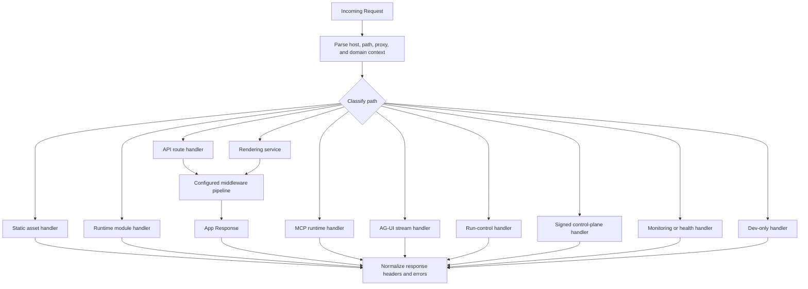

# Request pipeline

This page describes how an HTTP request reaches the right runtime handler. It
does not describe rendering internals, MCP JSON-RPC dispatch, AG-UI chunk
encoding, or build output generation.

## Responsibility

The request pipeline classifies incoming requests, applies the appropriate
middleware and handler path, and returns a normalized `Response`.

Primary source areas:

- [`src/server/handlers/`](../../src/server/handlers/)
- [`src/server/handlers/request/`](../../src/server/handlers/request/)
- [`src/server/handlers/dev/`](../../src/server/handlers/dev/)
- [`src/routing/`](../../src/routing/)
- [`src/middleware/`](../../src/middleware/)

## Request classes

| Request class         | Handler ownership                            |
| --------------------- | -------------------------------------------- |
| Static assets         | Static file handlers                         |
| Runtime modules       | Module request handlers                      |
| API routes            | API route handlers and route resolver        |
| Page routes           | Rendering service entrypoints                |
| MCP endpoint          | MCP runtime handler                          |
| AG-UI endpoint        | Agent stream handlers                        |
| Run-control endpoint  | Agent run start, resume, and cancel handlers |
| Control-plane channel | Signed channel dispatch and invoke handlers  |
| Monitoring and health | Monitoring handlers                          |
| Dev-only endpoints    | Dev server and dashboard handlers            |

## Flow

```mermaid
flowchart TD
  request[Incoming Request] --> context[Parse host, path, proxy, and domain context]
  context --> classify{Classify path}
  classify --> assets[Static asset handler]
  classify --> modules[Runtime module handler]
  classify --> api[API route handler]
  classify --> page[Rendering service]
  classify --> mcp[MCP runtime handler]
  classify --> agui[AG-UI stream handler]
  classify --> runctl[Run-control handler]
  classify --> channel[Signed control-plane handler]
  classify --> health[Monitoring or health handler]
  classify --> dev[Dev-only handler]

  api --> middleware[Configured middleware pipeline]
  page --> middleware
  middleware --> appResponse[App Response]

  assets --> normalize[Normalize response headers and errors]
  modules --> normalize
  appResponse --> normalize
  mcp --> normalize
  agui --> normalize
  runctl --> normalize
  channel --> normalize
  health --> normalize
  dev --> normalize
```

1. The runtime server receives a `Request`.
2. Request helpers parse host, path, proxy, and domain context.
3. Routing helpers classify the request path.
4. Public app paths pass through the configured middleware pipeline.
5. Protocol and control-plane paths enter their dedicated handlers.
6. Response helpers normalize headers, CORS, errors, and not-found behavior.

## Standalone proxy lifecycle

The split-mode proxy captures its core listener, upstream, retry, drain, and
routing-authority settings in one immutable configuration snapshot before it
creates network clients or listeners. Explicit malformed values stop startup;
they do not fall back to a different port, upstream, retry policy, or local
project map. API and renderer endpoints must be canonical HTTP(S) URLs without
credentials, queries, or fragments. `LOCAL_PROJECTS` must be a JSON object with
at most 1,000 canonical project slugs mapped to normalized absolute paths.

Production startup additionally requires `VERYFRONT_SERVER_URL`,
`VERYFRONT_PROXY_EXPECTED_REPLICAS`, and a
`VERYFRONT_PROXY_ROUTING_INVALIDATION_SECRET` of at least 32 UTF-8 bytes. OAuth
client credentials are validated when present. Their absence remains a
separate deployment-policy decision and currently emits the proxy's existing
unauthenticated-forwarding warning rather than being treated as malformed
configuration.

| Environment variable                    | Default                  | Allowed value or range                                         |
| --------------------------------------- | ------------------------ | -------------------------------------------------------------- |
| `VERYFRONT_PROXY_API_BASE_URL`          | Veryfront Cloud API      | Canonical HTTP(S) URL, optional path                           |
| `LOCAL_PROJECTS`                        | unset                    | Canonical absolute-path map; development only                  |
| `VERYFRONT_SERVER_URL`                  | localhost in development | HTTP(S) origin; required in production                         |
| `VERYFRONT_PROXY_URL`                   | unset                    | HTTP(S) bind origin; mutually exclusive with `HOST` and `PORT` |
| `HOST`                                  | `0.0.0.0`                | Canonical hostname or IP address                               |
| `PORT`                                  | `8080`                   | `1..65535`                                                     |
| `VERYFRONT_API_REQUEST_TIMEOUT_MS`      | `30000`                  | `1..300000`                                                    |
| `VERYFRONT_SERVER_REQUEST_TIMEOUT_MS`   | `90000`                  | `1..900000`                                                    |
| `VERYFRONT_SERVER_RETRY_COUNT`          | `1`                      | `0..5`                                                         |
| `VERYFRONT_SERVER_RETRY_DELAY_MS`       | `100`                    | `0..60000`                                                     |
| `VERYFRONT_PROXY_MAX_WEBSOCKET_BRIDGES` | `256`                    | `1..65535`                                                     |
| `SHUTDOWN_DRAIN_TIMEOUT_MS`             | `25000`                  | `0..600000`                                                    |
| `SHUTDOWN_CLEANUP_TIMEOUT_MS`           | `4000`                   | `0..2147483647`                                                |
| `VERYFRONT_PROXY_EXPECTED_REPLICAS`     | unset                    | `1..10000`; required in production                             |

After the synchronous configuration snapshot is accepted, the proxy installs
`SIGINT` and `SIGTERM` handlers before Sentry initialization or any other
asynchronous acquisition. Until listener readiness commits startup, the first
signal aborts the startup transaction. Every resource-producing stage is owned
before its producer begins, so reverse-order rollback observes and closes a
late successful result even when that producer ignores cancellation or settles
after the cleanup deadline. Diagnostics flush before Sentry is invalidated,
and signal handlers are the final rollback resource removed.

Redis startup distinguishes borrowed stores from proxy-created stores. Borrowed
stores are validated but never closed or unregistered by the proxy. A created
store moves through direct store, cache, and proxy-handler ownership while its
registry restoration remains independently armed until commit. Direct and
transitive cleanup share one immutable close attempt, so a cleanup that
outlives the shared deadline cannot concurrently close a non-idempotent
extension store twice. Registration, restoration, and cleanup failures remain
separate ordered causes rather than being hidden by the primary startup error.

The request boundary validates and canonicalizes the `Host` authority before
using it for project routing or token identity. Ports and DNS trailing dots are
removed, international names use their ASCII form, and credentials, paths,
queries, fragments, control characters, and malformed authorities produce a
non-cacheable `400`. Client-supplied internal routing headers are replaced with
proxy-owned values. Standard hop-by-hop headers and every extension header
named by `Connection` are removed in both directions.

Upstream retry counts are validated as integers in the documented range before
attempt streams are allocated. GET, HEAD, and OPTIONS requests may use the
configured retry budget. Other requests remain single-shot except for the
signed control-plane run-stream POST: it can retry once when its declared body
is present, bounded to 1 MiB, and the dedicated server refused the connection.
Missing, contradictory, chunked, malformed, or oversized body metadata disables
replay without discarding the original stream.

Renderer URLs are assembled by assigning a canonical origin-form path to a
validated origin, so a leading `//` cannot change the upstream authority.
Renderer fetches, dedicated-server selection waits, and retry delays all observe
incoming request cancellation. Each renderer attempt has the configured
deadline, and a fetch implementation that ignores cancellation cannot retain
request ownership; any late response body is canceled. Trace URL attributes
exclude all query strings.

The `/_vf/api` BFF uses the same cancellation boundary with its independent
30-second default deadline. It preserves an API base-path prefix, sends bearer
credentials only to the validated API origin, uses manual redirect handling,
and rejects every upstream redirect instead of forwarding credentials or an
untrusted location. BFF responses are always `no-store` and `nosniff`.

After listener readiness atomically commits the transaction, `SIGINT`,
`SIGTERM`, and a post-readiness HTTP-listener failure converge on one shared
shutdown attempt. New requests receive a retryable `503` while the proxy waits
for tracked response bodies, including event streams, to finish. The health
endpoint changes from `200 ok` to `503 draining` as soon as shutdown starts.
Proxy-generated JSON, HTML, redirect, timeout, and draining responses are
non-cacheable; content-bearing errors also use `nosniff`, and sign-in redirects
use `Referrer-Policy: no-referrer`.

After the drain deadline, cleanup has one shared four-second budget by default.
Every cleanup action is started in order even if an earlier action rejects or
stalls: the routing bus, WebSocket bridges, HTTP listener, renderer router,
dedicated-server resolver, proxy handler, direct token-cache fallback, telemetry
exporter, application error flush, and signal handlers. Signal handlers are
removed last. A listener failure, cleanup rejection, or deadline overrun
produces a non-zero process exit after the remaining actions have been
attempted.

### WebSocket bridge lifecycle

WebSocket upgrades pass through the normal proxy authorization path before the
HTTP connection is upgraded. The accepted browser socket and renderer socket
are then owned by a symmetric bridge: an error, close, timeout, invalid message,
or send race on either side closes both peers. The accepted browser connection
and the renderer connection must each open within 30 seconds.

Client messages received while the renderer connects are retained in order,
not dropped. The pre-open queue holds at most 64 messages and 1 MiB total; each
message is limited to 1 MiB. Binary queue entries are copied before retention.
Both forwarding directions also enforce a 1 MiB `bufferedAmount` ceiling so a
slow peer cannot create unbounded process memory. Queue, message, or
backpressure violations close the bridge with an explicit WebSocket status.

Live bridges have process-level ownership independent of the completed HTTP
upgrade response. Graceful shutdown closes every tracked bridge before closing
the HTTP listener, and late bridges cannot register after bridge shutdown has
started.

## Runtime caches

### OAuth token cache

The standalone proxy uses a bounded, process-local LRU token cache by default.
Setting `CACHE_TYPE=redis` explicitly loads `@veryfront/ext-cache-redis` and
requires a valid `REDIS_URL`; a missing extension, missing URL, unsupported URL
scheme, unsafe key prefix, or malformed extension contract stops startup. The
proxy does not silently replace invalid Redis configuration with memory.
`REDIS_PREFIX`, when present, is limited to 256 visible ASCII characters and
cannot contain Redis glob metacharacters because the extension uses that prefix
to scope bulk deletion.

Preview user authentication accepts exactly one bounded, visible-ASCII
`authToken` cookie. Duplicate cookies, malformed percent encoding, controls,
empty values, and oversized headers fail closed as unauthenticated input. JWT
verification resolves the current registered authentication provider for each
operation, validates algorithm and user identifiers through own data
properties, and contains extension exceptions without invoking accessors.
Unknown project identities are classified only from the token client's typed
HTTP 400/404 contract; response prose is never used as routing authority.

An operational Redis outage is different from invalid configuration. The
Redis-backed store is wrapped in a process-local memory fallback and a circuit
breaker. Three consecutive primary read failures open the circuit for 30
seconds; a failed mutation opens it immediately because stale writes and
invalidations are correctness-sensitive. Only one half-open health probe runs
at a time. Before Redis is trusted again, the proxy replays a bounded journal
of writes, deletes, and clears accumulated during the outage. Repeated journal
overflow escalates recovery to a Redis namespace clear and keeps at most 10,000
new mutations, so an extended outage cannot create unbounded process memory or
restore stale entries.

Mutations execute in call order so a slow, older Redis write cannot complete
after a newer write and roll the cache backward. At most 10,000 mutations may
wait for that ordering boundary; excess work is rejected instead of creating
an unbounded in-process queue.

Cache keys, entries, backend methods, and statistics are snapshotted and
validated at the proxy boundary. Already-expired writes behave as deletions.
Token values and cache keys are not attached to tracing spans. The fallback and
reconciliation journal are intentionally process-local: Redis is a performance
cache, not an authority for token validity, and every entry remains
expiry-bound.

### Project metadata caches

The proxy caches routing-only project metadata from the control plane. That
payload contains project identity, environments, domains, and active release
ids, but it does not contain `protected` flags or project members. Protection
state and project membership are fetched through a separate access metadata
lookup on every request, so protection toggles and membership changes stay
fresh while release routing avoids the full project relation query on warm
paths.

All three control-plane lookup shapes are validated before they enter request
state or the routing cache. Responses must be JSON, are limited to 512 KiB, and
must contain bounded project, environment, domain, release, and user
identifiers. Access metadata must make an explicit Boolean protection decision
for every environment. Lookups have a 10-second deadline and a shared
200-request concurrency ceiling. A `404` is the only response interpreted as
absence (and can trigger the legacy full-project fallback); authorization
failures refresh the service token once, while timeouts, capacity exhaustion,
other HTTP failures, and invalid payloads fail closed as gateway errors.

Default routing cache controls:

| Environment variable                        | Default | Allowed range |
| ------------------------------------------- | ------- | ------------- |
| `VERYFRONT_PROXY_ROUTING_CACHE_TTL_MS`      | `60000` | `0..86400000` |
| `VERYFRONT_PROXY_ROUTING_CACHE_MAX_ENTRIES` | `1000`  | `0..10000`    |

`0` disables routing-cache retention. Invalid or out-of-range values stop proxy
construction instead of silently selecting a different policy.

### Dedicated server routing

For each resolved environment, the standalone proxy asks the control plane
whether traffic belongs on a managed dedicated server before it selects a
shared renderer. Concurrent lookups for the same environment share one request.
Only an explicit `running` server with a canonical hostname becomes an upstream
origin; an explicit absence or inactive server selects the shared renderer.

Successful answers, including explicit absence, stay in a process-local LRU
cache for 30 seconds, with at most 10,000 environment entries. Transient
control-plane failures are not cached. Lookups have a five-second end-to-end
deadline, a shared limit of 200 in-flight requests, and a 64 KiB JSON response
limit. The API base URL, optional Basic credentials, response envelope, server
identifiers, status, and hostname are validated before use. Capacity exhaustion,
timeouts, invalid responses, and upstream errors select the shared renderer for
that request; malformed local environment identifiers are rejected.

Shutdown aborts outstanding lookups and generation-fences late responses so
they cannot repopulate the cache after the resolver closes.

### Shared renderer routing

When renderer discovery is enabled, the proxy consistently hashes each
canonical project slug across a sorted, deduplicated snapshot of renderer IPv4
addresses. Adding or removing a renderer remaps only the projects assigned by
the jump-hash algorithm. `VERYFRONT_SERVER_TARGETS` supplies a static
comma-separated snapshot and bypasses DNS; static targets remain valid for the
life of the process. Otherwise, `VERYFRONT_SERVER_DISCOVERY_HOST` is resolved
on startup and at the configured refresh interval.

| Environment variable                     | Default | Allowed range  |
| ---------------------------------------- | ------- | -------------- |
| `VERYFRONT_SERVER_PORT`                  | `20000` | `1..65535`     |
| `VERYFRONT_SERVER_DISCOVERY_INTERVAL_MS` | `15000` | `1000..300000` |

Static and DNS target snapshots contain at most 4,096 canonical IPv4 addresses.
Malformed hosts, targets, fallback origins, ports, and refresh intervals stop
construction. A DNS refresh has a five-second deadline and overlapping refreshes
coalesce into one underlying lookup. Failed or malformed refreshes retain the last
valid snapshot for at most five minutes, then routing uses
`VERYFRONT_SERVER_URL`. A close operation stops periodic discovery and
generation-fences any DNS result that arrives afterward.

After a deployment pointer commits, the control plane sends an authenticated,
project-scoped invalidation through the proxy-owned Redis bus. Every subscribed
proxy evicts the matching routing entries, refreshes the authoritative metadata,
and acknowledges only after observing the expected environment and release.
Generation fencing prevents an older in-flight lookup from repopulating the
cache. The TTL remains a recovery path when immediate fan-out cannot converge.

The signed HTTP ingress accepts at most 16 KiB of strict UTF-8 and has a
five-second body-read deadline. Project slugs and deployment, environment,
release, project, event, and replica identifiers are bounded and validated as
canonical at every HTTP and Redis boundary. Redis event and acknowledgement envelopes use
separate HMAC-SHA256 domains, exact signature lengths, a 60-second replay
window, and five seconds of future-clock tolerance. Startup rejects malformed
Redis URLs, replica counts, acknowledgement timeouts, clocks, client contracts,
and adapter return values.

The bus retains at most 1,000 completed event IDs and permits at most 100 active
event applications and 100 active publications. Concurrent reuse of one event
ID is rejected. Timed-out acknowledgement waiters detach immediately, partial
client construction destroys already-created clients, and every caller shares
the same in-flight close operation.

Release-backed production page-data requests use a fresh cache window plus a
bounded stale-while-revalidate window. The cache key includes the project,
environment, release content source, slug, and canonical query. The canonical
query uses the same `config.cache.queryParams` policy as HTML rendering, so
default tracking and cache-busting parameters do not fragment the cache.
Requests with cache-sensitive state are not cached. Preview branch page data
keeps the fresh TTL cache but does not serve stale responses after expiry.

Default page-data cache controls:

| Environment variable                    | Default   |
| --------------------------------------- | --------- |
| `VERYFRONT_PAGE_DATA_CACHE_TTL_MS`      | `60000`   |
| `VERYFRONT_PAGE_DATA_CACHE_STALE_MS`    | `1800000` |
| `VERYFRONT_PAGE_DATA_CACHE_MAX_ENTRIES` | `500`     |

Set `VERYFRONT_PAGE_DATA_CACHE_MAX_ENTRIES` to `0` to disable the page-data
endpoint cache.

Production HTML rendering also starts a bounded background prewarm after the
first cacheable request for a project release context. The prewarm discovers
concrete static routes, skips dynamic route patterns, validates each candidate
route resolves, uses canonical route cache keys without request cookies, query
strings, or nonces, and checks the shared render cache before rendering each
route. This populates the API-backed distributed render cache for sibling routes
without adding latency to the foreground response. API-backed render cache
writes complete before `CacheStore.set()` resolves so a render or prewarm fill
is visible to other pods before the cache fill is treated as done.

Default render prewarm controls:

| Environment variable                   | Default |
| -------------------------------------- | ------- |
| `VERYFRONT_RENDER_PREWARM_MAX_ROUTES`  | `12`    |
| `VERYFRONT_RENDER_PREWARM_CONCURRENCY` | `1`     |

Set `VERYFRONT_RENDER_PREWARM_MAX_ROUTES` to `0` to disable production render
prewarm.

## Boundaries

- Rendering details belong in [rendering runtime](./03-rendering-runtime.md).
- MCP dispatch belongs in [MCP runtime](./10-mcp-runtime.md).
- AG-UI stream encoding belongs in [AG-UI transport](./06-ag-ui-transport.md).
- `/api/runs*` run-control handlers are sibling runtime APIs, not child routes
  under `/api/ag-ui`.
- Control-plane signature handling belongs in
  [control-plane channels](./11-control-plane-channels.md).

## Change checks

- Add handler tests for any route classification or response shape change.
- Keep dev-only endpoints out of production request paths.
- Keep public app routes, protocol routes, and control-plane routes separate.

## Related guides

- [API routes](../guides/api-routes.md)
- [Middleware](../guides/middleware.md)
- [Pages and routing](../guides/pages-and-routing.md)

## Related reference

- [`veryfront/middleware`](../api-reference/veryfront/middleware.md)
- [`veryfront/router`](../api-reference/veryfront/router.md)
- [`veryfront/server`](../api-reference/veryfront/server.md)
