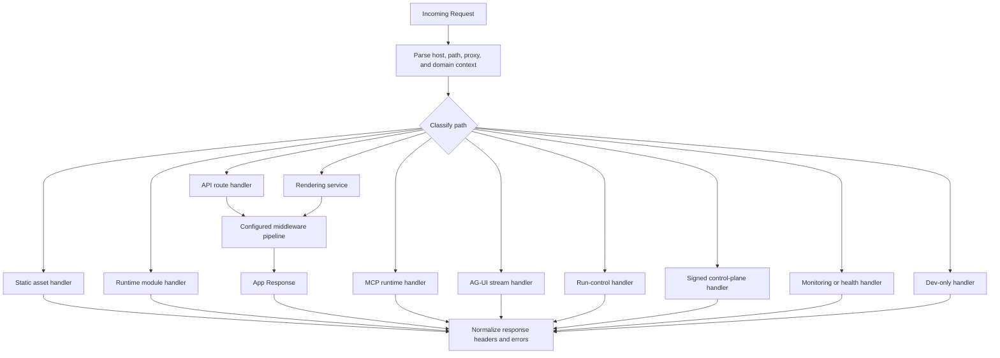

# Request pipeline

This page describes how an HTTP request reaches the right runtime handler. It
does not describe rendering internals, MCP JSON-RPC dispatch, AG-UI chunk
encoding, or build output generation.

## Responsibility

The request pipeline classifies incoming requests, applies the appropriate
middleware and handler path, and returns a normalized `Response`.

Primary source areas:

- [`src/server/handlers/`](../../src/server/handlers/)
- [`src/server/handlers/request/`](../../src/server/handlers/request/)
- [`src/server/handlers/dev/`](../../src/server/handlers/dev/)
- [`src/routing/`](../../src/routing/)
- [`src/middleware/`](../../src/middleware/)

## Request classes

| Request class         | Handler ownership                            |
| --------------------- | -------------------------------------------- |
| Static assets         | Static file handlers                         |
| Runtime modules       | Module request handlers                      |
| API routes            | API route handlers and route resolver        |
| Page routes           | Rendering service entrypoints                |
| MCP endpoint          | MCP runtime handler                          |
| AG-UI endpoint        | Agent stream handlers                        |
| Run-control endpoint  | Agent run start, resume, and cancel handlers |
| Control-plane channel | Signed channel dispatch and invoke handlers  |
| Monitoring and health | Monitoring handlers                          |
| Dev-only endpoints    | Dev server and dashboard handlers            |

## Flow

```mermaid
flowchart TD
  request[Incoming Request] --> context[Parse host, path, proxy, and domain context]
  context --> classify{Classify path}
  classify --> assets[Static asset handler]
  classify --> modules[Runtime module handler]
  classify --> api[API route handler]
  classify --> page[Rendering service]
  classify --> mcp[MCP runtime handler]
  classify --> agui[AG-UI stream handler]
  classify --> runctl[Run-control handler]
  classify --> channel[Signed control-plane handler]
  classify --> health[Monitoring or health handler]
  classify --> dev[Dev-only handler]

  api --> middleware[Configured middleware pipeline]
  page --> middleware
  middleware --> appResponse[App Response]

  assets --> normalize[Normalize response headers and errors]
  modules --> normalize
  appResponse --> normalize
  mcp --> normalize
  agui --> normalize
  runctl --> normalize
  channel --> normalize
  health --> normalize
  dev --> normalize
```

1. The runtime server receives a `Request`.
2. Request helpers parse host, path, proxy, and domain context.
3. Routing helpers classify the request path.
4. Public app paths pass through the configured middleware pipeline.
5. Protocol and control-plane paths enter their dedicated handlers.
6. Response helpers normalize headers, CORS, errors, and not-found behavior.

## Runtime caches

### OAuth token cache

The standalone proxy uses a bounded, process-local LRU token cache by default.
Setting `CACHE_TYPE=redis` explicitly loads `@veryfront/ext-cache-redis` and
requires a valid `REDIS_URL`; a missing extension, missing URL, unsupported URL
scheme, unsafe key prefix, or malformed extension contract stops startup. The
proxy does not silently replace invalid Redis configuration with memory.
`REDIS_PREFIX`, when present, is limited to 256 visible ASCII characters and
cannot contain Redis glob metacharacters because the extension uses that prefix
to scope bulk deletion.

An operational Redis outage is different from invalid configuration. The
Redis-backed store is wrapped in a process-local memory fallback and a circuit
breaker. Three consecutive primary read failures open the circuit for 30
seconds; a failed mutation opens it immediately because stale writes and
invalidations are correctness-sensitive. Only one half-open health probe runs
at a time. Before Redis is trusted again, the proxy replays a bounded journal
of writes, deletes, and clears accumulated during the outage. Repeated journal
overflow escalates recovery to a Redis namespace clear and keeps at most 10,000
new mutations, so an extended outage cannot create unbounded process memory or
restore stale entries.

Mutations execute in call order so a slow, older Redis write cannot complete
after a newer write and roll the cache backward. At most 10,000 mutations may
wait for that ordering boundary; excess work is rejected instead of creating
an unbounded in-process queue.

Cache keys, entries, backend methods, and statistics are snapshotted and
validated at the proxy boundary. Already-expired writes behave as deletions.
Token values and cache keys are not attached to tracing spans. The fallback and
reconciliation journal are intentionally process-local: Redis is a performance
cache, not an authority for token validity, and every entry remains
expiry-bound.

### Project metadata caches

The proxy caches routing-only project metadata from the control plane. That
payload contains project identity, environments, domains, and active release
ids, but it does not contain `protected` flags or project members. Protection
state and project membership are fetched through a separate access metadata
lookup on every request, so protection toggles and membership changes stay
fresh while release routing avoids the full project relation query on warm
paths.

All three control-plane lookup shapes are validated before they enter request
state or the routing cache. Responses must be JSON, are limited to 512 KiB, and
must contain bounded project, environment, domain, release, and user
identifiers. Access metadata must make an explicit Boolean protection decision
for every environment. Lookups have a 10-second deadline and a shared
200-request concurrency ceiling. A `404` is the only response interpreted as
absence (and can trigger the legacy full-project fallback); authorization
failures refresh the service token once, while timeouts, capacity exhaustion,
other HTTP failures, and invalid payloads fail closed as gateway errors.

Default routing cache controls:

| Environment variable                        | Default | Allowed range |
| ------------------------------------------- | ------- | ------------- |
| `VERYFRONT_PROXY_ROUTING_CACHE_TTL_MS`      | `60000` | `0..86400000` |
| `VERYFRONT_PROXY_ROUTING_CACHE_MAX_ENTRIES` | `1000`  | `0..10000`    |

`0` disables routing-cache retention. Invalid or out-of-range values stop proxy
construction instead of silently selecting a different policy.

### Dedicated server routing

For each resolved environment, the standalone proxy asks the control plane
whether traffic belongs on a managed dedicated server before it selects a
shared renderer. Concurrent lookups for the same environment share one request.
Only an explicit `running` server with a canonical hostname becomes an upstream
origin; an explicit absence or inactive server selects the shared renderer.

Successful answers, including explicit absence, stay in a process-local LRU
cache for 30 seconds, with at most 10,000 environment entries. Transient
control-plane failures are not cached. Lookups have a five-second end-to-end
deadline, a shared limit of 200 in-flight requests, and a 64 KiB JSON response
limit. The API base URL, optional Basic credentials, response envelope, server
identifiers, status, and hostname are validated before use. Capacity exhaustion,
timeouts, invalid responses, and upstream errors select the shared renderer for
that request; malformed local environment identifiers are rejected.

Shutdown aborts outstanding lookups and generation-fences late responses so
they cannot repopulate the cache after the resolver closes.

After a deployment pointer commits, the control plane sends an authenticated,
project-scoped invalidation through the proxy-owned Redis bus. Every subscribed
proxy evicts the matching routing entries, refreshes the authoritative metadata,
and acknowledges only after observing the expected environment and release.
Generation fencing prevents an older in-flight lookup from repopulating the
cache. The TTL remains a recovery path when immediate fan-out cannot converge.

Release-backed production page-data requests use a fresh cache window plus a
bounded stale-while-revalidate window. The cache key includes the project,
environment, release content source, slug, and canonical query. The canonical
query uses the same `config.cache.queryParams` policy as HTML rendering, so
default tracking and cache-busting parameters do not fragment the cache.
Requests with cache-sensitive state are not cached. Preview branch page data
keeps the fresh TTL cache but does not serve stale responses after expiry.

Default page-data cache controls:

| Environment variable                    | Default   |
| --------------------------------------- | --------- |
| `VERYFRONT_PAGE_DATA_CACHE_TTL_MS`      | `60000`   |
| `VERYFRONT_PAGE_DATA_CACHE_STALE_MS`    | `1800000` |
| `VERYFRONT_PAGE_DATA_CACHE_MAX_ENTRIES` | `500`     |

Set `VERYFRONT_PAGE_DATA_CACHE_MAX_ENTRIES` to `0` to disable the page-data
endpoint cache.

Production HTML rendering also starts a bounded background prewarm after the
first cacheable request for a project release context. The prewarm discovers
concrete static routes, skips dynamic route patterns, validates each candidate
route resolves, uses canonical route cache keys without request cookies, query
strings, or nonces, and checks the shared render cache before rendering each
route. This populates the API-backed distributed render cache for sibling routes
without adding latency to the foreground response. API-backed render cache
writes complete before `CacheStore.set()` resolves so a render or prewarm fill
is visible to other pods before the cache fill is treated as done.

Default render prewarm controls:

| Environment variable                   | Default |
| -------------------------------------- | ------- |
| `VERYFRONT_RENDER_PREWARM_MAX_ROUTES`  | `12`    |
| `VERYFRONT_RENDER_PREWARM_CONCURRENCY` | `1`     |

Set `VERYFRONT_RENDER_PREWARM_MAX_ROUTES` to `0` to disable production render
prewarm.

## Boundaries

- Rendering details belong in [rendering runtime](./03-rendering-runtime.md).
- MCP dispatch belongs in [MCP runtime](./10-mcp-runtime.md).
- AG-UI stream encoding belongs in [AG-UI transport](./06-ag-ui-transport.md).
- `/api/runs*` run-control handlers are sibling runtime APIs, not child routes
  under `/api/ag-ui`.
- Control-plane signature handling belongs in
  [control-plane channels](./11-control-plane-channels.md).

## Change checks

- Add handler tests for any route classification or response shape change.
- Keep dev-only endpoints out of production request paths.
- Keep public app routes, protocol routes, and control-plane routes separate.

## Related guides

- [API routes](../guides/api-routes.md)
- [Middleware](../guides/middleware.md)
- [Pages and routing](../guides/pages-and-routing.md)

## Related reference

- [`veryfront/middleware`](../api-reference/veryfront/middleware.md)
- [`veryfront/router`](../api-reference/veryfront/router.md)
- [`veryfront/server`](../api-reference/veryfront/server.md)
