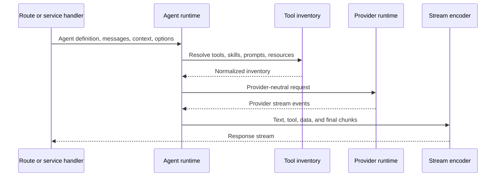

# Agent runtime

This page describes the agent execution boundary. It does not cover provider
selection, workflow execution, MCP transport, or hosted Studio transport.

## Responsibility

The agent runtime turns an agent definition, messages, tools, project context,
and runtime options into streamed model execution.

Primary source areas:

- [`src/agent/runtime/`](../../src/agent/runtime/)
- [`src/agent/factory.ts`](../../src/agent/factory.ts)
- [`src/agent/types.ts`](../../src/agent/types.ts)

## Runtime flow

1. Agent definitions declare instructions, model preferences, tools, and runtime
   behavior.
2. Runtime preparation normalizes messages, project files, skills, tool
   inventory, and provider options.
3. Provider compatibility logic converts tools and messages into the selected
   provider transport shape.
4. Streaming handlers emit text, tool events, data stream chunks, and final
   response state.
5. Runtime errors are converted to Veryfront error shapes before reaching public
   handlers.

## Boundaries

- Provider and model resolution belong in [provider runtime](./04-provider-runtime.md).
- Tool, prompt, and resource definitions belong in
  [AI primitives](./24-ai-primitives.md).
- Skill parsing and allowed-tool policy belong in
  [skill runtime](./25-skill-runtime.md).
- Browser AG-UI encoding belongs in [AG-UI transport](./10-ag-ui-transport.md).
- Hosted child-run behavior belongs in [hosted agent runs](./08-hosted-agent-runs.md).
- Workflow DAG execution belongs in [workflow runtime](./05-workflow-runtime.md).

## Change checks

- Keep tool inventory construction separate from provider transport adapters.
- Keep streamed runtime chunks separate from durable hosted run state.
- Add focused tests next to [`src/agent/runtime/`](../../src/agent/runtime/) when changing message
  normalization, tool conversion, streaming, or provider compatibility.
