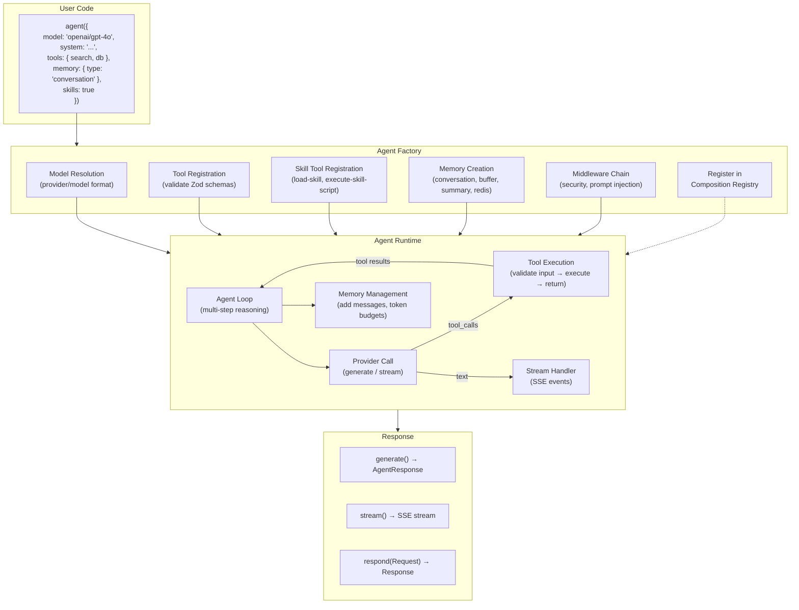
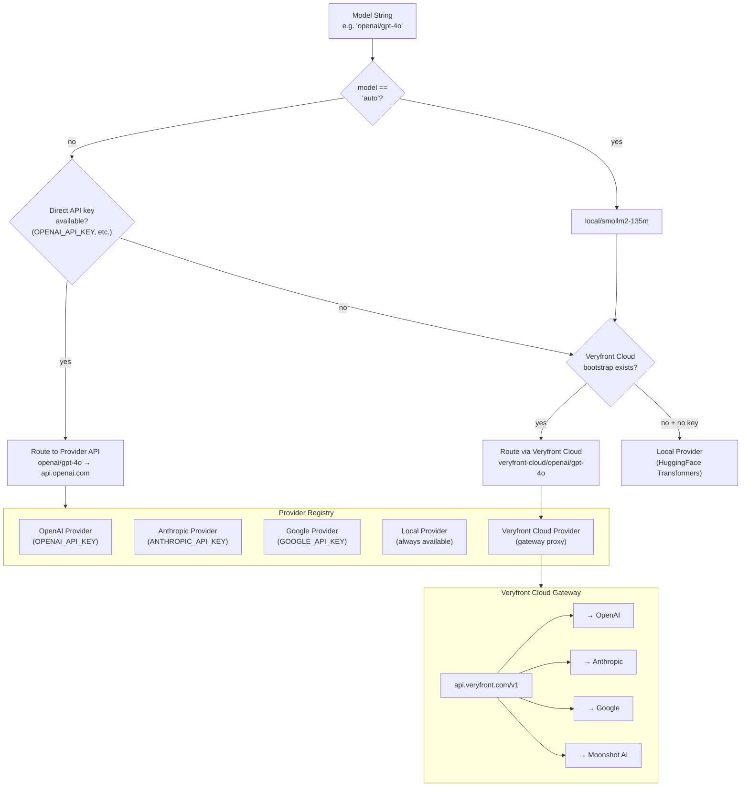
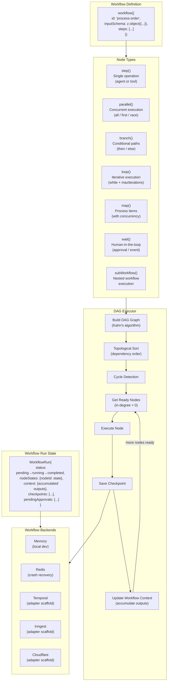
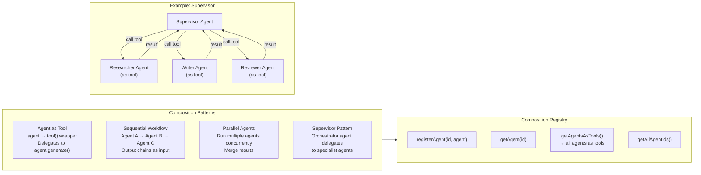
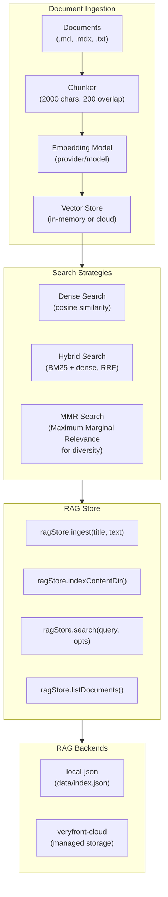

# AI Capabilities and Agent Runtime

## Agent Architecture Overview

Veryfront's AI capabilities include multi-step reasoning, streaming, memory, tool use, and multi-agent composition through a native agent runtime.

### Description

The agent lifecycle:

1. **Factory:** `agent()` resolves the model string (e.g., `"openai/gpt-4o"`), registers tools with Zod schema validation, sets up skill tools if enabled, creates the memory backend, configures security middleware (prompt injection detection is on by default), and registers the agent in the global composition registry.
2. **Runtime:** The agent loop sends messages to the model provider. When the provider returns tool calls, the runtime validates inputs against Zod schemas, executes tools, and feeds results back. This loop continues until the model returns text or hits the max step limit. Planned optimizations include parallel tool execution, cached model resolution, and fire-and-forget memory persistence (issues #885, #887, #888).
3. **Output:** Three consumption modes -- `generate()` for full responses, `stream()` for real-time SSE streaming, and `respond(Request)` for direct HTTP endpoint integration.

---

## Provider Resolution Chain

Model strings follow the `provider/model` format. The resolution chain determines which API endpoint handles each request.

### Description

Model resolution follows a prioritized chain:

1. **"auto"** resolves to the local default model (`local/smollm2-135m`).
2. **Cloud Upgrade for Local Models:** At runtime, local models upgrade to the first available cloud runtime. The current preference order is Veryfront Cloud first, then Anthropic, OpenAI, and Google when their direct credentials are available.
3. **Direct Provider Credentials:** If the caller explicitly selects a hosted provider model and direct provider credentials are configured (for example `OPENAI_API_KEY`), requests go directly to that provider API.
4. **Veryfront Cloud Proxy:** If direct hosted-provider credentials are absent but Veryfront Cloud bootstrap context exists, hosted-provider requests can route through the Veryfront Cloud gateway instead of forcing a different public API shape.
5. **Local Fallback:** If no cloud runtime is available, execution stays on the local provider.

The Veryfront Cloud provider uses `AsyncLocalStorage` for request-scoped credentials, enabling multi-tenant model access.

---

## Memory System

```mermaid
graph LR
    subgraph MemoryTypes["Memory Implementations"]
        ConvMem["ConversationMemory<br/>Full history with<br/>token/message limits"]
        BufferMem["BufferMemory<br/>Fixed-size circular buffer<br/>(last N messages)"]
        SummaryMem["SummaryMemory<br/>Summarizes old messages<br/>to stay within budget"]
        RedisMem["RedisMemory<br/>Persistent backend<br/>(survives restarts)"]
    end

    subgraph Interface["Memory Interface"]
        Add["add(message)"]
        Get["getMessages()"]
        Clear["clear()"]
        Stats["getStats()<br/>→ {totalMessages, estimatedTokens}"]
    end

    subgraph TokenBudget["Token Management"]
        Estimate["Estimate: ~4 chars/token"]
        MaxTokens["maxTokens limit"]
        MaxMessages["maxMessages limit"]
        Evict["Evict oldest messages<br/>when budget exceeded"]
    end

    Interface --> MemoryTypes
    MemoryTypes --> TokenBudget
```

### Description

Four memory implementations share a common interface:

- **ConversationMemory:** Keeps the full conversation history, evicting oldest messages when token or message limits are exceeded.
- **BufferMemory:** A fixed-size circular buffer that retains only the last N messages.
- **SummaryMemory:** When the conversation exceeds the token budget, older messages are summarized into a single summary message, preserving context while reducing tokens.
- **RedisMemory:** Persists messages in Redis, enabling memory that survives server restarts and can be shared across instances.

Token estimation uses a simple ~4 characters per token heuristic, which is effective for budget management without requiring a tokenizer.

---

## Workflow Engine

The workflow engine executes DAG-based workflows with support for parallel execution, branching, loops, human-in-the-loop approvals, and crash recovery.

### Description

The workflow engine:

1. **Definition:** Workflows are defined with `workflow()` using Zod schemas for input/output validation and an array of step nodes.
2. **Node Types:** Seven node types support different execution patterns -- single steps (calling agents or tools), parallel execution with configurable strategies (all/first/race), conditional branching, loops with max iteration guards, map for processing collections, wait for human approvals or external events, and sub-workflows for composition.
3. **DAG Executor:** Builds a directed acyclic graph from node definitions, performs topological sort using Kahn's algorithm, detects cycles, and executes nodes as their dependencies are satisfied. Nodes without explicit `dependsOn` declarations implicitly depend on the previous node in the array.
4. **Checkpointing:** After each node execution, a checkpoint is saved to the backend, enabling crash recovery. The workflow context accumulates outputs from each node, making them available to subsequent nodes.
5. **Backends:** `MemoryBackend` and `RedisBackend` are the implemented backends today. Temporal, Inngest, and Cloudflare appear in the architecture as adapter scaffolding and planned extension points, but they should not be treated as fully implemented production backends yet.

---

## Agent Composition

### Description

Multi-agent composition supports four patterns:

- **Agent as Tool:** Any agent can be wrapped as a tool via `agentAsTool()`, making it callable by other agents. The wrapper invokes `agent.generate()` and returns the text result.
- **Sequential Workflow:** A `createWorkflow()` function chains agents in sequence, with optional transform functions between steps and conditional skip logic.
- **Parallel Agents:** Multiple agents run concurrently with results merged.
- **Supervisor Pattern:** An orchestrator agent has specialist agents registered as tools and decides which to call based on the task.

The project-scoped composition registry tracks all agents and can export them as tools for cross-agent access.

---

## Embedding & RAG System

### Description

The embedding and RAG system:

- **Ingestion:** Documents are chunked (default 2000 chars with 200 char overlap), embedded via the configured model, and stored in a vector store.
- **Search Strategies:** Three strategies -- dense (cosine similarity), hybrid (BM25 + dense with reciprocal rank fusion), and MMR (maximum marginal relevance for diverse results).
- **RAG Store:** High-level API for document ingestion, directory indexing, search, and document management. Supports `local-json` backend (file-based) and `veryfront-cloud` (managed storage).
