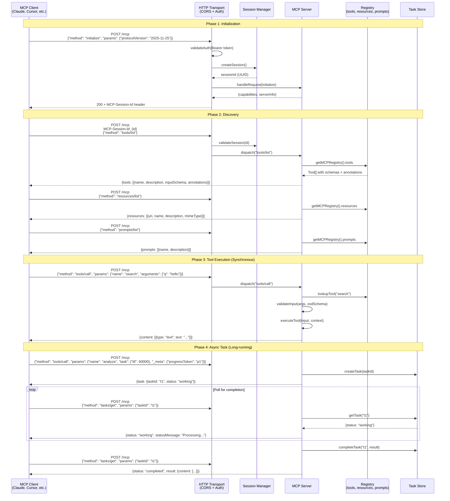
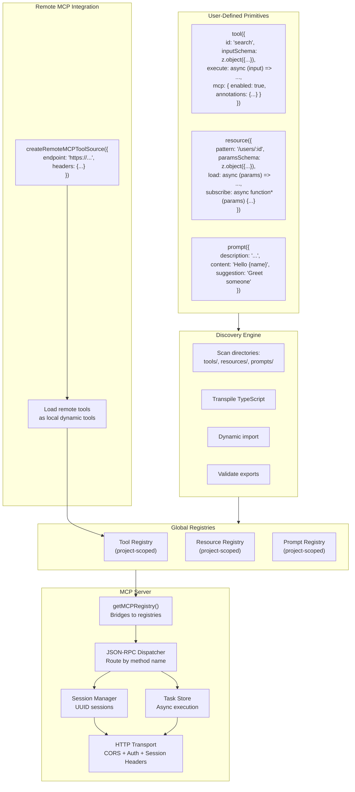
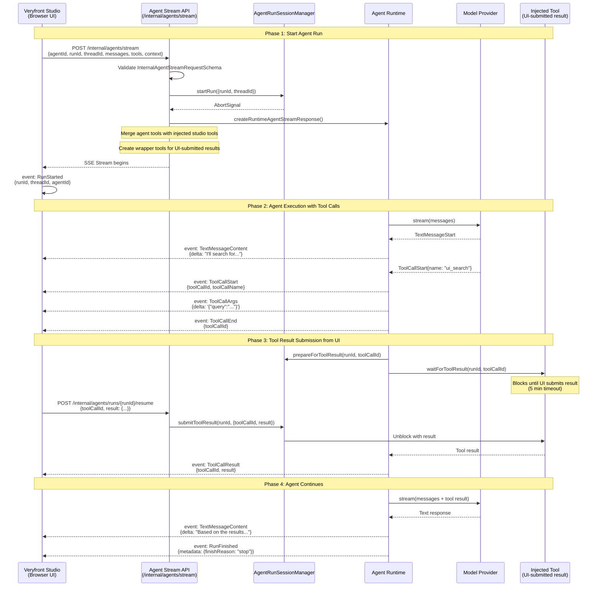
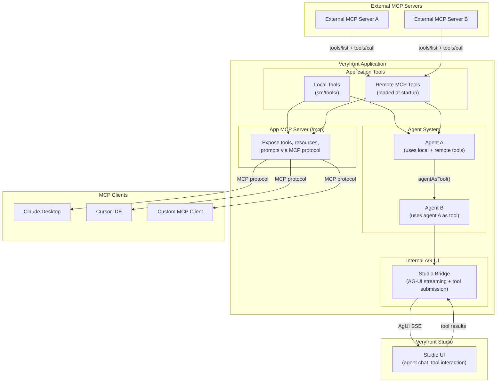

# MCP Server and Internal AG-UI Transport

Veryfront has two distinct integration surfaces in this area:

1. **App MCP Server** -- Lets user applications expose tools, resources, and prompts to any MCP client (Claude, Cursor, etc.)
2. **Internal AG-UI Transport** -- A separate Studio/internal-agent transport for AG-UI streaming and run control. This is not a second MCP server.

---

## App MCP Server

The App MCP server exposes user-defined tools, resources, and prompts via the MCP protocol (JSON-RPC 2.0 over HTTP).

### Description

The App MCP server implements the MCP protocol (versions 2025-11-25 and 2024-11-05):

1. **Initialization:** The client sends an `initialize` request. The server creates a session (UUID), exchanges capabilities, and returns the session ID as an `MCP-Session-Id` header.
2. **Discovery:** The client lists available tools, resources, and prompts. Tools include JSON Schema input definitions and MCP annotations (`readOnlyHint`, `destructiveHint`, `idempotentHint`, `openWorldHint`).
3. **Synchronous Execution:** For fast tools, the server validates input against the Zod schema, executes the tool, and returns the result immediately.
4. **Async Tasks:** For long-running tools, the caller opts into task mode by including a `task` object. The server creates a task and returns a task ID. The client polls `tasks/get` for status and `tasks/result` for output until the task reaches a terminal state (`completed`, `failed`, `cancelled`). Tasks have a max capacity of 1000, with TTL-based cleanup of terminal tasks.

Key features:

- **Auth:** Bearer token validation on every request
- **CORS:** Origin allowlisting with configurable headers
- **Session Management:** UUID-based sessions with capability tracking
- **Tool Annotations:** MCP 2025-11-25 annotations hint at tool behavior for clients
- **Progress Tokens:** Per-tool progress reporting via `progressToken` in context
- **Request Size Limit:** 1 MB max request body
- **Additional Methods:** `resources/templates/list` for resource template discovery, `completion/complete` for argument autocompletion, `logging/setLevel` for dynamic log level control, and `notifications/initialized` / `notifications/cancelled` for lifecycle events

---

## App MCP Component Architecture

### Description

The MCP server architecture connects user-defined primitives to MCP clients through a discovery-registration-exposure pipeline:

- **User-Defined Primitives:** Developers create tools, resources, and prompts using factory functions with Zod schemas. Tools can opt into MCP exposure with annotations.
- **Discovery Engine:** At startup, the discovery engine scans convention-based directories, transpiles TypeScript, dynamically imports modules, and validates exports.
- **Registries:** Validated primitives are registered in project-scoped registries (tool, resource, prompt).
- **MCP Server:** The `getMCPRegistry()` function bridges to the underlying registries. The JSON-RPC dispatcher routes method calls to the appropriate handler. Sessions track per-client state. The task store manages async tool executions.
- **Remote MCP Integration:** `createRemoteMCPToolSource()` connects to external MCP servers via HTTP POST with JSON-RPC payloads. Remote tools are loaded as local dynamic tools, enabling MCP-to-MCP chaining.

---

## Internal AG-UI Transport (Studio / Internal Agents)

The Studio/internal-agent transport is a Veryfront-specific AG-UI wrapper around the public `veryfront/agent` AG-UI handlers. It powers the Studio UI with real-time agent execution, tool result submission from the UI, and AG-UI streaming, but it should not be described as a second MCP server.

### Description

The internal AG-UI transport bridges AI agents with the Studio UI:

1. **Start Run:** The Studio sends a signed POST request to the internal compatibility wrapper with the agent ID, message history, injected tool definitions, and context. The `AgentRunSessionManager` creates a run with an abort signal.
2. **Injected Tool Pattern:** The Studio passes tool definitions (name, schema) that the agent can call. The system creates wrapper tools that, when called by the agent, block execution and wait for the Studio to submit tool results. This enables human-in-the-loop tool execution where the UI handles the actual tool interaction.
3. **Tool Result Submission:** When the agent calls an injected tool, the run pauses (up to 5 minutes). The Studio submits the tool result via `/internal/agents/runs/:runId/resume`. The wrapper tool unblocks and returns the result to the agent.
4. **AG-UI Streaming:** All events are streamed as SSE in the AG-UI wire format (`RunStarted`, `TextMessageContent`, `ToolCallStart`, `ToolCallArgs`, `ToolCallEnd`, `ToolCallResult`, `RunFinished`).
5. **Contract Boundary:** The internal `/internal/agents/*` routes are compatibility/control-plane wrappers. The canonical package-level AG-UI handlers live under `veryfront/agent` and are designed around host-configurable endpoints such as `/api/ag-ui`. Hosted services should use the framework prepared-execution helpers to stream prepared chat runs to AG-UI responses or finish detached durable runs instead of reimplementing that lifecycle locally.

Session states: `active` → `waiting` (for tool result) → `completed` / `failed` / `cancelled`. Default session TTL is 15 minutes.

---

## AgUI Wire Protocol

```mermaid
flowchart LR
    subgraph AgentRuntime["Agent Runtime Events"]
        RTStart["RunStarted"]
        RTTextStart["TextMessageStart"]
        RTTextContent["TextMessageContent"]
        RTTextEnd["TextMessageEnd"]
        RTToolStart["ToolCallStart"]
        RTToolArgs["ToolCallArgs"]
        RTToolEnd["ToolCallEnd"]
        RTToolResult["ToolCallResult"]
        RTFinish["RunFinished"]
    end

    subgraph Encoder["AgUI Browser Encoder"]
        Transform["Transform runtime events<br/>→ AgUI wire events"]
    end

    subgraph SSE["SSE Wire Format"]
        SSEFrame["event: {EventType}<br/>data: {JSON payload}"]
    end

    subgraph Decoder["AgUI Chat Event Decoder"]
        Parse["Parse SSE frames"]
        ValidateJSON["Validate JSON-RPC"]
        ConvertChat["Convert to ChatStreamEvent[]"]
        MergeTools["Merge tool call args<br/>(streaming accumulation)"]
    end

    subgraph ChatEvents["Chat Stream Events"]
        CStart["start"]
        CTextDelta["text-delta"]
        CToolInputStart["tool-input-start"]
        CToolInputDelta["tool-input-delta"]
        CToolOutputAvail["tool-output-available"]
        CFinish["finish"]
    end

    AgentRuntime --> Encoder
    Encoder --> SSE
    SSE --> Decoder
    Decoder --> ChatEvents
```

### Description

The AgUI protocol transforms between internal agent runtime events and the client-facing chat stream format:

- **Agent Runtime → SSE:** The `AgUiBrowserEncoder` converts internal events to AgUI wire events, formatted as SSE frames (`event:` + `data:` lines).
- **SSE → Chat Events:** The client-side `AgUiChatEventDecoder` parses SSE frames, validates JSON payloads, converts wire events to `ChatStreamEvent` objects, and handles tool call argument merging (streaming accumulation with deduplication).

This dual-layer protocol keeps the internal agent runtime decoupled from the wire format while providing a consistent streaming experience.

---

## Integration Points

### Description

MCP integration flows in three directions:

1. **Inbound (External → App):** `createRemoteMCPToolSource()` connects to external MCP servers, loading their tools as local dynamic tools. These tools are available to agents and can be re-exposed through the App MCP server.
2. **Outbound (App → Clients):** The App MCP server exposes local and remote tools, resources, and prompts to any MCP client (Claude Desktop, Cursor, custom clients).
3. **Studio (App → UI):** A separate internal AG-UI transport bridges agents with the Studio UI. The Studio can inject tools, receive streaming responses, and submit tool results for human-in-the-loop execution without going through MCP.
