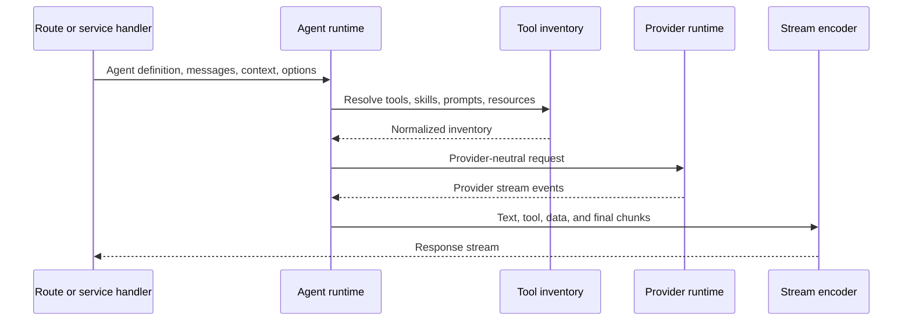
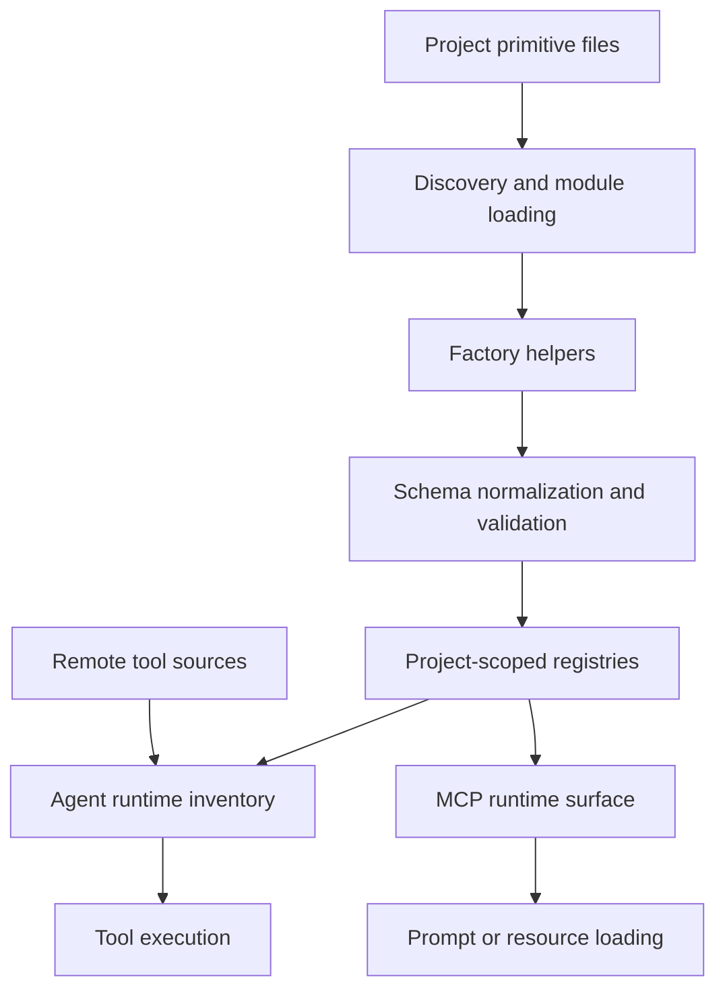
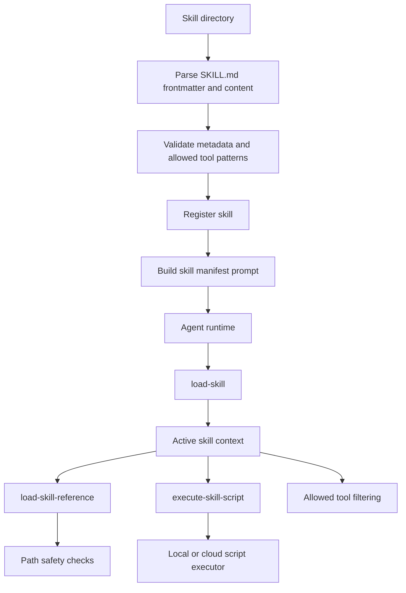

# Agent runtime

This page describes the agent execution boundary: agent definitions, message
preparation, tool inventory, streamed model execution, hosted run state, child
runs, and the AI primitives (tools, prompts, resources, skills) that agents
consume. It does not cover provider request transport, AG-UI browser encoding,
MCP JSON-RPC dispatch, or workflow DAG execution.

## Responsibility

The agent runtime turns an agent definition, messages, tools, project context,
and runtime options into streamed model execution. The hosted runtime extends
that execution into Veryfront-hosted conversation flows with durable run state
and child-run tools. Tool, prompt, resource, and skill code define the reusable
primitives the runtime executes and exposes.

Primary source areas:

- [`src/agent/runtime/`](../../src/agent/runtime/)
- [`src/agent/factory.ts`](../../src/agent/factory.ts)
- [`src/agent/types.ts`](../../src/agent/types.ts)
- [`src/agent/hosted/`](../../src/agent/hosted/)
- [`src/agent/conversation/`](../../src/agent/conversation/)
- [`src/agent/child-run/`](../../src/agent/child-run/)
- [`src/agent/project/`](../../src/agent/project/)
- [`src/agent/artifacts/`](../../src/agent/artifacts/)
- [`src/tool/`](../../src/tool/)
- [`src/prompt/`](../../src/prompt/)
- [`src/resource/`](../../src/resource/)
- [`src/skill/`](../../src/skill/)

## Runtime flow

1. Agent definitions declare instructions, model preferences, tools, and runtime
   behavior.
2. Runtime preparation normalizes messages, project files, skills, tool
   inventory, and provider options.
3. Provider compatibility logic converts tools and messages into the selected
   provider transport shape.
4. Streaming handlers emit text, tool events, data stream chunks, and final
   response state.
5. Runtime errors are converted to Veryfront error shapes before reaching public
   handlers.

## Hosted runs

Hosted agent run code adapts agent runtime execution to Veryfront-hosted
conversation flows, project steering, child-run tools, durable mirrors,
terminal state, and cloud runtime services.

1. Hosted request parsing validates incoming chat, AG-UI, or runtime invocation
   input.
2. Runtime preparation resolves project steering, remote tool sources, MCP
   server configs, and cloud runtime instructions.
3. Hosted stream execution mirrors chunks into durable conversation state.
4. Child-run helpers create fork tools, invoke child agents, summarize results,
   and persist execution snapshots.
5. Lifecycle helpers finalize messages, terminal state, and trace attributes.

Hosted state is separate from provider-neutral agent runtime streaming.
Child-run tools are a hosted runtime feature, not a workflow DAG primitive.

## AI primitives

Tool, prompt, and resource code define reusable AI primitives, validate their
schemas, register project-scoped definitions, and adapt definitions for agent
and MCP runtime use.

1. Discovery imports project files and identifies tool, prompt, and resource
   exports.
2. Factory helpers normalize ids, schemas, execution functions, generated
   content, and resource loaders.
3. Registry facades store project-scoped primitives for runtime lookup.
4. The agent runtime consumes tool definitions and executes selected tools.
5. The MCP runtime can expose tools, prompts, and resources through protocol
   handlers; see [MCP runtime](./10-mcp-runtime.md).
6. Remote tool sources materialize project-scoped or MCP-backed tools without
   global registration.

## Skills

Skill code turns `SKILL.md` directories into agent-usable instruction packs
with metadata validation, optional reference files, optional executable
scripts, and tool restrictions.

1. Skill discovery reads `SKILL.md`, parses frontmatter, and validates metadata.
2. Registry helpers store project-scoped skills for lookup.
3. Prompt augmentation summarizes available skills for agent planning.
4. Built-in skill tools load instructions, read reference files, and execute
   scripts.
5. Allowed-tool policy filters callable tools while a skill is active.
6. Path-safety helpers reject traversal and symlink escapes before reading
   skill files.
7. Script execution selects local subprocess execution or cloud sandbox
   execution based on runtime credentials.

Skills provide instruction packs and tool policy. They are not workflows,
jobs, or local tool definitions. Skills are configured through project
discovery and `agent({ skills })`; there is no top-level `veryfront/skill`
import path in the current public export map.

## Boundaries

- Provider and model resolution belong in
  [provider runtime](./07-provider-runtime.md).
- Browser AG-UI encoding belongs in [AG-UI transport](./06-ag-ui-transport.md).
- Control-plane transport routing belongs in
  [control-plane channels](./11-control-plane-channels.md).
- MCP transport and protocol response shapes belong in
  [MCP runtime](./10-mcp-runtime.md).
- Workflow DAG execution belongs in [workflow runtime](./08-workflow-runtime.md).
- Sandbox session and shell-tool execution belong in
  [sandbox runtime](./17-sandbox-runtime.md).
- Skill discovery paths are part of
  [discovery and registries](./16-discovery-and-registries.md).

## Change checks

- Keep tool inventory construction separate from provider transport adapters.
- Keep streamed runtime chunks separate from durable hosted run state.
- Treat provider body-read transport failures as non-fatal only after hosted
  finalization has durable assistant output; empty output and semantic provider
  errors remain terminal failures.
- Add focused tests next to [`src/agent/runtime/`](../../src/agent/runtime/) when
  changing message normalization, tool conversion, streaming, or provider
  compatibility.
- Add tests for durable mirror behavior when changing run event normalization.
- Keep child-run result snapshots stable when changing child fork execution.
- Redact project and user data in hosted logs and thrown errors.
- Add factory and registry tests when changing primitive shape, id generation,
  schema normalization, or project scoping.
- Add executor tests when changing tool context, errors, result markers, or
  tracing.
- Add remote-source tests when changing remote tool filtering, materialization,
  or project id hydration.
- Add prompt and resource tests when changing interpolation, loader behavior,
  params validation, or registry lookup.
- Add skill parser tests when changing frontmatter shape, validation, defaults,
  or metadata limits.
- Add allowed-tool tests when changing exact-match or prefix-match policy.
- Add path-safety tests when changing reference, asset, or script file access.
- Add skill executor tests when changing local execution, cloud execution,
  timeout handling, or environment forwarding.

## Related guides

- [Agents](../guides/agents.md)
- [Tools](../guides/tools.md)
- [Skills](../guides/skills.md)
- [Multi-agent](../guides/multi-agent.md)
- [Memory and streaming](../guides/memory-and-streaming.md)

## Related reference

- [`veryfront/agent`](../api-reference/veryfront/agent.md)
- [`veryfront/agent/tooling`](../api-reference/veryfront/agent.md)
- [`veryfront/agent/hosted-lifecycle`](../api-reference/veryfront/agent.md)
- [`veryfront/agent/conversation-control-plane`](../api-reference/veryfront/agent.md)
- [`veryfront/agent/runtime/ag-ui`](../api-reference/veryfront/agent.md)
- [`veryfront/tool`](../api-reference/veryfront/tool.md)
- [`veryfront/prompt`](../api-reference/veryfront/prompt.md)
- [`veryfront/resource`](../api-reference/veryfront/resource.md)
