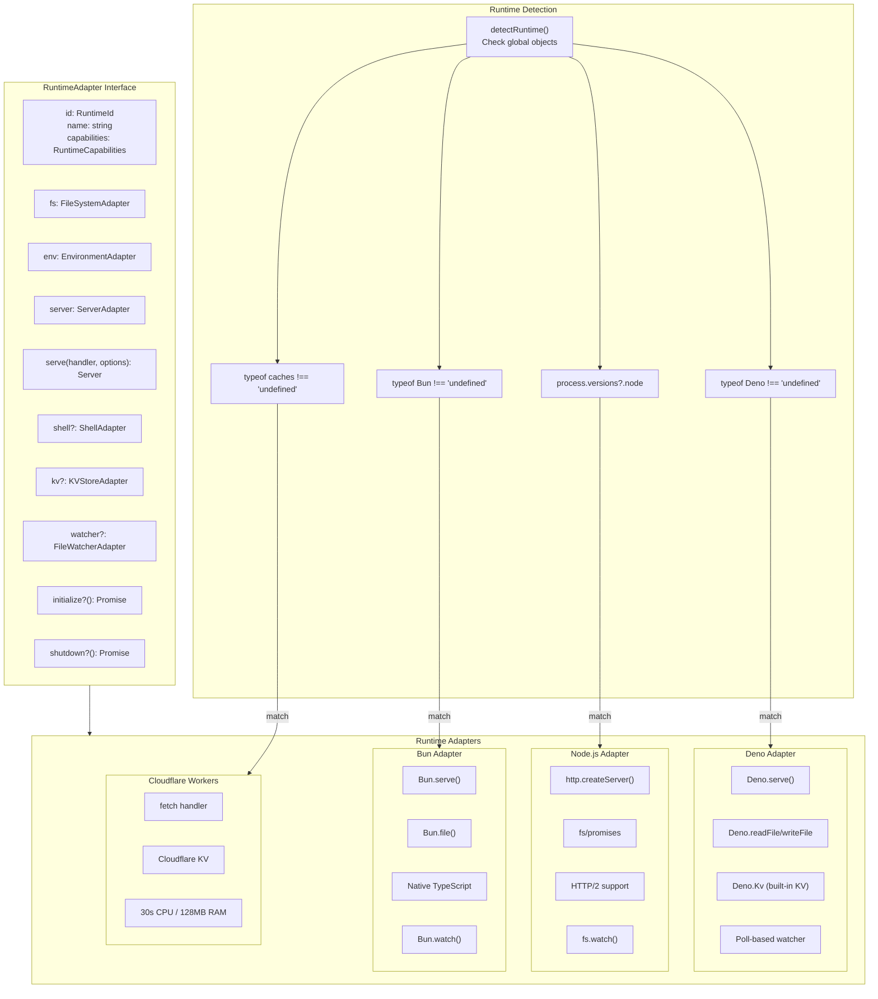
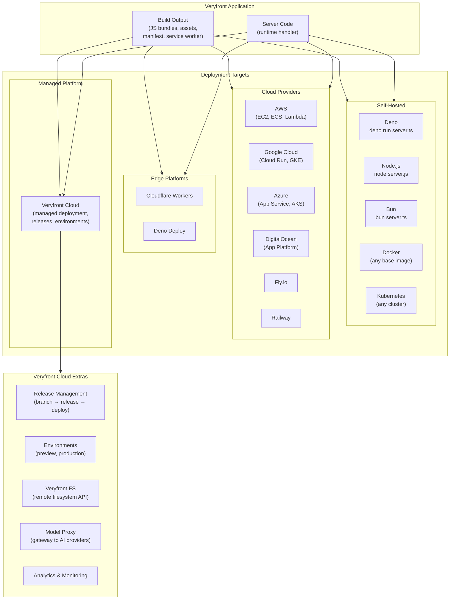
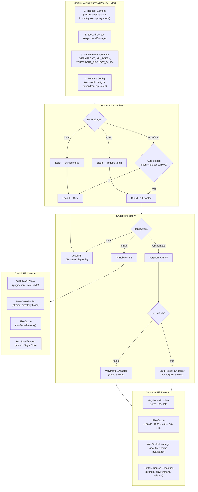
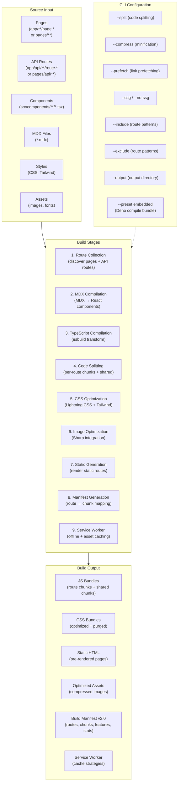
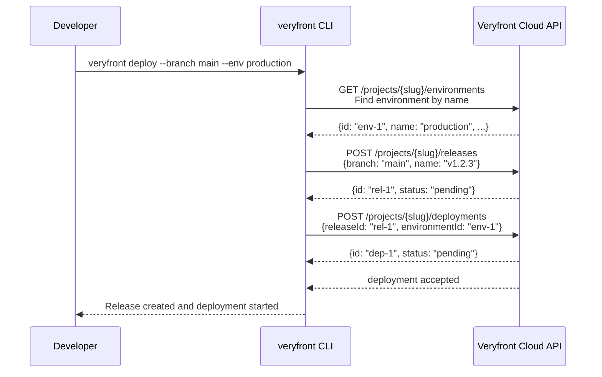
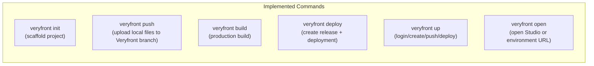

# Deployment Platform Architecture

`veryfront-code` is the open core of the Veryfront platform. Veryfront Cloud is the primary managed deployment path, and the same runtime can also be self-hosted or deployed to other cloud environments. The runtime adapter pattern abstracts away platform differences, and the build system produces portable deployment artifacts.

---

## Runtime Adapter Architecture

### Runtime Capabilities

| Capability   | Deno | Node | Bun | Cloudflare Workers |
|--------------|------|------|-----|--------------------|
| TypeScript   | yes (1) | no | yes | no |
| HTTP/2       | no   | yes  | no  | no |
| WebSocket    | yes  | yes  | yes | yes |
| File Watch   | yes (2) | yes | yes | no |
| Shell        | yes  | yes  | yes | no |
| KV Store     | yes  | no   | no  | yes |
| Writable FS  | yes  | yes  | yes | no |

1. Deno supports TypeScript natively. Veryfront still relies on esbuild for framework transforms and bundling.
2. Deno uses poll-based file watching (manual snapshot diffing) due to platform limitations.

### Description

The `RuntimeAdapter` interface is the core abstraction that makes veryfront deployable to any environment:

- **Detection:** `detectRuntime()` checks for runtime-specific globals to determine the current platform.
- **Singleton Registry:** `AdapterRegistry` ensures exactly one adapter instance per process. Lazy loading prevents importing runtime-specific code on other platforms.
- **Capabilities:** Each adapter declares its capabilities. The framework adjusts behavior based on available features (e.g., poll-based file watching on Deno, no filesystem on Cloudflare Workers).
- **Unified Interface:** All adapters expose the same `serve(handler, options)` method that accepts a standard `Request => Response` handler. This means the same application code runs on any runtime.

---

## Deployment Targets

### Description

Veryfront produces standard deployment artifacts that work across managed and self-hosted environments:

- **Veryfront Cloud:** The primary managed deployment path. It adds release management (branch → release → deploy), preview/production environments, a remote filesystem API, AI model proxy gateway, and platform operations on top of the open-core runtime.
- **Self-Hosted:** Run directly with `deno run`, `node`, or `bun`. Package in Docker containers for any container orchestration platform (Kubernetes, Docker Compose, etc.).
- **Other Cloud Providers:** Use the same build/runtime outputs on cloud providers that run containers or Node.js/Deno/Bun applications -- AWS (EC2, ECS, Lambda), Google Cloud (Cloud Run, GKE), Azure (App Service, AKS), DigitalOcean, Fly.io, Railway, etc.
- **Edge Platforms:** Deploy to Cloudflare Workers or Deno Deploy for edge execution with the Cloudflare adapter when that runtime model fits.

The intent is straightforward: Veryfront Cloud is the primary managed path, but the open core stays portable and avoids deployment lock-in.

---

## Virtual Filesystem Resolution

The filesystem abstraction allows reading project files from multiple sources, enabling both local development and cloud-hosted projects.

### Description

Filesystem resolution follows a layered decision process:

1. **Configuration Priority:** Request context (for multi-project proxy mode) > scoped context (AsyncLocalStorage) > environment variables > runtime config.
2. **Cloud Enable Decision:** The `serviceLayer` setting determines the mode -- `"local"` bypasses cloud entirely, `"cloud"` requires an API token, and auto-detect enables cloud when both a token and project context are present.
3. **Adapter Selection:** Three adapter types -- local filesystem (direct runtime access), Veryfront API (remote project files), and GitHub API (repository files).
4. **Veryfront FS:** Uses an API client with retry/backoff, a file cache (100MB, 1000 entries, 60s TTL), WebSocket-based real-time cache invalidation, and content source resolution (read from a specific branch, environment, or release).
5. **GitHub FS:** Uses the GitHub API with pagination and rate limit handling, tree-based indexing for efficient directory listing, and ref specification for reading specific branches/tags.
6. **Multi-Project Mode:** The `MultiProjectFSAdapter` supports per-request project scoping via `runWithContext()`, enabling a single server to serve multiple projects (proxy mode).

---

## Build Pipeline

### Description

The build pipeline transforms source code into production-ready artifacts:

1. **Route Collection:** Discovers page routes and API routes from both supported router modes. The active mode is controlled by `veryfront.config.ts` (`router: "app" | "pages"`), with fallback behavior when only one directory is present.
2. **MDX Compilation:** Transforms MDX files into React components with plugin support and frontmatter extraction.
3. **TypeScript Compilation:** Uses esbuild for fast TypeScript/JSX compilation.
4. **Code Splitting:** Generates per-route chunks and shared chunks for optimal loading. Tree shaking removes unused code.
5. **CSS Optimization:** Lightning CSS for minification and autoprefixing. Tailwind CSS processing with purging.
6. **Image Optimization:** Sharp integration for image compression and format conversion.
7. **Static Generation:** Pre-renders routes that use `getStaticPaths()` into static HTML.
8. **Manifest Generation:** Produces a `BuildManifest` (v2.0) mapping routes to their chunks, enabling the client runtime to load only the code needed for each page.
9. **Service Worker:** Generates a service worker for offline support and asset caching.

The `--preset embedded` flag produces a Deno-compiled bundle with all dependencies included.

---

## Veryfront Cloud Release and Deployment Flow

When deploying to Veryfront Cloud, the current CLI flow is release-and-deploy orchestration against the Veryfront API:

### Description

The current CLI-managed flow is:

1. **Resolve Environment:** `veryfront deploy` looks up the named environment through `/projects/{slug}/environments`.
2. **Create Release:** The CLI creates a release from the requested branch through `/projects/{slug}/releases`.
3. **Create Deployment:** The CLI creates a deployment linking that release to the target environment through `/projects/{slug}/deployments`.

After that, the platform continues the managed deployment workflow. The current CLI implementation does not document or expose a full build-status polling loop in this command, so this architecture page should stay grounded on the API interactions it actually performs.

For other cloud providers, developers use the standard build output with their preferred deployment tools.

---

## Current Deployment CLI Surfaces

The current deployment-related CLI surface is:

### Description

These commands are implemented today and are the ones this documentation should treat as current:

- **`veryfront init`:** Scaffold a project locally and optionally connect it to Veryfront.
- **`veryfront push`:** Upload local files to a Veryfront branch and share preview work.
- **`veryfront build`:** Produce the portable production build output.
- **`veryfront deploy`:** Create a release from a branch and deploy it to a named environment.
- **`veryfront up`:** Run the higher-level login/create/push/deploy flow.
- **`veryfront open`:** Open Studio or a project environment URL in the browser.

Operational commands such as environment-variable management, rollback, or deployment-log streaming should not be documented here as current CLI surfaces unless they are actually implemented.
