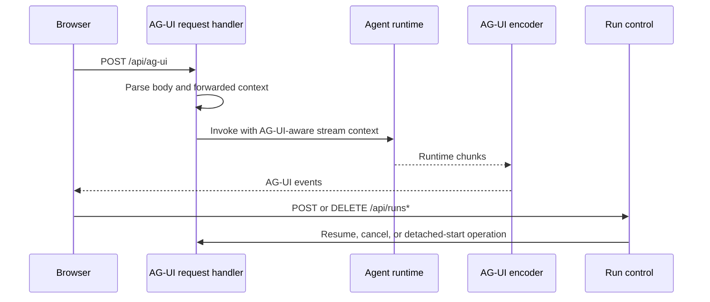

# AG-UI transport

This page describes AG-UI request parsing, browser response encoding, and chunk
bridging. It does not cover MCP, provider-specific SSE parsing, or
conversation-scoped run lineage APIs.

## Responsibility

AG-UI transport adapts agent runtime events to browser-facing AG-UI streams.
The browser-facing transport convention is `POST /api/ag-ui`. Durable run
command and control uses sibling `/api/runs*` routes. Signed project-runtime
invocation uses `/api/control-plane/agents/*`.

Primary source areas:

- [`src/agent/ag-ui/`](../../src/agent/ag-ui/)
- [`src/server/handlers/request/agent-stream.handler.ts`](../../src/server/handlers/request/agent-stream.handler.ts)
- [`src/server/handlers/request/agent-run-resume.handler.ts`](../../src/server/handlers/request/agent-run-resume.handler.ts)
- [`src/server/handlers/request/agent-run-cancel.handler.ts`](../../src/server/handlers/request/agent-run-cancel.handler.ts)
- [`src/agent/service/routes.ts`](../../src/agent/service/routes.ts)

## Runtime flow

1. Request handlers parse AG-UI request bodies and forwarded context.
2. Tool merging combines request tools, agent tools, and session-managed tools.
3. Runtime support invokes the agent runtime with AG-UI-aware stream context.
4. Encoders convert runtime chunks into browser AG-UI events.
5. Run control handlers support resume, detached start, and cancellation flows.

## Boundaries

- AG-UI is the agent UI event stream. It is not MCP JSON-RPC.
- Provider SSE parsing happens before AG-UI encoding.
- `/api/runs*` is a sibling lifecycle surface, not a nested AG-UI endpoint.
- Conversation-scoped runs are Veryfront API lineage and replay records, not
  package-hosted AG-UI transport endpoints.
- Hosted durable mirrors consume AG-UI-adjacent state but are documented in
  [agent runtime](./05-agent-runtime.md).

## Change checks

- Add tests for chunk encoding, finalization, resume, cancellation, and forwarded
  context changes.
- Keep AG-UI event names and payload shapes compatible with browser clients.

## Related guides

- [Agent service runtime](../guides/agent-service-runtime.md)
- [Memory and streaming](../guides/memory-and-streaming.md)

## Related reference

- [`veryfront/agent/runtime/ag-ui`](../reference/veryfront/agent.md)
- [`veryfront/agent/service-runtime`](../reference/veryfront/agent.md)
