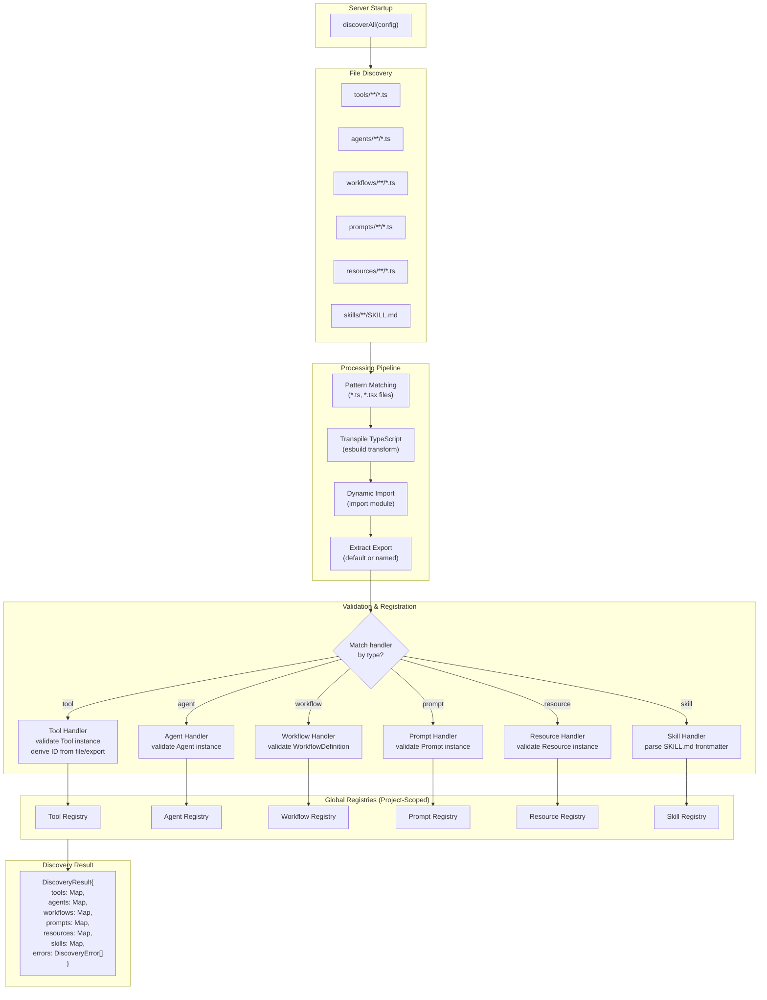
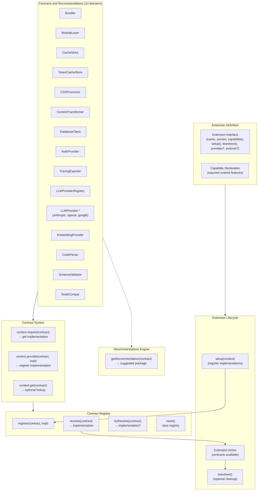
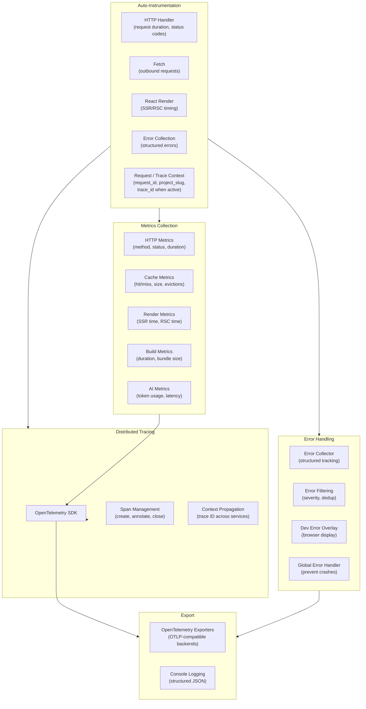
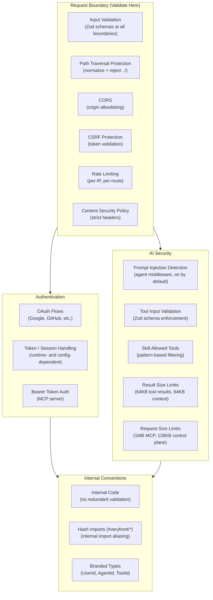
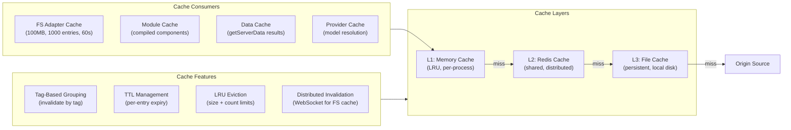

# Discovery, Extensions & Observability

## Discovery Engine

The discovery engine automatically finds, validates, and registers AI primitives (tools, agents, workflows, prompts, resources, skills) at server startup.

### Description

The discovery engine follows a convention-over-configuration approach:

1. **Scan:** Each primitive type has a convention-based directory (`tools/`, `agents/`, `workflows/`, etc.). Files matching `**/*.ts` and `**/*.tsx` are collected. Note: test files in discovery directories will be imported -- place tests outside these directories or use separate test directories.
2. **Process:** TypeScript files are transpiled via esbuild, dynamically imported, and their exports (default or named) are extracted.
3. **Validate:** Each handler validates that the export is a valid instance of its type (e.g., a `Tool` with an `execute` function and `inputSchema`). IDs are derived from the handler's `getId()` method or fall back to the export/file name.
4. **Register:** Valid primitives are registered in project-scoped registries. Registration makes them available to agents, the MCP server, and the workflow engine.
5. **Error Handling:** Discovery is fault-tolerant -- individual file failures (syntax errors, validation failures) are collected as `DiscoveryError` entries but don't block other files from loading.

The result is a `DiscoveryResult` containing Maps of all discovered primitives and any errors encountered.

---

## Extension System

The extension system is a lightweight contract-based runtime for wiring optional capabilities into `veryfront-code`.

### Description

The extension system currently provides:

- **Extension Definitions:** An extension declares `name`, `version`, `capabilities`, and optional `setup()` / `teardown()` hooks, plus optional `provides` and `extends` fields.
- **Extension Context:** `ExtensionContext` exposes `get()`, `require()`, `provide()`, a config bag, and a logger so extensions can register implementations into the runtime.
- **Contract Registry:** The runtime registry is currently a small in-memory contract map with `register()`, `resolve()`, `tryResolve()`, and `reset()`.
- **Recommendations:** Some contract names map to recommended first-party extension packages via `getRecommendation()`, which is used to improve missing-contract errors.

Current first-party extension packages: `@veryfront/ext-zod` (SchemaValidator), `@veryfront/ext-llm-anthropic` (LLMProvider:anthropic), `@veryfront/ext-llm-google` (LLMProvider:google), `@veryfront/ext-llm-openai` (LLMProvider:openai), `@veryfront/ext-auth-jwt` (AuthProvider), `@veryfront/ext-bundler-esbuild` (Bundler + ModuleLexer), `@veryfront/ext-cache-redis` (TokenCacheStore), `@veryfront/ext-css-tailwind` (CSSProcessor), `@veryfront/ext-node-compatibility` (NodeCompat), `@veryfront/ext-parser-babel` (CodeParser), `@veryfront/ext-tracing-opentelemetry` (TracingExporter), `@veryfront/ext-transform-mdx` (ContentTransformer).

---

## Observability System

### Description

The observability system combines several source-backed pieces:

- **Tracing:** OpenTelemetry tracing utilities, OTLP setup, span helpers, and context propagation for HTTP/fetch/render flows.
- **Metrics:** OpenTelemetry metrics plus a simpler in-process metrics surface used by runtime handlers and monitoring endpoints such as `/_metrics`.
- **Auto-Instrumentation Helpers:** Wrappers exist for HTTP handlers, fetch, React render paths, and error handlers; they are opt-in helpers initialized through `initAutoInstrumentation()`.
- **Errors and Logs:** The repo includes a structured error collector, log buffering, and dev-facing error surfaces for debugging.

Request context propagation enriches logs with request and project context, and the trace bridge can add `trace_id` / `span_id` fields when OpenTelemetry tracing is active.

---

## Security Architecture

### Description

Security follows a boundary-based validation model:

- **Request Boundary:** All user input is validated at the system boundary using Zod schemas. Path traversal protection normalizes and rejects directory traversal attempts. CORS, CSRF, rate limiting, and CSP headers are enforced at the middleware level.
- **Authentication:** OAuth flows, CSRF support, and MCP Bearer-token authentication are part of the current security surface. Token/session storage details vary by runtime and deployment mode.
- **AI Security:** Prompt injection detection runs as agent middleware by default. Tool inputs are validated against Zod schemas before execution. Skills can restrict which tools are available via pattern-based filtering. Request size limits include 1MB for MCP and 128KB for the internal agent control plane.
- **Internal:** Inside the trust boundary, internal code relies on framework guarantees without redundant validation. Hash imports (`#veryfront/*`) are an internal aliasing convention, and branded types provide compile-time ID discrimination.

---

## Cache System

### Description

The multi-layer cache system optimizes performance across all framework subsystems:

- **L1 (Memory):** In-process LRU cache for hot data. Fastest but limited to the process lifetime.
- **L2 (Redis):** Shared cache across processes/instances. Enables cache coherency in multi-instance deployments.
- **L3 (File):** Persistent file-based cache on local disk. Survives process restarts.

Features include tag-based grouping (invalidate all entries with a given tag), per-entry TTL, LRU eviction with configurable size and count limits, and distributed invalidation via WebSocket for the filesystem cache.

Major consumers: the FS adapter (100MB, 1000 entries, 60s TTL for remote files), the module cache (compiled components), the data cache (`getServerData` results), and the provider cache (model resolution).
