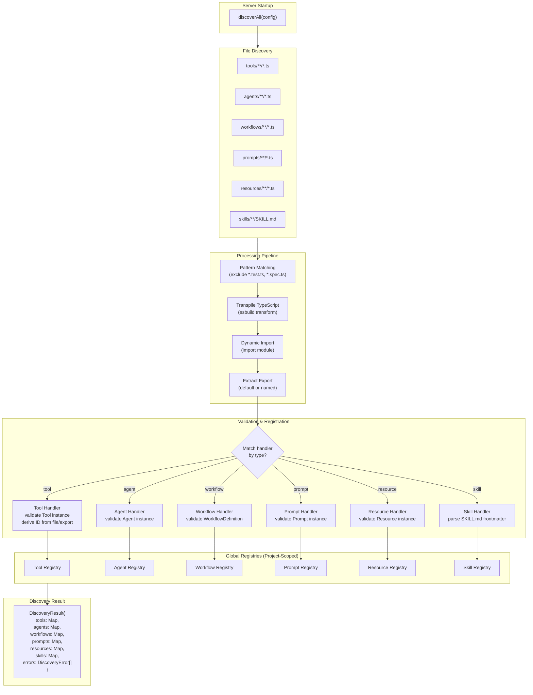
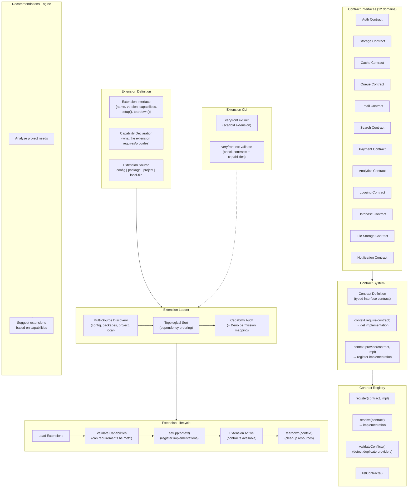
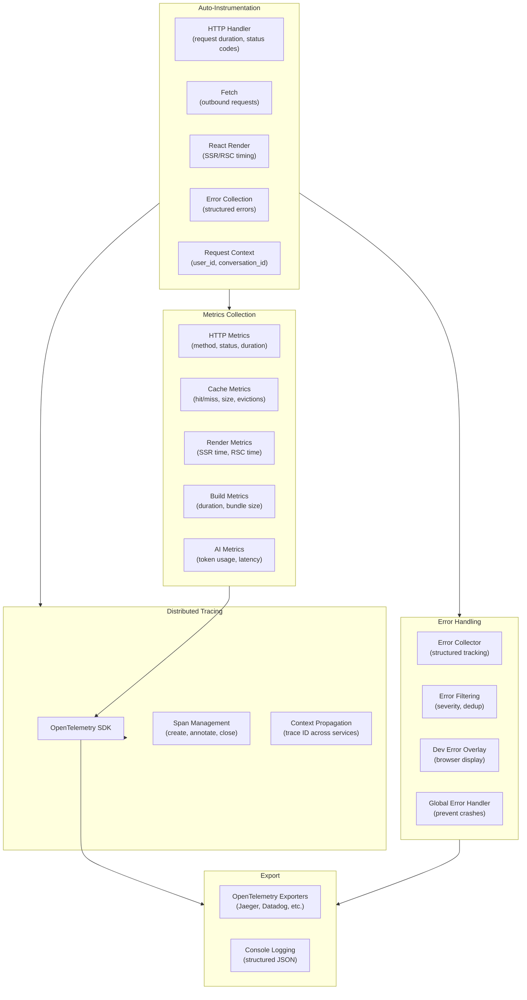
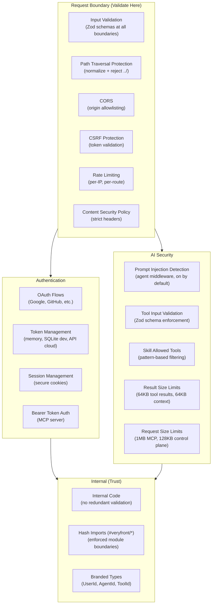
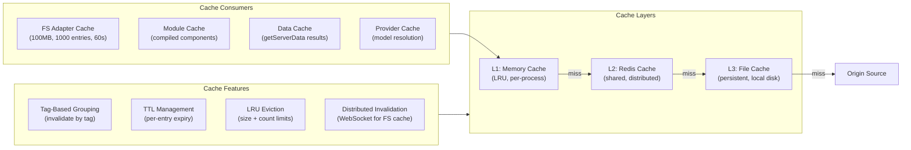

# Discovery, Extensions & Observability

## Discovery Engine

The discovery engine automatically finds, validates, and registers AI primitives (tools, agents, workflows, prompts, resources, skills) at server startup.

### Description

The discovery engine follows a convention-over-configuration approach:

1. **Scan:** Each primitive type has a convention-based directory (`tools/`, `agents/`, `workflows/`, etc.). Files matching `**/*.ts` are collected, excluding test files (`*.test.ts`, `*.spec.ts`).
2. **Process:** TypeScript files are transpiled via esbuild, dynamically imported, and their exports (default or named) are extracted.
3. **Validate:** Each handler validates that the export is a valid instance of its type (e.g., a `Tool` with an `execute` function and `inputSchema`). IDs are derived from the handler's `getId()` method or fall back to the export/file name.
4. **Register:** Valid primitives are registered in project-scoped registries. Registration makes them available to agents, the MCP server, and the workflow engine.
5. **Error Handling:** Discovery is fault-tolerant -- individual file failures (syntax errors, validation failures) are collected as `DiscoveryError` entries but don't block other files from loading.

The result is a `DiscoveryResult` containing Maps of all discovered primitives and any errors encountered.

---

## Extension System

The extension system provides a contract-based dependency injection pattern for extending veryfront with additional capabilities.

### Description

The extension system:

- **Extensions** declare a name, version, required capabilities, and `setup()`/`teardown()` lifecycle hooks. They can be loaded from configuration files, npm packages, the project directory, or local files.
- **12 Contract Interfaces** cover the major integration domains: auth, storage, cache, queue, email, search, payment, analytics, logging, database, file storage, and notifications. Each contract is a typed interface that decouples providers from consumers (see PRs #1028, #1008).
- **Contract Registry** manages the mapping from contracts to implementations, with conflict detection for duplicate providers. It supports listing all registered contracts and resolving implementations at runtime.
- **Extension Loader** discovers extensions from multiple sources (config, packages, project, local files), topologically sorts them by dependency order, and audits capabilities against Deno permissions (see PRs #1031, #1035, #1029, #1030).
- **Lifecycle:** Extensions are loaded, capabilities are validated (can all requirements be satisfied?), then `setup()` is called with the `ExtensionContext` for registration. On shutdown, `teardown()` handles cleanup.
- **Extension CLI:** `veryfront ext init` scaffolds a new extension; `veryfront ext validate` checks contracts and capabilities (see PR #1034).
- **Recommendations:** The recommendations engine analyzes the project's needs and suggests relevant extensions based on capability gaps.

---

## Observability System

### Description

The observability system provides three pillars:

- **Distributed Tracing:** OpenTelemetry integration with span management and context propagation across services. Traces capture the full request lifecycle from HTTP entry to rendering to external API calls.
- **Metrics:** Automatic collection of HTTP metrics (request count, duration, status), cache metrics (hit rate, size, evictions), render metrics (SSR/RSC timing), build metrics (duration, bundle sizes), and AI metrics (token usage, provider latency).
- **Error Handling:** A structured error collector with severity-based filtering and deduplication. In development, errors are displayed via a browser overlay. In production, a global error handler prevents process crashes from non-fatal errors while allowing fatal errors (stack overflow, out of memory) to trigger container restarts.

Auto-instrumentation wraps HTTP handlers, fetch calls, React renders, and error boundaries without requiring manual code changes. Request context propagation attaches `user_id` and `conversation_id` to log entries for agent tracing (see PR #1085).

---

## Security Architecture

### Description

Security follows a boundary-based validation model:

- **Request Boundary:** All user input is validated at the system boundary using Zod schemas. Path traversal protection normalizes and rejects directory traversal attempts. CORS, CSRF, rate limiting, and CSP headers are enforced at the middleware level.
- **Authentication:** OAuth flows support multiple providers (Google, GitHub, etc.). Token storage uses memory in development, SQLite for local persistence, and the Veryfront API for cloud deployments. The MCP server uses Bearer token authentication.
- **AI Security:** Prompt injection detection runs as agent middleware (enabled by default). Tool inputs are validated against Zod schemas before execution. Skills can restrict which tools are available via pattern-based filtering. Result and request size limits prevent abuse.
- **Internal:** Inside the trust boundary, internal code relies on framework guarantees without redundant validation. Hash imports (`#veryfront/*`) enforce module boundaries. Branded types provide compile-time ID discrimination.

---

## Cache System

### Description

The multi-layer cache system optimizes performance across all framework subsystems:

- **L1 (Memory):** In-process LRU cache for hot data. Fastest but limited to the process lifetime.
- **L2 (Redis):** Shared cache across processes/instances. Enables cache coherency in multi-instance deployments.
- **L3 (File):** Persistent file-based cache on local disk. Survives process restarts.

Features include tag-based grouping (invalidate all entries with a given tag), per-entry TTL, LRU eviction with configurable size and count limits, and distributed invalidation via WebSocket for the filesystem cache.

Major consumers: the FS adapter (100MB, 1000 entries, 60s TTL for remote files), the module cache (compiled components), the data cache (`getServerData` results), and the provider cache (model resolution).
