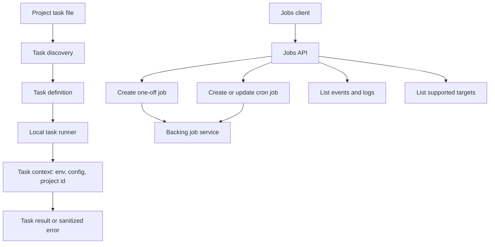

# Jobs and tasks

This page describes job client operations, cron job scheduling surfaces, task
definition discovery, and local task execution. It does not cover workflow DAG
execution or the external service that persists and runs cloud jobs.

## Responsibility

Jobs code exposes the public client for project-scoped one-off jobs, cron jobs,
batches, events, logs, and target discovery. Task code discovers project task
definitions and runs them with a sanitized task context.

Primary source areas:

- [`src/jobs/`](../../src/jobs/)
- [`src/jobs/jobs-client.ts`](../../src/jobs/jobs-client.ts)
- [`src/jobs/schemas.ts`](../../src/jobs/schemas.ts)
- [`src/jobs/runtime-env.ts`](../../src/jobs/runtime-env.ts)
- [`src/task/`](../../src/task/)
- [`src/task/discovery.ts`](../../src/task/discovery.ts)
- [`src/task/runner.ts`](../../src/task/runner.ts)

## Runtime flow

1. Task discovery scans configured `tasks/` directories and imports supported
   task files.
2. The task runner builds a scoped context and calls the task definition's
   `run()` function.
3. The jobs client builds authenticated project-scoped requests for jobs, cron
   jobs, batches, events, logs, and target metadata.
4. Public schemas validate job, cron, batch, event, log, and target response
   shapes.
5. Cloud job execution is delegated to the configured backing service.

## Boundaries

- A task is a developer-defined function. It is not a job run.
- A job is durable background execution of a target. It is not a workflow DAG.
- Cron jobs create job runs over time. They are not job runs themselves.
- Workflow worker execution belongs in [workflow runtime](./08-workflow-runtime.md).
- The managed job service is outside this package; this package owns the client,
  schemas, discovery, and local task runner.

## Change checks

- Add client tests when changing request paths, query params, auth headers, or
  response parsing.
- Add schema tests when changing job, cron, batch, event, log, or target shapes.
- Add discovery or runner tests when changing task file detection, import
  behavior, context construction, or env allowlisting.
- Update [Jobs and cron jobs](../guides/jobs.md) and [Tasks](../guides/tasks.md)
  when public behavior changes.

## Related guides

- [Jobs and cron jobs](../guides/jobs.md)
- [Tasks](../guides/tasks.md)

## Related reference

- [`veryfront/jobs`](../reference/veryfront/jobs.md)
