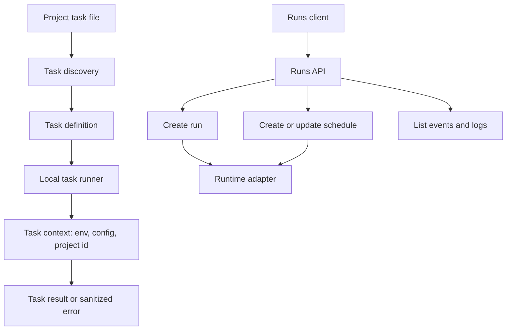

# Runs and tasks

This page describes run client operations, schedule surfaces, task
definition discovery, and local task execution. It does not cover workflow DAG
execution internals.

## Responsibility

Runs code exposes the public client for project-scoped task, workflow, and
knowledge ingest runs, plus event streams and runtime environment helpers.
Task code discovers project task definitions and runs them with a sanitized task
context.

Primary source areas:

- [`src/runs/`](../../src/runs/)
- [`src/runs/runs-client.ts`](../../src/runs/runs-client.ts)
- [`src/runs/schemas.ts`](../../src/runs/schemas.ts)
- [`src/runs/runtime-env.ts`](../../src/runs/runtime-env.ts)
- [`src/task/`](../../src/task/)
- [`src/task/discovery.ts`](../../src/task/discovery.ts)
- [`src/task/runner.ts`](../../src/task/runner.ts)

## Runtime flow

1. Task discovery scans configured `tasks/` directories and imports supported
   task files.
2. The task runner builds a scoped context and calls the task definition's
   `run()` function.
3. The runs client builds authenticated requests for creating runs, listing
   project runs, reading events, and cancelling execution.
4. Public schemas validate run and event response shapes.
5. Cloud execution is delegated to the configured runtime adapter.

## Canonical run model

Execution is represented through canonical runs:

| Concept  | Public meaning                           | Execution mapping                                                                         |
| -------- | ---------------------------------------- | ----------------------------------------------------------------------------------------- |
| Task     | Developer-defined background work target | Starting a task creates `run.kind = "task"` with target `task:<task-id>`.                 |
| Workflow | Developer-defined step graph or DAG      | Starting a workflow creates `run.kind = "workflow"` with target `workflow:<workflow-id>`. |
| Schedule | Time-based run definition                | Each trigger creates the run kind implied by its target.                                  |
| Run      | Durable execution record                 | Owns queueing, dispatch, logs, retry, cancellation, and runtime metadata.                 |

A `task:<task-id>` schedule creates a task run. A `workflow:<workflow-id>`
schedule creates a workflow run.

## Boundaries

- A task is a developer-defined function. It is not a run.
- A run is durable execution of a target. It is not a task
  definition or workflow definition.
- Schedules create runs over time. They are not runs themselves.
- Workflow worker execution belongs in [workflow runtime](./08-workflow-runtime.md).
- Runtime adapters own execution mechanics. This package owns the client,
  schemas, discovery, and local task runner.

## Change checks

- Add client tests when changing request paths, query params, auth headers, or
  response parsing.
- Add schema tests when changing run, event, or schedule shapes.
- Add discovery or runner tests when changing task file detection, import
  behavior, context construction, or env allowlisting.
- Update [Runs](../guides/runs.md) and [Tasks](../guides/tasks.md)
  when public behavior changes.

## Related guides

- [Runs](../guides/runs.md)
- [Tasks](../guides/tasks.md)

## Related reference

- [`veryfront/runs`](../api-reference/veryfront/runs.md)
