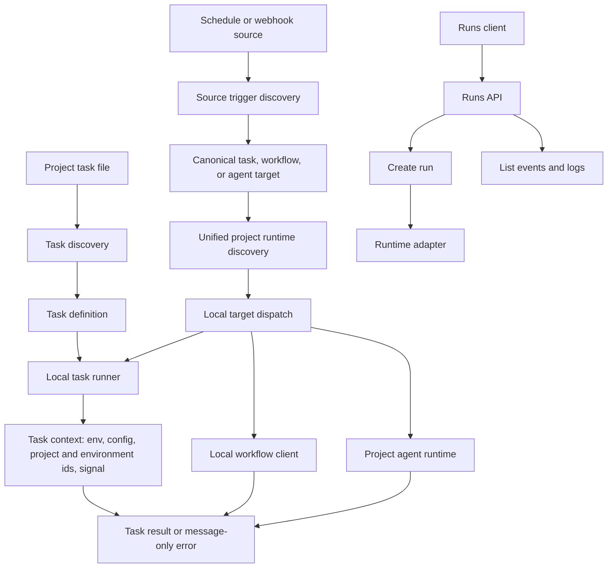

# Runs and tasks

This page describes run client operations, the boundary between source
triggers and runs, task definition discovery, and local target execution. It
does not cover workflow DAG execution internals.

## Responsibility

Runs code exposes the public client for project-scoped task, workflow, and
knowledge ingest runs, plus event streams and runtime environment helpers.
Task code discovers project task definitions and runs them with a sanitized task
context. Trigger code discovers source schedule and webhook definitions and
dispatches their canonical task, workflow, or agent target through the unified
project runtime.

Primary source areas:

- [`src/runs/`](../../src/runs/)
- [`src/runs/runs-client.ts`](../../src/runs/runs-client.ts)
- [`src/runs/schemas.ts`](../../src/runs/schemas.ts)
- [`src/runs/runtime-env.ts`](../../src/runs/runtime-env.ts)
- [`src/task/`](../../src/task/)
- [`src/task/discovery.ts`](../../src/task/discovery.ts)
- [`src/task/runner.ts`](../../src/task/runner.ts)
- [`src/trigger/`](../../src/trigger/)
- [`src/schedule/`](../../src/schedule/)
- [`src/webhook/`](../../src/webhook/)

## Runtime flow

```mermaid
flowchart TD
  sourceFile[Schedule or webhook source] --> sourceDiscovery[Source trigger discovery]
  sourceDiscovery --> triggerTarget[Canonical task, workflow, or agent target]
  triggerTarget --> projectDiscovery[Unified project runtime discovery]
  projectDiscovery --> targetDispatch[Local target dispatch]

  taskFile[Project task file] --> discovery[Task discovery]
  discovery --> taskDef[Task definition]
  taskDef --> localRun[Local task runner]
  targetDispatch --> localRun
  targetDispatch --> workflowRun[Local workflow client]
  targetDispatch --> agentRun[Project agent runtime]
  localRun --> taskContext[Task context: env, config, project and environment ids, signal]
  taskContext --> result[Task result or message-only error]
  workflowRun --> result
  agentRun --> result

  client[Runs client] --> api[Runs API]
  api --> create[Create run]
  api --> events[List events and logs]
  create --> backing[Runtime adapter]
```

1. Task discovery scans configured `tasks/` directories and imports supported
   task files.
2. The task runner builds a scoped context and calls the task definition's
   `run()` function.
3. The runs client builds authenticated requests for creating runs, listing
   project runs, reading events, and cancelling execution.
4. Public schemas validate run and event response shapes.
5. Cloud execution is delegated to the configured runtime adapter.
6. Local schedule and webhook execution validates a canonical target, snapshots
   bounded JSON input, performs unified runtime discovery, and dispatches the
   task, workflow, or agent with the caller's cancellation signal.

Schedule APIs live outside the runs client. A schedule eventually creates a
canonical run, after which the same run detail, event, and cancellation
contracts apply.

## Boundary guarantees

- Construction snapshots explicit URL, credential, project, and retry
  configuration. `withRequestContext()` creates a separate client for
  concurrent request handling; legacy mutation methods are not the
  concurrency-safe path.
- API base URLs are canonical HTTP(S) URLs without embedded credentials,
  queries, or fragments.
- Creation requests validate target prefixes, runtime-target tuples,
  identifiers, counters, pagination, knowledge selections, and bounded
  data-only JSON before transport.
- Response schemas reject malformed timestamps, negative duration/backoff
  counters, fractional event IDs, and contradictory runtime-target fields.
- Project environment injection is bounded and fail-closed. Every
  `VERYFRONT_*` and `TENANT_*` name is reserved case-insensitively so platform
  credentials cannot enter task context or persisted workflow context.
- Request-scoped cancellation reaches task code as an `AbortSignal`. The
  runner rejects pre-aborted work and exposes cooperative cancellation without
  pretending it can terminate arbitrary JavaScript that ignores the signal.
- Task IDs are deterministic, retain nested path segments, and normalize
  native paths and file URLs to `/`. Ambiguous legacy definitions that collapse
  to the same ID are rejected instead of depending on filesystem order.
- Source trigger IDs contain bounded slash-separated lowercase segments. Empty,
  dot, traversal-shaped, oversized, inherited, and accessor-backed target
  identities fail before project discovery.
- Source files and results are ordered by code units. If multiple valid files
  declare one source ID, every conflicting definition is rejected with the full
  deterministic path set; no filesystem-dependent winner executes.
- Trigger input and agent context become bounded, descriptor-safe JSON
  snapshots before asynchronous discovery. Sparse arrays, accessors, cycles,
  unsupported values, and resource-limit violations fail without invoking
  caller code or retaining mutable input.
- Cancellation is checked before and after discovery, passed to tasks and
  agents, and actively cancels and settles workflow handles before their local
  client is destroyed. Successful trigger durations cover discovery and
  execution using a monotonic clock.

## Canonical run model

Execution is represented through canonical runs:

| Concept  | Public meaning                           | Execution mapping                                                                         |
| -------- | ---------------------------------------- | ----------------------------------------------------------------------------------------- |
| Task     | Developer-defined background work target | Starting a task creates `run.kind = "task"` with target `task:<task-id>`.                 |
| Workflow | Developer-defined step graph or DAG      | Starting a workflow creates `run.kind = "workflow"` with target `workflow:<workflow-id>`. |
| Schedule | Time-based run definition                | Each trigger creates the run kind implied by its target.                                  |
| Run      | Durable execution record                 | Owns queueing, dispatch, logs, retry, cancellation, and runtime metadata.                 |

A `task:<task-id>` schedule creates a task run. A `workflow:<workflow-id>`
schedule creates a workflow run.

## Boundaries

- A task is a developer-defined function. It is not a run.
- A run is durable execution of a target. It is not a task
  definition or workflow definition.
- Schedules create runs over time. They are not runs themselves.
- Workflow worker execution belongs in [workflow runtime](./08-workflow-runtime.md).
- Runtime adapters own execution mechanics. This package owns the client,
  schemas, discovery, and local task runner.

## Change checks

- Add client tests when changing request paths, query params, auth headers, or
  response parsing.
- Add schema tests when changing run, event, or schedule shapes.
- Add discovery or runner tests when changing task file detection, import
  behavior, context construction, or env allowlisting.
- Add trigger tests when changing source ordering, duplicate handling, target
  identity, JSON input ownership, cancellation, or local dispatch behavior.
- Run the `src/runs` tests with type checking enabled; the repository's broad
  behavioral suite intentionally uses `--no-check`.
- Update [Runs](../guides/runs.md) and [Tasks](../guides/tasks.md)
  when public behavior changes.

## Related guides

- [Runs](../guides/runs.md)
- [Tasks](../guides/tasks.md)

## Related reference

- [`veryfront/runs`](../api-reference/veryfront/runs.md)
- [`veryfront/trigger`](../api-reference/veryfront/trigger.md)
