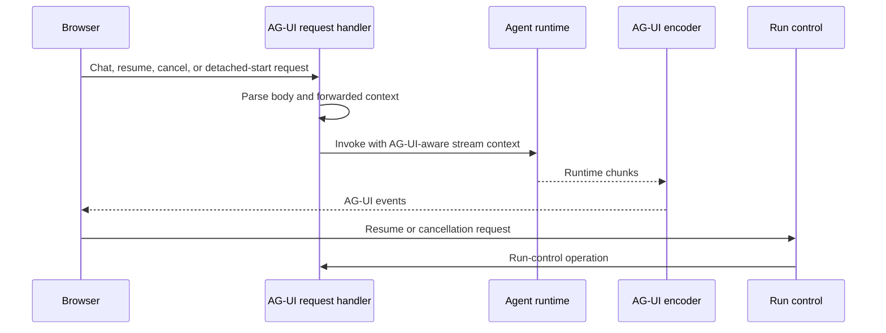

# AG-UI transport

This page describes AG-UI request parsing, browser response encoding, chunk
bridging, and run control. It does not cover MCP or provider-specific SSE
parsing.

## Responsibility

AG-UI transport adapts agent runtime events to browser-facing AG-UI streams.

Primary source areas:

- [`src/agent/ag-ui/`](../../src/agent/ag-ui/)
- [`src/server/handlers/request/agent-stream.handler.ts`](../../src/server/handlers/request/agent-stream.handler.ts)
- [`src/server/handlers/request/agent-run-resume.handler.ts`](../../src/server/handlers/request/agent-run-resume.handler.ts)
- [`src/server/handlers/request/agent-run-cancel.handler.ts`](../../src/server/handlers/request/agent-run-cancel.handler.ts)

## Runtime flow

1. Request handlers parse AG-UI request bodies and forwarded context.
2. Tool merging combines request tools, agent tools, and session-managed tools.
3. Runtime support invokes the agent runtime with AG-UI-aware stream context.
4. Encoders convert runtime chunks into browser AG-UI events.
5. Run control handlers support resume, detached start, and cancellation flows.

## Boundaries

- AG-UI is the agent UI event stream. It is not MCP JSON-RPC.
- Provider SSE parsing happens before AG-UI encoding.
- Hosted durable mirrors consume AG-UI-adjacent state but are documented in
  [hosted agent runs](./08-hosted-agent-runs.md).

## Change checks

- Add tests for chunk encoding, finalization, resume, cancellation, and forwarded
  context changes.
- Keep AG-UI event names and payload shapes compatible with browser clients.
