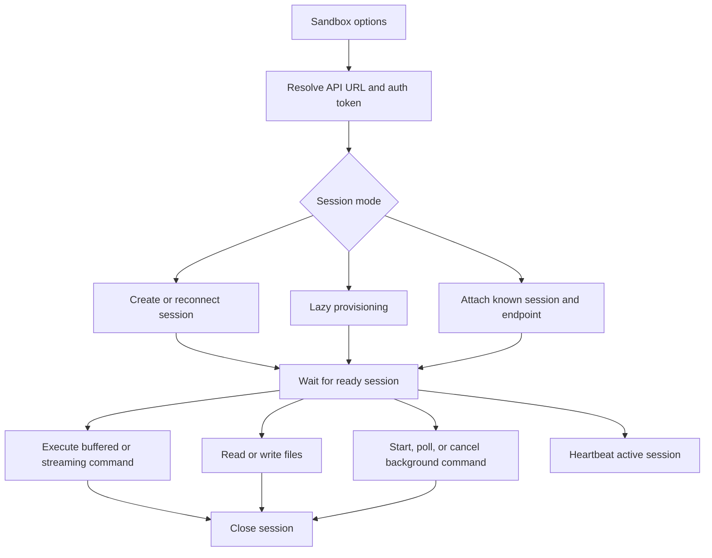

# Sandbox runtime

This page describes sandbox session clients, lazy provisioning, command
execution, file operations, background commands, heartbeats, and agent-service sandbox
tools. It does not cover workflow execution or the backing sandbox service
implementation.

## Responsibility

Sandbox code provides the public client for authenticated sandbox sessions and
the tool adapters that let agents run isolated shell and file operations.

Primary source areas:

- [`src/sandbox/`](../../src/sandbox/)
- [`src/sandbox/sandbox.ts`](../../src/sandbox/sandbox.ts)
- [`src/sandbox/lazy-sandbox.ts`](../../src/sandbox/lazy-sandbox.ts)
- [`src/sandbox/shell-tools.ts`](../../src/sandbox/shell-tools.ts)
- [`src/sandbox/agent-service-tools.ts`](../../src/sandbox/agent-service-tools.ts)
- [`src/sandbox/types.ts`](../../src/sandbox/types.ts)
- [`src/sandbox/config.ts`](../../src/sandbox/config.ts)

## Runtime flow

1. Config helpers resolve sandbox API URL and auth token from explicit options
   or environment.
2. `Sandbox.create()`, `Sandbox.get()`, and `Sandbox.attach()` establish a
   session endpoint.
3. `Sandbox.createLazy()` defers provisioning until command or file operations
   need a session.
4. Command helpers support buffered output, streamed NDJSON events, and async
   background commands.
5. Agent-service helpers adapt sandbox operations into shell and file tools.

## Boundaries

- Sandbox runtime owns client behavior, lazy provisioning, command streaming,
  background command polling, and agent-service tool adapters.
- The backing sandbox service owns container lifecycle, isolation, scheduling,
  and command execution internals.
- Workflow runtime may call sandbox-backed tools, but workflow state belongs in
  [workflow runtime](./08-workflow-runtime.md).
- MCP may expose sandbox-backed tools, but MCP transport belongs in
  [MCP runtime](./10-mcp-runtime.md).

## Change checks

- Add sandbox client tests when changing session creation, attach, reconnect,
  file operations, command execution, or NDJSON parsing.
- Add lazy sandbox tests when changing provisioning, endpoint resolution,
  retries, heartbeat behavior, or background command tracking.
- Add shell-tool tests when changing agent-facing tool names, schemas, or
  argument normalization.
- Keep auth tokens server-side and redact backing service details from public
  errors.
- Update [Sandbox](../guides/sandbox.md) when public client behavior changes.

## Related guides

- [Sandbox](../guides/sandbox.md)

## Related reference

- [`veryfront/sandbox`](../api-reference/veryfront/sandbox.md)
