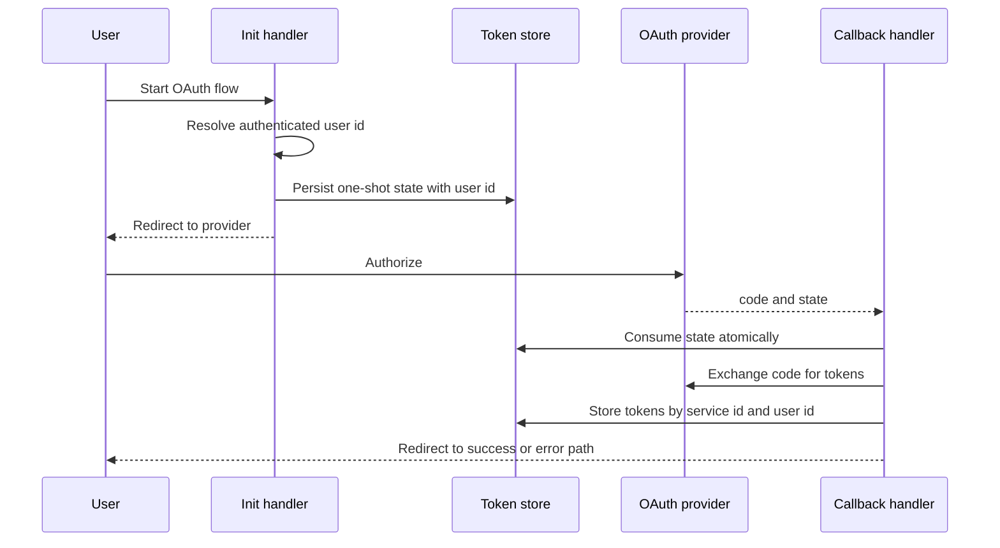

# OAuth runtime

This page describes OAuth provider configuration, authorization redirects,
callback handling, token exchange, token storage, status checks, and disconnect
handlers. It does not cover integration tool execution.

## Responsibility

OAuth code provides provider configs, OAuth service helpers, route handlers,
state validation, token exchange, refresh support, and token store contracts.

Primary source areas:

- [`src/oauth/`](../../src/oauth/)
- [`src/oauth/providers/`](../../src/oauth/providers/)
- [`src/oauth/handlers/`](../../src/oauth/handlers/)
- [`src/oauth/token-store/`](../../src/oauth/token-store/)
- [`src/oauth/schemas/`](../../src/oauth/schemas/)
- [`src/oauth/types.ts`](../../src/oauth/types.ts)

## Runtime flow

1. Init handlers require a user id and reject anonymous requests.
2. Provider helpers create authorization URLs and persist one-shot state rows.
3. Callback handlers consume state, validate the service id, exchange codes for
   tokens, and store tokens under the initiating user.
4. Status and disconnect handlers act on the authenticated user's own token
   slot.
5. Provider catalogs supply common service configs, scopes, URLs, and client env
   variable names.

## Boundaries

- OAuth owns authorization, callback, token exchange, and token storage
  contracts.
- Integration metadata can reference OAuth provider configs, but integration
  tool execution belongs in [integration runtime](./19-integration-runtime.md).
- Public route ownership belongs to the application route that mounts the OAuth
  handlers.
- Persistent token storage is supplied by the application or backing service.

## Change checks

- Add handler tests for state validation, user binding, redirect behavior, and
  provider errors.
- Add provider tests when changing auth URL, token URL, scope, PKCE, or token
  exchange behavior.
- Add token-store tests when changing state consumption or token keying.
- Keep tokens, secrets, and provider responses out of public logs and errors.
- Update [OAuth](../guides/oauth.md) when public handler behavior changes.

## Related guides

- [OAuth](../guides/oauth.md)

## Related reference

- [`veryfront/oauth`](../reference/veryfront/oauth.md)
