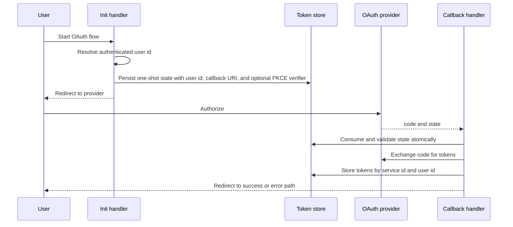

# OAuth runtime

This page describes OAuth provider configuration, authorization redirects,
callback handling, token exchange, token storage, status checks, and disconnect
handlers. It does not cover integration tool execution.

## Responsibility

OAuth code provides provider configs, OAuth service helpers, route handlers,
state validation, token exchange, refresh support, and token store contracts.

Primary source areas:

- [`src/oauth/`](../../src/oauth/)
- [`src/oauth/providers/`](../../src/oauth/providers/)
- [`src/oauth/handlers/`](../../src/oauth/handlers/)
- [`src/oauth/token-store/`](../../src/oauth/token-store/)
- [`src/oauth/schemas/`](../../src/oauth/schemas/)
- [`src/oauth/types.ts`](../../src/oauth/types.ts)

## Runtime flow

1. Init handlers require a user id and reject anonymous requests.
2. The init handler creates authorization URLs with generated state and S256
   PKCE values when the provider supports PKCE, then persists a bounded
   one-shot state row. Providers that explicitly do not support PKCE omit the
   verifier; callers cannot downgrade PKCE through route options.
3. Callback handlers consume state before processing either success or provider
   error responses. They validate its age, service id, exact callback URI, and
   PKCE verifier before exchanging a code.
4. Token requests have explicit time and response-size bounds. Successful token
   responses require a nonblank access token and valid expiry data.
5. Tokens are stored under the initiating user. Refresh writes verify that the
   stored token generation has not been disconnected or replaced while the
   provider request was in flight. Shared stores also serialize refresh through
   a bounded, renewable distributed lease.
6. Status and disconnect handlers act on the authenticated user's own token
   slot. Disconnect is a same-origin `POST`; method and origin checks run before
   authentication callbacks or token-store mutation.
7. Provider catalogs supply common service configs, scopes, URLs, and client env
   variable names.

## Boundaries

- OAuth owns authorization, callback, token exchange, and token storage
  contracts.
- Integration metadata can reference OAuth provider configs, but integration
  tool execution belongs in [integration runtime](./19-integration-runtime.md).
- Public route ownership belongs to the application route that mounts the OAuth
  handlers.
- Persistent token storage is supplied by the application or backing service.
- Deployment stores protect token and state rows with authenticated encryption,
  use transport security, and keep `(serviceId, userId)` inside the storage key.
- State consumption must be an atomic read-and-delete operation. A separate
  read followed by delete permits concurrent callback reuse.
- Refresh requires revisioned snapshots, atomic compare-and-set, and a
  crash-recoverable distributed lease. Without all three capabilities, refresh
  fails closed before contacting the provider.
- Completion redirects remain on the configured application origin. Handler
  responses disable caching and referrer propagation.

## Change checks

- Add handler tests for one-shot state validation, user binding, exact callback
  URI checks, redirect behavior, and provider errors.
- Add provider tests when changing auth URL, token URL, scope, PKCE, or token
  exchange behavior.
- Add token-store tests when changing state consumption or token keying.
- Keep tokens, secrets, and provider responses out of public logs and errors.
- Update [OAuth](../guides/oauth.md) when public handler behavior changes.

## Related guides

- [OAuth](../guides/oauth.md)

## Related reference

- [`veryfront/oauth`](../api-reference/veryfront/oauth.md)
