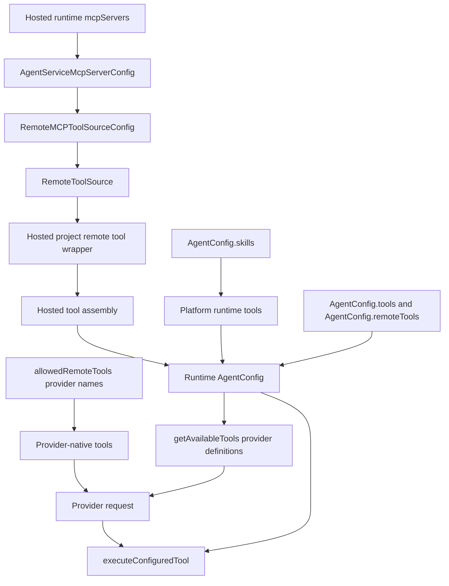
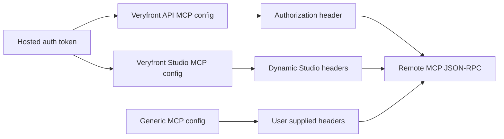

# Agent tool registration baseline state

This review documents the baseline agent tool registration path found at the
start of the migration on 2026-06-03. It covers local tools, remote MCP tools,
Veryfront MCP servers, and custom MCP servers, with focus on architecture,
naming, auth boundaries, and operational risks.

## Responsibility

Agent tool registration currently spans these concerns:

- Local tool configuration through `agent({ tools })`.
- Platform runtime tools such as `load_skill` for skills and other built-ins.
- Remote MCP source configuration through hosted runtime `mcpServers`.
- Runtime conversion of configured tools into provider-visible tool
  definitions.
- Runtime execution of local tools, registry tools, remote MCP tools, and
  integration tools.
- Hosted project context injection for Veryfront API and Studio MCP tools.

Primary source areas:

- [`src/agent/types.ts`](../../src/agent/types.ts)
- [`src/agent/runtime/tool-helpers.ts`](../../src/agent/runtime/tool-helpers.ts)
- [`src/agent/runtime/load-skill-tool.ts`](../../src/agent/runtime/load-skill-tool.ts)
- [`src/agent/runtime/provider-native-tools.ts`](../../src/agent/runtime/provider-native-tools.ts)
- [`src/agent/hosted/chat-runtime-tool-assembly.ts`](../../src/agent/hosted/chat-runtime-tool-assembly.ts)
- [`src/agent/hosted/default-chat-runtime.ts`](../../src/agent/hosted/default-chat-runtime.ts)
- [`src/agent/service/mcp-server-config.ts`](../../src/agent/service/mcp-server-config.ts)
- [`src/agent/hosted/project-remote-tool-source.ts`](../../src/agent/hosted/project-remote-tool-source.ts)
- [`src/tool/remote-mcp.ts`](../../src/tool/remote-mcp.ts)
- [`src/server/handlers/request/agent-stream.handler.ts`](../../src/server/handlers/request/agent-stream.handler.ts)

## Current flow

The hosted path starts from `mcpServers`, converts each server config into a
`RemoteMCPToolSourceConfig`, creates a `RemoteToolSource`, wraps it with
project-aware behavior, and finally maps it back into `AgentConfig.remoteTools`.
Local host tools are converted separately into `runtimeTools`.

## Current configuration surfaces

### AgentConfig

`AgentConfig` has:

- `tools?: true | Record<string, Tool | boolean>`
- `skills?: true | string[]`
- `remoteTools?: RemoteToolSource[]`
- `allowedRemoteTools?: string[]`

This is a compact surface, but it mixes different concepts. `tools` can mean
all registry tools, inline local tool objects, boolean references to local
tools, or remote tool names that are resolved later. `remoteTools` is not a
tool list. It is a list of remote tool sources. `allowedRemoteTools` is a name
allowlist, not an authorization policy. The same list also enables
provider-native tools such as `web_search`, even though those tools are not MCP
tools and are executed by the selected model provider.

When `skills` is enabled, skill tools are exposed without the user manually
adding them to `tools`. At review start, the behavior was not uniform:

- The classic `agent()` factory registers shared skill tools and merges
  the skill platform tools into the agent's internal tools config using the old
  hyphenated runtime spelling.
- The hosted runtime injects `load_skill` into its local host tool set and uses
  `load_skill` in hosted steering, live eval, and child-agent paths.

So the expected user experience mostly existed at review start: public users configure
`skills`, not `tools: { load_skill: true }`. The defect is the mixed runtime
tool id convention and the fact that `agent()` currently implements this as an
internal tools-config merge instead of a separate platform tool catalog entry.

### Tool classes

The current code has four practical tool classes:

| Class                      | Example                   | Config or source                         | Executor owner                         |
| -------------------------- | ------------------------- | ---------------------------------------- | -------------------------------------- |
| Local or project tool      | `read_file`               | `agent.tools` or tool registry           | Veryfront runtime                      |
| Platform runtime tool      | `load_skill`              | `agent.skills` and hosted steering setup | Veryfront runtime                      |
| Provider-native tool       | `web_search`, `web_fetch` | `allowedRemoteTools`                     | Selected model provider                |
| Veryfront integration tool | `github__list_repos`      | Per-request API integration discovery    | Veryfront API integration endpoint     |
| MCP or remote tool         | `list_uploads`            | `remoteTools` or hosted `mcpServers`     | MCP server through Veryfront execution |

The problem is not that these classes exist. The problem is that
`allowedRemoteTools` and `remoteTools` do not name the classes accurately.

### Hosted runtime

Hosted runtime accepts `mcpServers?: readonly AgentServiceMcpServerConfig[]` in
`DefaultHostedChatRuntimeConfig`. `prepareHostedChatRuntimeToolAssembly` creates
remote tool sources from those server configs, computes available names, and
returns:

- `runtimeTools`
- `remoteToolSources`
- `localToolNames`
- `remoteToolNames`
- `availableToolNames`
- `compatibleRemoteToolNames`

The name `runtimeTools` currently means local host tools only. Remote tools are
kept separate until they are placed back into `AgentConfig.remoteTools`.

### MCP server config

`AgentServiceMcpServerConfig` supports:

- `{ kind: "veryfront-api"; id?: string }`
- `{ kind: "veryfront-studio"; id?: string }`
- `{ kind?: "generic"; id?: string; endpoint; headers?; fetch?; listMethod?; callMethod? }`

The default hosted server set is `[{ kind: "veryfront-api" }]`. Studio MCP is
enabled only when a Studio MCP URL is present and the client profile allows it.
Generic MCP servers can pass a static or dynamic endpoint and headers through
to the remote MCP source adapter.

## Auth handling

Veryfront API and Studio MCP use bearer headers derived from hosted runtime
context. Generic MCP servers use caller supplied headers or a caller supplied
fetch implementation. The implementation does not currently expose a first
class MCP OAuth client flow, OAuth protected resource metadata discovery,
resource indicators, token refresh, or per-server credential lifecycle.

The current auth model is enough for internal trusted servers and simple custom
servers. It is weaker for third-party remote MCP because credentials are passed
as transport headers rather than managed as MCP server authorization state.

## Execution path

`getAvailableTools` builds provider-visible tool definitions. It reads local
tool config, appends remote definitions from `remoteToolSources`, optionally
appends forwarded remote definitions, and applies `allowedRemoteToolNames`.
Provider-native tools are added later during model tool conversion. For
example, `web_search` is selected from the allowed name list, converted into an
Anthropic provider tool, and marked as provider-executed in stream handling.
Runtime skill tools are local platform tools. They are exposed when skills are
enabled, filtered by the active skill policy, and executed by Veryfront.

`executeConfiguredTool` resolves in this order:

1. Inline configured local tool.
2. Global local registry tool.
3. Remote tool source.
4. Remote integration tool.
5. Generic `executeTool` fallback.

This sequence is practical, but remote tool names are global strings. Duplicate
tool names across MCP servers are deduped by first seen name, so the server
boundary is not represented in the model-visible name or execution identity.
Remote integration tools use a separate per-request API path and names such as
`integration__tool`. They are currently filtered by the same
`allowedRemoteTools` list as MCP and provider-native tools, even though they
have a different owner and auth path.

## Naming findings

| Current name                        | Current meaning                                            | Issue                                                                          |
| ----------------------------------- | ---------------------------------------------------------- | ------------------------------------------------------------------------------ |
| `remoteTools`                       | `RemoteToolSource[]`                                       | Says tools, stores sources.                                                    |
| `allowedRemoteTools`                | String allowlist for remote and provider-native tool names | Sounds like auth and remote-only, but also enables provider-native tools.      |
| Mixed skill tool spellings          | Skill runtime tool ids and policy ids                      | Mixed underscore and hyphen forms made policy and docs harder to reason about. |
| `runtimeTools`                      | Local host tools                                           | Excludes remote tools.                                                         |
| `availableToolNames`                | Provider-compatible visible tool names                     | Used in several contexts with different implications.                          |
| `mcpServers`                        | Hosted MCP server configs                                  | Later converted into remote sources and loses server identity.                 |
| `AgentServiceMcpServerConfig.kind`  | Built-in or generic server selector                        | `"generic"` is optional, and `"api"` maps elsewhere to `"veryfront-api"`.      |
| `createAgentServiceRemoteMcpConfig` | Resolves source transport config                           | Name suggests service config, return type is `RemoteMCPToolSourceConfig`.      |
| `ProjectScopedRemoteToolSource`     | Project context, filtering, retry, steering mutation       | Name understates the behavior it owns.                                         |

The naming debt is material because it hides the difference between:

- Config versus runtime object.
- MCP server versus remote tool source.
- Tool definition versus executable tool.
- Visibility policy versus authorization.
- Local name versus server-scoped name.
- Provider-executed versus Veryfront-executed.

## Best-practice comparison

The current implementation is serviceable, provider-neutral, and small. It is
behind current MCP and agent SDK practice in these areas:

- First-class MCP server config should be distinct from tool source config.
- Tool filtering should be a named policy, not only a loose string array.
- Sensitive tools should support per-tool approval policy.
- HTTP MCP auth should support OAuth-style server discovery and token audience
  binding when connecting to protected third-party servers.
- Tool list caching should be explicit and bounded by server identity,
  credentials, and context.
- Duplicate tool names should have deterministic namespacing or conflict
  handling.
- Tracing should retain the server id, tool name, call id, approval decision,
  and auth mode.

Reference baseline:

- [MCP authorization specification](https://modelcontextprotocol.io/specification/2025-06-18/basic/authorization)
- [OpenAI remote MCP tools guide](https://developers.openai.com/api/docs/guides/tools-connectors-mcp)
- [OpenAI Agents SDK MCP guide](https://openai.github.io/openai-agents-python/mcp/)

## Current strengths

- The adapter is small and provider-neutral.
- Custom MCP servers are already possible through generic server config.
- Veryfront API and Studio MCP servers have built-in hosted integration.
- Remote tool definition and execution are centralized enough to migrate.
- Project-aware filtering and hydration already exist.

## Sibling repo impact

A targeted scan of canonical sibling repos found these dependents:

| Repo                    | Evidence                                                                                                                                                                                                                                                                        | Impact                                                                                                                             |
| ----------------------- | ------------------------------------------------------------------------------------------------------------------------------------------------------------------------------------------------------------------------------------------------------------------------------- | ---------------------------------------------------------------------------------------------------------------------------------- |
| `veryfront-agent`       | [`main.ts`](../../../veryfront-agent/main.ts) uses `mcpServers: [veryfrontMcpServer(), veryfrontMcpServer('studio')]`.                                                                                                                                                          | Product agent code needs a direct migration to `veryfrontApiMcpServer()` and `veryfrontStudioMcpServer()`.                         |
| `veryfront-agent`       | [`docs/context-population.md`](../../../veryfront-agent/docs/context-population.md) and [`docs/coding-standards.md`](../../../veryfront-agent/docs/coding-standards.md) describe the current tool population model.                                                             | Product runtime docs must be updated when naming changes.                                                                          |
| `veryfront-agent-codex` | `src/codexMcpConfig.ts` writes Codex `mcp_servers` entries named `veryfront`, `veryfront_studio`, and `veryfront_agent`.                                                                                                                                                         | Codex adapter naming is already server-centric. Keep this separate from agent runtime naming and do not force the same key casing. |
| `veryfront-codex-agent` | `src/codexMcpConfig.ts` mirrors the Codex MCP config behavior.                                                                                                                                                                                                                   | Changes to token env vars or server ids must be coordinated across both packages.                                                  |
| `veryfront-docs`        | [`docs/code/guides/agent-service-runtime.md`](../../../veryfront-docs/docs/code/guides/agent-service-runtime.md), generated API reference, and tool reference mention `mcpServers`, `remoteTools`, `allowedRemoteTools`, `createRemoteMCPToolSource`, and `veryfrontMcpServer`. | Public docs and generated references need replacement guidance and regenerated API tables.                                         |
| `veryfront-examples`    | Swedish tax and DORA examples use `allowedRemoteTools`.                                                                                                                                                                                                                         | Examples need migration examples for provider tools and remote MCP allowlists.                                                     |
| `veryfront-studio`      | Storybook MCP docs use client-side `mcpServers` config for local Storybook.                                                                                                                                                                                                     | Do not conflate external MCP client config names with Veryfront agent runtime names.                                               |
| `veryfront-api`         | The API owns the public MCP endpoint, project selection, tool tracing, and integration tool authorization.                                                                                                                                                                      | Client-side auth improvements may require API support for OAuth protected resource metadata and stronger 401 challenge behavior.   |

Notably, sibling repos already use two different MCP vocabularies:

- Client config vocabulary: `mcpServers` or Codex `mcp_servers`.
- Veryfront agent runtime vocabulary: `remoteTools`, `allowedRemoteTools`, and
  `veryfrontMcpServer`.

The migration should preserve client config vocabulary where it is external to
Veryfront runtime. The naming cleanup should target the Veryfront agent runtime
and generated docs first.

## Current risks

- Naming makes misuse likely, especially around `remoteTools` and
  `allowedRemoteTools`.
- Custom MCP auth is header passthrough, not a managed auth lifecycle.
- Tool name conflicts across multiple MCP servers are not first-class.
- Approval policy is absent at the MCP tool layer.
- Discovery failures are logged and skipped, which is useful for resilience but
  can hide misconfiguration unless strict mode is added.
- Hosted platform injection mutates `remoteTools` and `allowedRemoteTools` from
  unresolved boolean tool names, which couples request handling to remote tool
  registration semantics.

## Review verdict

The system has the right raw parts, but the boundary vocabulary is out of date.
The target should not introduce a large new framework. It should rename the
layers, make MCP server config explicit, add simple policy objects for
filtering and approval, and preserve the existing adapter path while improving
auth and traceability.
