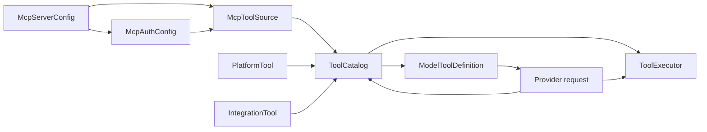
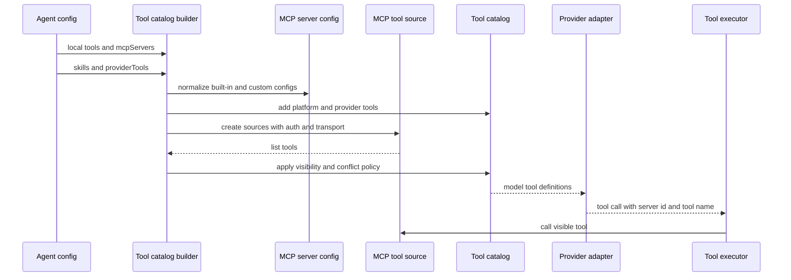
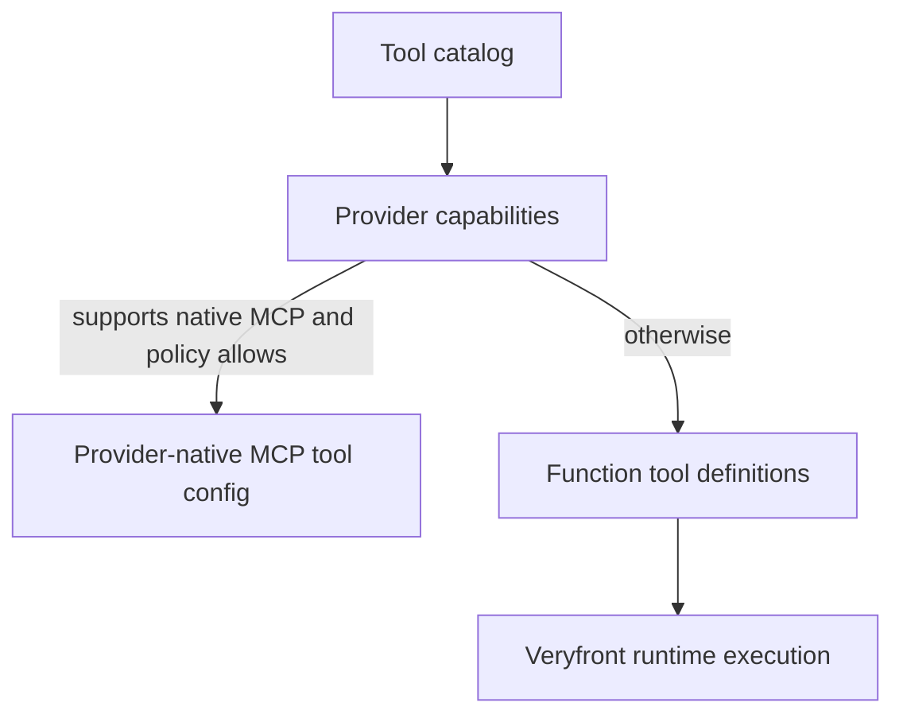

# Agent tool registration target state

This document defines a target state for agent tool registration that unifies
local tools, Veryfront MCP servers, and custom MCP servers without adding a
large orchestration layer. The goal is simpler names, safer defaults, and MCP
behavior that matches current best practices.

## Design goals

- Keep runtime behavior equivalent during the feature branch until the
  coordinated breaking rollout lands.
- Use one vocabulary across public config, hosted runtime, provider assembly,
  and execution.
- Treat MCP server identity as a first-class boundary.
- Treat provider-executed and platform runtime tools as first-class non-MCP
  entries in the same catalog.
- Support Veryfront API MCP, Veryfront Studio MCP, and custom MCP servers with
  one config shape.
- Add tool filtering, auth, and tracing as focused policy fields.
- Avoid provider lock-in. Provider-native hosted MCP can be an optimization,
  not the only path.

## Non-goals

- Do not replace the existing local tool registry.
- Do not require OAuth for every custom MCP server.
- Do not introduce a separate plugin system for MCP.
- Do not require users to namespace every tool manually.
- Do not carry long-lived legacy aliases. This target assumes a coordinated
  breaking migration across Veryfront repos.

## Canonical vocabulary



| Concept               | Meaning                                                          |
| --------------------- | ---------------------------------------------------------------- |
| `McpServerConfig`     | User or service config for one MCP server.                       |
| `McpAuthConfig`       | How credentials are discovered, supplied, refreshed, or omitted. |
| `McpToolSource`       | Runtime object that can list and call MCP tools for one server.  |
| `PlatformTool`        | Veryfront-owned runtime tool such as `load_skill`.               |
| `ProviderTool`        | Tool executed by the selected model provider.                    |
| `IntegrationTool`     | Project-scoped Veryfront integration tool fetched per request.   |
| `ToolCatalog`         | Local, platform, provider, integration, and MCP inventory.       |
| `ModelToolDefinition` | Provider-visible tool schema and metadata.                       |
| `ToolExecutor`        | Runtime executable for a selected tool call.                     |
| `ToolPolicy`          | Visibility policy for a tool source.                             |

Canonical field names:

| Field name              | Layer    | Meaning                                                                   |
| ----------------------- | -------- | ------------------------------------------------------------------------- |
| `mcpServers`            | Config   | User or service MCP server configuration.                                 |
| `skills`                | Config   | Skill selection that enables skill platform tools.                        |
| `providerTools`         | Config   | Provider-executed tool names such as `web_search`.                        |
| `localTools`            | Runtime  | Local tool set owned by the project, app, or host runtime.                |
| `platformTools`         | Runtime  | Veryfront runtime tools, including skill and orchestration tools.         |
| `integrationTools`      | Runtime  | Veryfront project integration tools fetched or forwarded per request.     |
| `mcpToolSources`        | Runtime  | MCP runtime sources created from `mcpServers`.                            |
| `modelToolDefinitions`  | Provider | Tool definitions exposed to the selected model provider.                  |
| `toolExecutors`         | Runtime  | Executable dispatch table keyed by stable `ToolIdentity`.                 |
| `modelVisibleToolNames` | Metadata | Final tool names visible to the model after policy and conflict handling. |

## Naming conventions

Use one TypeScript naming style across the new surface:

- Use PascalCase with acronyms treated as words for exported types:
  `McpServerConfig`, `McpAuthConfig`, `McpToolSource`, `HttpTransport`.
- Use lower camelCase for object fields and helpers:
  `mcpServers`, `mcpToolSources`, `modelVisibleToolNames`,
  `veryfrontApiMcpServer`.
- Use plural nouns only for arrays or collections:
  `mcpServers`, `localTools`, `modelToolDefinitions`.
- Use `source` only for runtime objects that can list or call tools.
  Use `server` only for user or service configuration.
- Use `model` for provider-visible names and definitions. Use `runtime` only
  for executable objects.
- Avoid overloaded names such as `available`, `remote`, and `runtimeTools`
  unless the layer is explicit in the name.

## Unified policy model

Project tools and MCP server tools should use the same policy concepts. The
attachment point differs because their ownership boundary differs.

| Tool source                 | Existing selector                                   | Target selection or policy                                                                                                     | Reason                                                                        |
| --------------------------- | --------------------------------------------------- | ------------------------------------------------------------------------------------------------------------------------------ | ----------------------------------------------------------------------------- |
| Local or project tools      | `agent({ tools })`, registry discovery, skills      | Keep `agent.tools` as the primary selection shorthand. Add `toolPolicy` only when local approval is needed.                    | The project or app owns the tool code, schema, and execution path.            |
| Platform runtime tools      | Runtime injection from `skills` or host context     | Keep source-specific config such as `skills`. Apply shared policy after tool ids are in the catalog.                           | Veryfront owns these tools and their execution semantics.                     |
| Provider tools              | `allowedRemoteTools` for names such as `web_search` | Use top-level `providerTools`.                                                                                                 | The provider executes the tool; it is not MCP and has no MCP server boundary. |
| Veryfront integration tools | Per-request API discovery and forwarded definitions | Keep as `integrationTools` in the runtime catalog. Do not model them as MCP unless the API exposes them through an MCP server. | The Veryfront API owns project integration auth and execution.                |
| Veryfront MCP tools         | Built-in MCP server helper plus hosted filtering    | Built-in `McpServerConfig` policy defaults.                                                                                    | The MCP server is remote, but first-party and request-authenticated.          |
| Custom MCP server tools     | Custom `McpServerConfig`                            | Per-server `toolPolicy`.                                                                                                       | The server is an external trust, auth, discovery, and naming boundary.        |

Do not create separate policy types for project tools and MCP tools. Use shared
visibility semantics inside `ToolPolicy`, then attach the policy at the
smallest boundary that owns the risk.

## Target public config

Use explicit MCP server config on agents and hosted services:

```ts
agent({
  system: "You help the user.",
  tools: {
    read_file: true,
  },
  providerTools: ["web_search"],
  mcpServers: [
    veryfrontApiMcpServer(),
    {
      id: "docs",
      transport: {
        type: "http",
        url: "https://docs.example.com/mcp",
      },
      auth: {
        type: "bearer",
        token: () => getDocsMcpToken(),
      },
      toolPolicy: {
        allow: ["search_docs", "read_doc"],
        approval: "never",
      },
    },
  ],
});
```

The config stays small. Advanced behavior is opt-in.

### McpServerConfig

```ts
type McpServerConfig =
  | VeryfrontMcpServerConfig
  | CustomMcpServerConfig;

type CustomMcpServerConfig = {
  id: string;
  title?: string;
  transport: McpTransportConfig;
  auth?: McpAuthConfig;
  toolPolicy?: ToolPolicy;
  strict?: boolean;
};
```

`id` is required for custom servers. Built-in helpers provide stable ids for
Veryfront servers.

### Provider tools

```ts
type ProviderToolName = "web_search" | "web_fetch" | string;
```

`providerTools` enables provider-executed capabilities. These are not local
tools and not MCP tools. The selected model provider owns execution, result
shape, provider limits, and provider-specific tool ids. Veryfront should
validate requested names against the selected provider and selected model, then
only pass supported names through to the provider adapter.

`providerTools` must not mean every tool definition sent to a provider. It only
means tools that the provider executes itself.

### Transport

```ts
type McpTransportConfig = { type: "http"; url: string | (() => string | Promise<string>) };
```

Keep stdio and SSE out of the first hosted remote runtime target unless a
separate process or transport manager is added. Stdio is useful for local agent
SDKs, but this runtime already uses HTTP JSON-RPC style remote sources.

### Auth

```ts
type McpAuthConfig =
  | { type: "none" }
  | { type: "bearer"; token: string | (() => string | Promise<string>) }
  | { type: "headers"; headers: HeadersInit | (() => HeadersInit | Promise<HeadersInit>) }
  | { type: "oauth"; tokenProvider: McpTokenProvider; resource?: string };
```

Target behavior:

- Built-in Veryfront servers use internal token providers.
- Custom servers can start with `bearer` or `headers`.
- OAuth support can be added without changing server, tool, or executor names.
- HTTP MCP auth should be able to honor MCP protected resource metadata and
  resource indicators where available.

### Tool policy

```ts
type ToolPolicy = {
  allow?: string[];
  deny?: string[];
  approval?: "never";
};
```

Allowlist first, then denylist. The first implementation supports
`approval: "never"` only. Add richer approval modes only after the product has
a concrete review UI and audited execution path. Keep dynamic filtering
internal until a public use case requires it.

### Approval

Do not build a generic approval subsystem as part of this naming migration.
The target shape accepts `approval: "never"` to make the absence of an approval
gate explicit. Add interactive approval only when the product can surface,
persist, and audit that decision.

## Target runtime assembly



Runtime assembly should produce one clear object:

```ts
type ToolCatalog = {
  localTools: ToolSet;
  platformTools: ToolSet;
  providerTools: ProviderToolName[];
  integrationTools: ToolSet;
  mcpToolSources: McpToolSource[];
  modelToolDefinitions: ModelToolDefinition[];
  toolExecutors: Map<ToolIdentity, ToolExecutor>;
  modelVisibleToolNames: string[];
};
```

`ToolIdentity` should carry server identity for remote tools:

```ts
type ToolIdentity =
  | { kind: "local"; name: string }
  | { kind: "platform"; name: string }
  | { kind: "provider"; name: string }
  | { kind: "integration"; name: string }
  | { kind: "mcp"; serverId: string; name: string; modelName: string };
```

## Platform runtime tools

Platform runtime tools are Veryfront-owned tools that are injected by runtime
features rather than authored in `agent.tools`. Examples include skill tools
such as `load_skill` and hosted orchestration tools. They should stay separate
from MCP server config and provider tool config.

For skills, the public contract should be:

```ts
agent({
  system: "Use project skills when they match the task.",
  skills: ["code-review"],
});
```

Users should not need to write:

```ts
agent({
  system: "Use project skills when they match the task.",
  tools: { load_skill: true },
  skills: ["code-review"],
});
```

`skills` selects skill packs. The runtime derives platform tools such as
`load_skill` from that selection and places them in
`ToolCatalog.platformTools`.

Target rules:

1. Use snake case for runtime tool ids exposed to models, for example
   `load_skill`.
2. Keep skill ids hyphenated when they name skill packages, for example
   `code-review`.
3. Remove the old hyphenated runtime spelling from runtime policy paths.
4. Represent platform tools in `ToolCatalog.platformTools`.
5. Apply active skill policy and other tool policy checks against the final
   model-visible tool id.
6. Do not require users to opt into skill platform tools through `agent.tools`.

This preserves the current capability while making it clear that `load_skill`
is neither an MCP tool nor a provider tool.

## Edge cases the target must preserve

These cases should stay explicit in the catalog builder and tests:

| Edge case                     | Target handling                                                                                          |
| ----------------------------- | -------------------------------------------------------------------------------------------------------- |
| Provider tools                | `providerTools` are validated against provider and model capability and never routed to local execution. |
| Veryfront integration tools   | Keep project-scoped integration tools as `kind: "integration"` with per-request auth context.            |
| Forwarded integration schemas | Preserve forwarded definitions when the runtime cannot list integration tools directly.                  |
| Skill policy intersection     | `load_skill` can narrow the active tool set but cannot grant tools absent from the current run.          |
| Child or fork tool allowlists | Requested child tools may include provider tool names that are not present in `HostToolSet`.             |
| Provider tool limits          | Preserve required platform tools when applying provider limits such as OpenAI's tool cap.                |
| Provider schema quirks        | Keep provider-specific schema sanitization for Google and Anthropic tool schemas.                        |
| Local model fallback          | When the selected model cannot call tools, do not advertise an executable tool catalog.                  |
| Explicit versus all tools     | Preserve the current difference between `tools: true` and explicit object tool selection.                |
| Discovery failures            | Keep resilient discovery by default, with strict mode for configuration errors.                          |

## Name conflict policy

Default policy should be deterministic and simple:

1. Platform tools win for reserved Veryfront runtime names.
2. Local tool names win over integration and MCP tool names.
3. Integration tool names win over MCP tool names when the names are identical.
4. Within MCP tools, the first configured server wins for a plain name.
5. Conflicting MCP tools get a namespaced model name such as
   `serverId.toolName`.
6. Execution always uses `ToolIdentity`, not only the model-visible string.

This avoids breaking existing single-server setups while making multi-server
custom MCP safer.

## Provider-native MCP

Provider-native remote MCP should be a capability adapter, not the core
abstraction. The catalog builder can decide per provider:



Provider-native MCP can reduce latency and support provider-hosted approval or
streaming behavior. Runtime-executed MCP remains the portable fallback and keeps
custom policy enforcement inside Veryfront.

## Target auth posture

Custom MCP server support should follow a tiered model:

| Tier    | Use case                               | Required support                                              |
| ------- | -------------------------------------- | ------------------------------------------------------------- |
| None    | Public or local test MCP server        | No auth headers.                                              |
| bearer  | Simple internal or user-supplied token | Token resolver, redacted tracing.                             |
| Headers | Compatibility with existing servers    | Header resolver, redacted tracing.                            |
| OAuth   | Third-party protected MCP servers      | Discovery, resource binding, refresh, 401 challenge handling. |

Do not block the naming cleanup on full OAuth. Add the `auth` slot now and
implement the simplest safe modes first.

## Target observability

Each remote tool list and call should trace:

- `serverId`
- `transportType`
- `toolName`
- `modelToolName`
- `authType`
- `approvalPolicy`
- `approvalDecision`
- `durationMs`
- sanitized error code

Never trace raw tokens, custom headers, tool arguments with secrets, or provider
request bodies.

## Replacement contract

The target state replaces the current names rather than keeping them as public
aliases.

| Remove                                           | Replace with                                                    |
| ------------------------------------------------ | --------------------------------------------------------------- |
| `remoteTools`                                    | `mcpServers` at config boundaries, `mcpToolSources` at runtime. |
| `allowedRemoteTools` for provider-executed tools | `providerTools`.                                                |
| `allowedRemoteTools` for MCP tools               | `ToolPolicy.allow` attached to the owning MCP server.           |
| `RemoteMCPToolSourceConfig`                      | `McpHttpTransportSourceConfig` or internal adapter config.      |
| `veryfrontMcpServer("api")`                      | `veryfrontApiMcpServer()`.                                      |
| `veryfrontMcpServer("studio")`                   | `veryfrontStudioMcpServer()`.                                   |

Temporary adapters are acceptable inside a feature branch for test
equivalence. They should be deleted before the coordinated release lands.

## Cross-repo alignment

The target vocabulary should be applied at the Veryfront agent runtime boundary,
not blindly across every repo that mentions MCP.

| Surface                                             | Target action                                                                                                      |
| --------------------------------------------------- | ------------------------------------------------------------------------------------------------------------------ |
| `veryfront-code`                                    | Own the new runtime types, catalog builder, and tests.                                                             |
| `veryfront-agent`                                   | Use new helper names in product service startup in the same rollout.                                               |
| `veryfront-agent-codex` and `veryfront-codex-agent` | Keep Codex `mcp_servers` output stable. Only change token env or server ids through an explicit adapter migration. |
| `veryfront-api`                                     | Add server-side auth features only when client OAuth support is implemented. Keep existing bearer API key support. |
| `veryfront-docs`                                    | Regenerate API reference and update guides for the replacement API.                                                |
| `veryfront-examples`                                | Migrate examples from global `allowedRemoteTools` to the smallest equivalent policy.                               |
| `veryfront-studio`                                  | Keep Storybook and Studio MCP docs distinct from agent runtime MCP config.                                         |

This avoids overcorrecting the naming problem. External MCP clients already use
their own conventional config names, and those names should remain stable unless
the external client changes.

## Target verdict

The target state is not a new framework. It is a vocabulary correction plus a
small policy layer:

- `mcpServers` is config.
- `mcpToolSources` is runtime.
- `platformTools` are Veryfront runtime tools such as `load_skill`.
- `providerTools` are model-gated provider-executed capabilities such as
  `web_search`.
- `integrationTools` are Veryfront project integration tools.
- `modelToolDefinitions` is provider visibility.
- `toolExecutors` is execution.
- `auth` owns credentials, and `toolPolicy` owns visibility.

That is enough to make custom MCP servers understandable, safer, and closer to
current MCP practice without overengineering the runtime.
