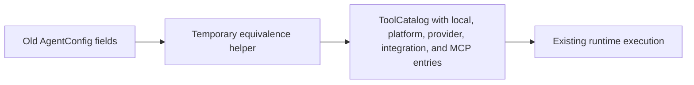
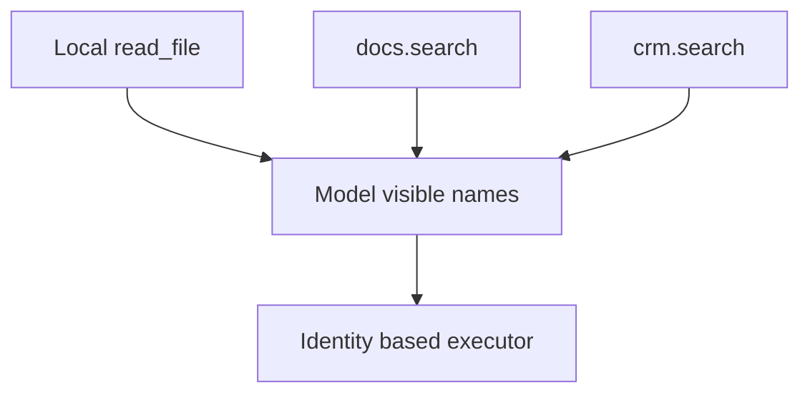
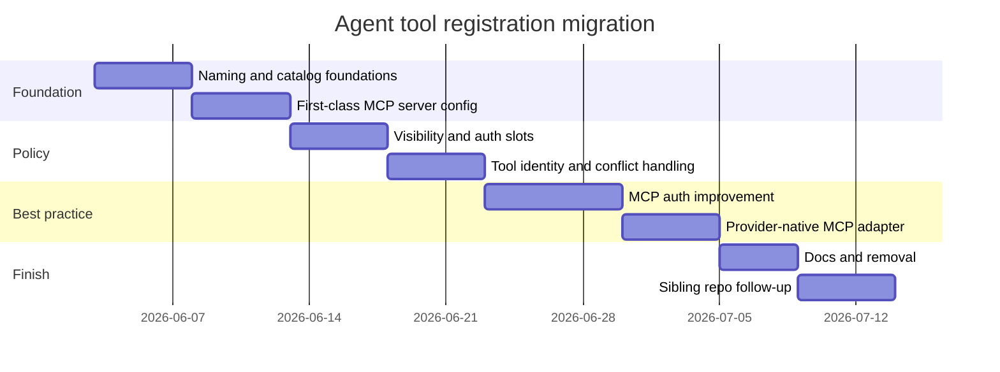

# Agent tool registration migration plan

This plan moves the current tool registration system to the target state in
small, reviewable steps inside one coordinated breaking migration. It avoids
overengineering, but it does not preserve legacy public names after the rollout.

## Scope

In scope:

- Agent tool registration naming cleanup.
- First-class `mcpServers` config for agents and hosted runtime.
- Custom MCP server support with clear auth and filtering slots.
- First-class `providerTools` config for provider-executed tools such as
  `web_search`.
- Explicit catalog entries for platform runtime tools such as `load_skill`.
- Explicit catalog entries for Veryfront integration tools fetched or forwarded
  per request.
- Runtime tool catalog assembly.
- Removal of existing `remoteTools`, `allowedRemoteTools`, and
  `veryfrontMcpServer("...")` public usage.
- Focused tests and architecture docs.

Out of scope for the first pass:

- Full OAuth UI.
- Stdio MCP process management in hosted runtime.
- SSE MCP transport.
- Long-lived compatibility aliases or a public deprecation window.
- Provider-native MCP as the only execution path.

## Migration principles

- Add the new path beside the old path only inside the feature branch.
- Delete temporary adapters before the coordinated release lands.
- Keep runtime behavior equivalent until tests cover the new vocabulary, then
  remove old fields and call sites.
- Prefer small adapter functions over duplicate execution logic while the
  feature branch is in progress.
- Add auth slots before full OAuth implementation.
- Implement custom MCP support with `none`, `bearer`, and `headers` first.
- Defer interactive approval policy until the product has review UI and audit
  support.

## Phase 1: naming and catalog foundations

Goal: make the existing behavior readable without changing semantics.

Tasks:

1. Add internal type names:
   - `McpServerConfig`
   - `McpToolSource`
   - `PlatformTool`
   - `ProviderTool`
   - `ProviderToolName`
   - `IntegrationTool`
   - `ToolCatalog`
   - `ModelToolDefinition`
   - `ToolPolicy`
2. Replace public runtime vocabulary in `veryfront-code`; do not ship public
   aliases for old names.
3. Rename internal assembly result fields:
   - `runtimeTools` to `localTools`
   - platform-injected tools to `platformTools`
   - `availableToolNames` to `modelVisibleToolNames`
   - `remoteToolSources` to `mcpToolSources`
   - remove `compatibleRemoteToolNames` if it is derivable from
     `modelToolDefinitions` and `ToolIdentity`
4. Add a temporary branch-local equivalence helper if needed to compare the old
   and new catalogs in tests.
5. Delete the temporary helper before finalizing the migration.
6. Add tests that prove the new catalog exposes the same tool names for
   existing scenarios.

Validation:

- Existing hosted agent tests pass.
- Tool helper tests pass.
- Legacy public fields are removed after in-repo call sites are migrated.

Mermaid checkpoint:

## Phase 2: first-class MCP server config

Goal: make server config explicit and replace existing `remoteTools`.

Tasks:

1. Add `mcpServers?: McpServerConfig[]` to `AgentConfig`.
2. Normalize hosted service `mcpServers` and agent `mcpServers` through the
   same resolver.
3. Require `id` for custom MCP servers.
4. Add built-in helpers:
   - `veryfrontApiMcpServer()`
   - `veryfrontStudioMcpServer()`
5. Remove `veryfrontMcpServer("api" | "studio")`.
6. Support custom MCP servers as plain `McpServerConfig` objects. Do not add a
   `customMcpServer(config)` wrapper unless repeated call sites prove it is
   useful.
7. Map existing generic `AgentServiceMcpServerConfig` into the new custom
   server shape.
8. Keep `RemoteToolSource` as the legacy adapter interface until all internal
   call sites accept `McpToolSource`.
9. Remove `remoteTools` from `AgentConfig` before final release.

Validation:

- Existing `mcp-server-config` tests pass.
- New tests cover Veryfront API, Veryfront Studio, and custom MCP config.
- Explicit `mcpServers: []` still disables default hosted MCP servers.

## Phase 3: policy slots

Goal: separate visibility and auth.

Tasks:

1. Introduce a small shared `ToolPolicy` shape.
2. Keep local and project tools on the existing `agent.tools` selection path.
   Add a local per-tool approval hook only if a concrete local-tool approval
   use case appears.
3. Add `providerTools?: ProviderToolName[]` to `AgentConfig`.
4. Keep platform runtime tools on their source-specific config paths, for
   example `skills` for skill tools.
5. Keep Veryfront integration tools on their existing per-request discovery and
   forwarded-definition path.
6. Add `toolPolicy` to `McpServerConfig`:
   - `allow`
   - `deny`
   - `approval: "never"`
7. Defer richer approval modes until the product has a concrete review UI and
   audited execution path.
8. Add `auth` policy to `McpServerConfig`:
   - `none`
   - `bearer`
   - `headers`
   - placeholder shape for `oauth`
9. Replace provider-executed uses of `allowedRemoteTools` with
   `providerTools`.
10. Replace MCP uses of `allowedRemoteTools` with per-source
    `toolPolicy.allow`.
11. Replace integration-tool uses of `allowedRemoteTools` with an internal
    catalog selection allowlist or the owning hosted request tool selection.
12. Remove `allowedRemoteTools` from `AgentConfig` before final release.

Validation:

- Tests cover allowlist, denylist, and allow plus deny precedence.
- Tests cover denied tools before remote execution.
- Tests cover bearer and headers auth without logging sensitive values.
- Tests prove local project tool selection through `agent.tools` is unchanged.
- Tests prove `web_search` is selected through `providerTools` and is not
  treated as an MCP tool.
- Tests prove `load_skill` remains available through skill configuration and is
  represented as a platform tool.
- Tests prove `agent({ skills: [...] })` exposes the skill loading platform
  tool without requiring `tools: { load_skill: true }`.
- Tests prove forwarded integration definitions remain available and
  executable through the integration executor.

## Phase 4: tool identity and conflict handling

Goal: make multi-server custom MCP deterministic.

Tasks:

1. Add `ToolIdentity` for local, platform, provider, integration, and
   MCP tools.
2. Build provider-visible names from `ToolIdentity`.
3. Preserve plain names when no conflict exists.
4. Reserve platform runtime names such as `load_skill`.
5. Namespace conflicting remote names as `serverId.toolName`.
6. Route execution through identity mapping instead of searching sources by
   global string only.

Validation:

- Two custom MCP servers can expose the same tool name without accidental
  cross-server execution.
- Platform tools keep stable ids and cannot be shadowed by MCP tools.
- Integration tools keep project-scoped execution context and cannot be
  confused with MCP server tools.
- Local tools still win over remote tools with the same name.
- Existing single-server names do not change.

Mermaid checkpoint:

## Phase 5: MCP auth improvement

Goal: support best-practice HTTP MCP auth without blocking simpler custom
servers.

Tasks:

1. Implement `McpTokenProvider` for Veryfront built-in servers.
2. Add OAuth discovery support behind `auth.type === "oauth"`.
3. Parse `WWW-Authenticate` challenges for protected resource metadata.
4. Support resource indicator binding when requesting MCP access tokens.
5. Add refresh behavior and token cache boundaries keyed by server id and user.
6. Keep bearer and headers modes for internal and simple custom servers.

Validation:

- Unit tests cover token provider selection and redaction.
- Integration-style tests use mocked 401 challenge and metadata responses.
- Expired tokens retry once with a refreshed token.
- Query-string tokens are rejected.

## Phase 6: provider-native MCP adapter

Goal: use provider-native MCP when available and allowed, while keeping the
portable runtime-executed path.

Tasks:

1. Add provider capability detection for native MCP.
2. Convert eligible `McpServerConfig` entries to provider-native MCP config.
3. Keep runtime execution for servers with custom policy or unsupported auth
   modes.
4. Preserve trace events across both paths.

Validation:

- Provider adapter tests assert native MCP config shape.
- Fallback tests assert runtime-executed MCP still works.
- Approval and visibility behavior are equivalent where supported.

## Phase 7: documentation and removal

Goal: make the new vocabulary the only documented and exported vocabulary.

Tasks:

1. Update architecture docs for agent runtime and MCP runtime.
2. Update user guides for agents and tools.
3. Remove old names from generated reference and examples.
4. Add migration examples:
   - `remoteTools` to `mcpServers`
   - `allowedRemoteTools: ["web_search"]` to `providerTools: ["web_search"]`
   - MCP allowlists in `allowedRemoteTools` to
     `mcpServers[].toolPolicy.allow`
   - `veryfrontMcpServer("api")` to `veryfrontApiMcpServer()`
   - Legacy hyphenated skill tool docs and runtime paths to `load_skill`
     runtime tool ids
5. Remove temporary aliases and branch-local equivalence helpers.

Validation:

- Docs build or generated reference check passes.
- Examples compile or typecheck.
- Generated reference does not advertise removed names.
- Removed-name docs do not expose internal paths or sensitive values.

## Phase 8: sibling repo follow-up

Goal: update dependent Veryfront repos in the same coordinated rollout.

Tasks:

1. `veryfront-agent`
   - Replace `veryfrontMcpServer()` with `veryfrontApiMcpServer()`.
   - Replace `veryfrontMcpServer('studio')` with `veryfrontStudioMcpServer()`.
   - Update context population and coding standard docs.
2. `veryfront-docs`
   - Regenerate `veryfront/agent` and `veryfront/tool` API reference.
   - Update the agent service runtime guide to show `auth` and `toolPolicy`.
   - Keep cloud MCP client docs using `mcpServers` because that is external MCP
     client configuration.
3. `veryfront-examples`
   - Migrate provider-executed examples from `allowedRemoteTools` to
     `providerTools`, for example `web_search`.
   - Migrate MCP examples from `allowedRemoteTools` to the owning MCP server
     `toolPolicy.allow`, for example `list_uploads` when it comes from the
     Veryfront API MCP server.
   - Keep integration-tool examples separate from MCP examples when the tool
     name uses the Veryfront integration naming convention.
   - Add one custom MCP example that uses `mcpServers` with bearer auth and
     `toolPolicy.allow`.
4. `veryfront-agent-codex` and `veryfront-codex-agent`
   - Leave Codex `mcp_servers` output stable.
   - Add tests only if server ids, token env vars, or Studio headers change.
5. `veryfront-api`
   - Coordinate OAuth protected resource metadata only when the client OAuth
     phase starts.
   - Preserve existing API key and JWT bearer support.
   - Extend MCP tracing fields only after the client sends stable server ids.
6. `veryfront-studio`
   - Keep Storybook MCP documentation separate from agent runtime MCP docs.
   - Update Studio chat docs only if the Studio MCP server helper names become
     user-visible.

Validation:

- Product agent service starts with the new helper names.
- Generated docs do not advertise removed names.
- Examples compile.
- Codex MCP config snapshots remain unchanged unless intentionally migrated.
- API MCP tests continue to pass for bearer-auth clients.

## Recommended order

The first four phases provide most of the value. OAuth and provider-native MCP
can follow after the naming and policy seams are clean.

## Risk controls

| Risk                      | Control                                                                           |
| ------------------------- | --------------------------------------------------------------------------------- |
| Public API break          | Coordinate all Veryfront repo updates in the same rollout.                        |
| Tool name behavior change | Preserve plain names unless conflicts exist.                                      |
| Auth regression           | Keep existing bearer and headers path while adding typed auth.                    |
| Overengineering           | Avoid server managers, plugin layers, or stdio process control in the first pass. |
| Hidden tool loss          | Add strict mode for discovery errors, default to current resilient behavior.      |
| Sensitive logs            | Add redaction tests around auth and headers.                                      |
| Provider tool regression  | Test `providerTools` separately from MCP and local tools.                         |
| Skill policy regression   | Test that `load_skill` narrows but does not expand the current tool set.          |
| Integration regression    | Test forwarded definitions and per-request API execution context.                 |
| Child runtime regression  | Test requested fork tools that include provider-executed names.                   |
| Provider limit regression | Preserve required platform tools when provider tool caps apply.                   |

## Test plan

Focused tests:

- `src/agent/service/mcp-server-config.test.ts`
- `src/agent/hosted/chat-runtime-tool-assembly.test.ts` if added or updated.
- `src/agent/runtime/tool-helpers.test.ts`
- `src/agent/runtime/model-tool-converter.test.ts`
- `src/agent/runtime/provider-tool-compat.test.ts`
- `src/agent/runtime/load-skill-tool.test.ts`
- `src/agent/runtime/skill-policy.test.ts`
- `src/agent/hosted/child-requested-tools.test.ts`
- `src/tool/remote-mcp.test.ts`
- `src/tool/project-scoped-remote-tools.test.ts`
- `src/server/handlers/request/agent-stream.handler.test.ts`

Scenarios:

- Local tools only.
- Skill-enabled platform tools such as `load_skill`.
- `skills` enabled without any user-authored `tools` config.
- Provider tools such as `web_search`.
- Provider tools in child or fork runtime allowlists.
- Forwarded Veryfront integration definitions and execution.
- Veryfront API MCP default.
- Studio MCP gated by client profile.
- One custom MCP server with bearer auth.
- One custom MCP server with dynamic headers.
- Two custom MCP servers with conflicting tool names.
- Allowlist, denylist, and allow plus deny precedence.
- Remote discovery failure in resilient and strict modes.
- OpenAI tool-count cap keeps required platform tools.
- Google and Anthropic schema sanitization still applies.
- Local models do not advertise executable tools.
- `tools: true` and explicit object tool selection keep their current
  difference.

## Stop condition

The migration is complete when:

- New docs and examples use `mcpServers`, `McpServerConfig`, and `toolPolicy`.
- Provider-executed docs and examples use `providerTools`.
- Platform runtime tool docs consistently use `load_skill` for the runtime
  tool id.
- Skill examples use `skills` to enable skill loading and do not ask users to
  configure `load_skill` under `tools`.
- `remoteTools`, `allowedRemoteTools`, and `veryfrontMcpServer("...")` are
  removed from public docs, generated reference, and code usage.
- Custom MCP servers support typed transport, auth, and visibility.
- Multi-server tool conflicts are deterministic.
- Verification covers local tools, platform tools, provider tools,
  integration tools, built-in Veryfront MCP, and custom MCP.
- Replacement guidance exists for removed names.
