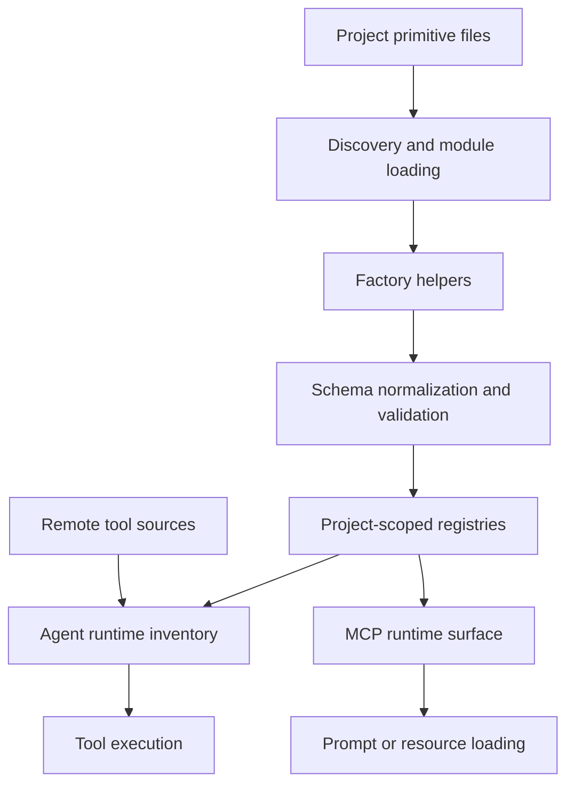

# AI primitives

This page describes tool, prompt, and resource definitions. It does not cover
agent message execution, provider request transport, MCP JSON-RPC dispatch, or
skill policy.

## Responsibility

Tool, prompt, and resource code define reusable AI primitives, validate their
schemas, register project-scoped definitions, and adapt definitions for agent
and MCP runtime use.

Primary source areas:

- [`src/tool/`](../../src/tool/)
- [`src/tool/factory.ts`](../../src/tool/factory.ts)
- [`src/tool/executor.ts`](../../src/tool/executor.ts)
- [`src/tool/registry.ts`](../../src/tool/registry.ts)
- [`src/tool/remote-source-tools.ts`](../../src/tool/remote-source-tools.ts)
- [`src/tool/remote-mcp.ts`](../../src/tool/remote-mcp.ts)
- [`src/tool/schema/`](../../src/tool/schema/)
- [`src/prompt/`](../../src/prompt/)
- [`src/prompt/factory.ts`](../../src/prompt/factory.ts)
- [`src/prompt/registry.ts`](../../src/prompt/registry.ts)
- [`src/resource/`](../../src/resource/)
- [`src/resource/factory.ts`](../../src/resource/factory.ts)
- [`src/resource/registry.ts`](../../src/resource/registry.ts)

## Runtime flow

1. Discovery imports project files and identifies tool, prompt, and resource
   exports.
2. Factory helpers normalize ids, schemas, execution functions, generated
   content, and resource loaders.
3. Registry facades store project-scoped primitives for runtime lookup.
4. Agent runtime consumes tool definitions and executes selected tools.
5. MCP runtime can expose tools, prompts, and resources through protocol
   handlers.
6. Remote tool sources materialize project-scoped or MCP-backed tools without
   global registration.

## Boundaries

- Agent runtime owns model loops, message state, and provider-neutral streaming.
- Tool execution owns callable capability behavior and execution context.
- Prompt and resource definitions own reusable prompt content and loadable
  resource data.
- MCP runtime owns JSON-RPC transport, session behavior, and protocol response
  shapes.
- Skill policy belongs in [skill runtime](./25-skill-runtime.md).

## Change checks

- Add factory and registry tests when changing primitive shape, id generation,
  schema normalization, or project scoping.
- Add executor tests when changing tool context, errors, result markers, or
  tracing.
- Add remote-source tests when changing remote tool filtering, materialization,
  or project id hydration.
- Add prompt and resource tests when changing interpolation, loader behavior,
  params validation, or registry lookup.
- Update [Tools](../guides/tools.md), [`veryfront/tool`](../reference/tool.md),
  [`veryfront/prompt`](../reference/prompt.md), or
  [`veryfront/resource`](../reference/resource.md) when public behavior changes.
