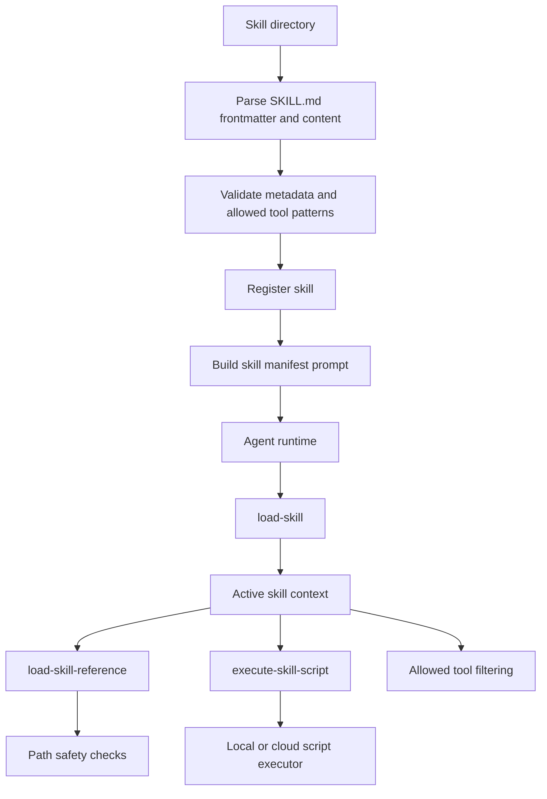

# Skill runtime

This page describes skill parsing, registration, prompt augmentation, allowed
tool policy, path-safe reference loading, and script execution. It does not
cover local tool definitions or provider request transport.

## Responsibility

Skill code turns `SKILL.md` directories into agent-usable instruction packs with
metadata validation, optional reference files, optional executable scripts, and
tool restrictions.

Primary source areas:

- [`src/skill/`](../../src/skill/)
- [`src/skill/types.ts`](../../src/skill/types.ts)
- [`src/skill/parser.ts`](../../src/skill/parser.ts)
- [`src/skill/registry.ts`](../../src/skill/registry.ts)
- [`src/skill/prompt-augmentation.ts`](../../src/skill/prompt-augmentation.ts)
- [`src/skill/allowed-tools.ts`](../../src/skill/allowed-tools.ts)
- [`src/skill/path-safety.ts`](../../src/skill/path-safety.ts)
- [`src/skill/tools.ts`](../../src/skill/tools.ts)
- [`src/skill/executor.ts`](../../src/skill/executor.ts)

## Runtime flow

1. Skill discovery reads `SKILL.md`, parses frontmatter, and validates metadata.
2. Registry helpers store project-scoped skills for lookup.
3. Prompt augmentation summarizes available skills for agent planning.
4. Built-in skill tools load instructions, read reference files, and execute
   scripts.
5. Allowed-tool policy filters callable tools while a skill is active.
6. Path-safety helpers reject traversal and symlink escapes before reading
   skill files.
7. Script execution selects local subprocess execution or cloud sandbox
   execution based on runtime credentials.

## Boundaries

- Skills provide instruction packs and tool policy. They are not workflows,
  jobs, or local tool definitions.
- Skills are configured through project discovery and `agent({ skills })`;
  there is no top-level `veryfront/skill` import path in the current public
  export map.
- Local and remote tool definitions belong in [AI primitives](./24-ai-primitives.md).
- Agent runtime decides when to call skill tools during model execution.
- Sandbox client behavior belongs in [sandbox runtime](./23-sandbox-runtime.md).
- Skill discovery paths are part of
  [discovery and registries](./15-discovery-and-registries.md).

## Change checks

- Add parser tests when changing frontmatter shape, validation, defaults, or
  metadata limits.
- Add allowed-tool tests when changing exact-match or prefix-match policy.
- Add path-safety tests when changing reference, asset, or script file access.
- Add tool tests when changing `load-skill`, `load-skill-reference`, or
  `execute-skill-script`.
- Add executor tests when changing local execution, cloud execution, timeout
  handling, or environment forwarding.
- Update [Skills](../guides/skills.md) when public skill behavior changes.
