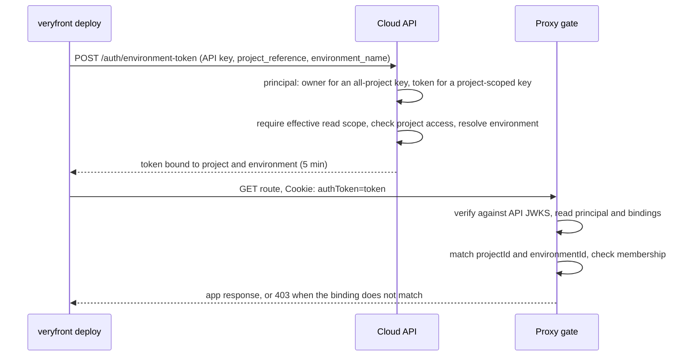

# Environment access gate

A protected Veryfront Cloud environment is fronted by the proxy, which admits a
request only when it carries a credential the gate can verify. This page
documents the gate's decision, the environment access token that lets an
API-key client through it, and which component owns each part.

## Responsibility

- The proxy decides whether a request reaches a protected environment. It
  owns the decision in
  [src/proxy/proxy-access-control.ts](../../src/proxy/proxy-access-control.ts),
  called from [src/proxy/handler.ts](../../src/proxy/handler.ts) once the
  project and environment are resolved.
- The Cloud API owns credential issuance. A browser session is a user JWT in
  the `authToken` cookie. An environment access token is a purpose-bound JWT
  the API mints from an API key for one environment
  (`POST /auth/environment-token`).
- The CLI deploy flow obtains an environment access token only to probe the
  environment it just deployed, in
  [cli/shared/deployment/deploy-project.ts](../../cli/shared/deployment/deploy-project.ts)
  through the control-plane seam in
  [cli/shared/deployment/control-plane.ts](../../cli/shared/deployment/control-plane.ts).

## Flow

The gate reads a verified payload into a principal with `toProxyPrincipal`:

| Token                    | Accepted when                                                                                                               |
| ------------------------ | --------------------------------------------------------------------------------------------------------------------------- |
| User session             | Carries `userId` and no `tokenUse`; the user is a project member.                                                           |
| Environment access token | Carries `aud: environment-gate`, `tokenUse: environment_access`, `projectId`, and `environmentId`.                          |
| Anything in between      | Refused. A token that names the use without the audience, or either without both bindings, is not one this gate issued for. |

For an environment access token the gate compares `projectId` and
`environmentId` to the environment it resolved for the request, fails closed
when the proxy cannot identify the environment, and still checks membership on
the owner. A signature the API's JWKS does not verify, or a missing credential,
redirects to sign-in.

## Boundaries

- The proxy never exchanges or mints. It only verifies and compares.
- The API never sends an environment access token anywhere; it returns it to
  the caller that presented the key. The API refuses that token as a session on
  every one of its own authentication paths, including magic-link
  verification, so an API key cannot be traded up to a user session.
- The token carries no email and no API scopes. The key's effective scopes are
  checked at the exchange, where read access is required; a key scoped to one
  project is refused for any other before access is checked.
- The deploy probe sends either a session credential or an exchanged
  environment access token, never the raw API key. A failed or refused
  exchange degrades the probe to the `gated` outcome and names a bounded
  failure class, not the server's words.

## Deployment dependency

The Cloud API must be deployed before a CLI release that performs the exchange:
an older API answers the exchange with `404`, which the CLI reports as
`unsupported` and degrades to `gated`. The gate change is backward compatible
with existing session cookies, so the proxy can ship in either order relative
to the CLI.

## Change checks

- `deno task test:file src/proxy/proxy-access-control.test.ts` for the gate
  decision and token bindings.
- `deno task test:file cli/shared/deployment/deploy-project.test.ts` and
  `cli/shared/deployment/control-plane.test.ts` for the probe and the exchange
  seam.
- When the token's claims change, update the API minter, `toProxyPrincipal`,
  and this page together.

## Related guides

- [Cloud environment access](../guides/cloud-environment-access.md)
- [Deployment behavior](../guides/deploying.md)

## Related reference

- [Control-plane channels](./11-control-plane-channels.md) for the other signed
  path through the proxy, which is not reachable with an API key.
