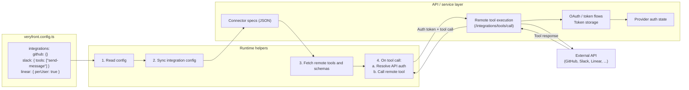

# Integrations

Veryfront integrations let AI agents use third-party services on behalf of
users. Developers enable integrations in `veryfront.config.ts`, and the runtime
uses the built-in connector catalog plus remote integration helpers to fetch
tool definitions and execute calls through the configured API layer.

## Prerequisites

- A Veryfront project with a configured agent (see [Agents](./agents.md)).
- Provider credentials for each integration you enable: either a Veryfront Cloud
  token plus a project reference, or per-user OAuth credentials (see
  [OAuth](./oauth.md)).
- `veryfront.config.ts` is editable in your repo.

## How it works



**Key points:**

- The **runtime** reads integration config locally, syncs it to the API when
  needed, and fetches remote tool definitions per request
- The **API / service layer** is responsible for OAuth, token storage, and
  remote integration execution
- **Config-driven:** adding `github: {}` to the `integrations` record enables
  all GitHub tools instantly
- **Per-user tokens:** set `perUser: true` so each end-user authenticates with
  their own account
- **Tool allowlisting:** use `tools: ["send-message"]` to expose only specific
  tools

## Configuration

```ts
// veryfront.config.ts
import { defineConfig } from "veryfront";

export default defineConfig({
  integrations: {
    // All tools, project-level token
    github: {},

    // Only specific tools
    slack: {
      tools: ["send-message", "list-channels"],
    },

    // Per-user tokens (each end-user authenticates individually)
    linear: {
      perUser: true,
    },

    // API-key based (no OAuth needed)
    stripe: {},
  },
});
```

## Authentication flow

When an agent calls an integration tool and no valid token exists:

1. Tool returns `{ error: "authentication_required", connectUrl: "..." }`
2. Agent surfaces the connect URL to the user
3. User selects the connect URL and completes the configured OAuth app, provider
   consent screen, and callback flow
4. The backing API layer stores the resulting token according to its configured
   token store
5. Subsequent tool calls can use that token automatically
6. Refresh behavior depends on the provider and the API/service layer you run
   behind these endpoints

### OAuth credentials and deployment model

The open-core repo exposes provider metadata, OAuth handler building blocks, and
integration/runtime helpers. Managed OAuth defaults, shared provider apps, and
token-vault behavior depend on the API/service layer you deploy behind these
endpoints.

### BYO Credentials

Enterprise teams can use their own OAuth app credentials by setting environment
variables:

```bash
GITHUB_CLIENT_ID=<GITHUB_CLIENT_ID>
GITHUB_CLIENT_SECRET=<GITHUB_CLIENT_SECRET>
```

When these are set in the backing API environment, the OAuth handlers use them
directly.

## API setup for OAuth credentials

If you are running your own API/service layer for integrations, register an
OAuth app for each provider you enable and configure the matching credentials
there.

### Provider registration

For each OAuth provider, create an application and configure the callback URL:

```
https://<api-host>/api/oauth/callback/{integration-name}
```

Then set the credentials as environment variables on the API:

| Provider                                         | Variable Prefix | Registration URL                                                  |
| ------------------------------------------------ | --------------- | ----------------------------------------------------------------- |
| GitHub                                           | `GITHUB_`       | https://github.com/settings/developers                            |
| Google (Gmail, Calendar, Docs, Drive, Sheets)    | `GOOGLE_`       | https://console.cloud.google.com/apis/credentials                 |
| Slack                                            | `SLACK_`        | https://api.slack.com/apps                                        |
| Microsoft (Outlook, Teams, OneDrive, SharePoint) | `MICROSOFT_`    | https://portal.azure.com/#blade/Microsoft_AAD_RegisteredApps      |
| Atlassian (Jira, Confluence)                     | `ATLASSIAN_`    | https://developer.atlassian.com/console/myapps/                   |
| Linear                                           | `LINEAR_`       | https://linear.app/settings/api                                   |
| Notion                                           | `NOTION_`       | https://www.notion.so/my-integrations                             |
| Figma                                            | `FIGMA_`        | https://www.figma.com/developers/apps                             |
| Discord                                          | `DISCORD_`      | https://discord.com/developers/applications                       |
| Dropbox                                          | `DROPBOX_`      | https://www.dropbox.com/developers/apps                           |
| Airtable                                         | `AIRTABLE_`     | https://airtable.com/create/oauth                                 |
| Asana                                            | `ASANA_`        | https://app.asana.com/0/developer-console                         |
| Bitbucket                                        | `BITBUCKET_`    | https://bitbucket.org/workspace/settings/oauth-consumers          |
| Box                                              | `BOX_`          | https://app.box.com/developers/console                            |
| ClickUp                                          | `CLICKUP_`      | https://app.clickup.com/settings/integrations                     |
| Freshdesk                                        | `FRESHDESK_`    | https://developers.freshdesk.com/                                 |
| GitLab                                           | `GITLAB_`       | https://gitlab.com/-/profile/applications                         |
| HubSpot                                          | `HUBSPOT_`      | https://app.hubspot.com/developer                                 |
| Intercom                                         | `INTERCOM_`     | https://app.intercom.com/a/apps/_/developer-hub                   |
| Mailchimp                                        | `MAILCHIMP_`    | https://admin.mailchimp.com/account/oauth2/                       |
| Monday.com                                       | `MONDAY_`       | https://monday.com/developers/apps                                |
| Pipedrive                                        | `PIPEDRIVE_`    | https://developers.pipedrive.com/docs/marketplace                 |
| QuickBooks                                       | `QUICKBOOKS_`   | https://developer.intuit.com/app/developer/dashboard              |
| Salesforce                                       | `SALESFORCE_`   | https://login.salesforce.com/lightning/setup/ConnectedApplication |
| ServiceNow                                       | `SERVICENOW_`   | Instance admin, Application Registry                              |
| Shopify                                          | `SHOPIFY_`      | https://partners.shopify.com/organizations                        |
| Trello                                           | `TRELLO_`       | https://trello.com/power-ups/admin                                |
| Twitter/X                                        | `TWITTER_`      | https://developer.twitter.com/en/portal/dashboard                 |
| Webex                                            | `WEBEX_`        | https://developer.webex.com/my-apps                               |
| Xero                                             | `XERO_`         | https://developer.xero.com/app/manage                             |
| Zendesk                                          | `ZENDESK_`      | https://zendesk.com/admin/apps-integrations                       |
| Zoom                                             | `ZOOM_`         | https://marketplace.zoom.us/develop                               |

Each provider needs two variables:

```bash
{PREFIX}CLIENT_ID=...
{PREFIX}CLIENT_SECRET=...
```

For example:

```bash
GITHUB_CLIENT_ID=<GITHUB_CLIENT_ID>
GITHUB_CLIENT_SECRET=<GITHUB_CLIENT_SECRET>
GOOGLE_CLIENT_ID=<GOOGLE_CLIENT_ID>
GOOGLE_CLIENT_SECRET=<GOOGLE_CLIENT_SECRET>
SLACK_CLIENT_ID=<SLACK_CLIENT_ID>
SLACK_CLIENT_SECRET=<SLACK_CLIENT_SECRET>
```

### Google APIs (shared credentials)

Google Calendar, Gmail, Docs, Drive, and Sheets all use the same
`GOOGLE_CLIENT_ID` / `GOOGLE_CLIENT_SECRET`. Register one Google OAuth app and
enable all required APIs in the Cloud Console:

- [Google Calendar API](https://console.cloud.google.com/apis/library/calendar-json.googleapis.com)
- [Gmail API](https://console.cloud.google.com/apis/library/gmail.googleapis.com)
- [Google Docs API](https://console.cloud.google.com/apis/library/docs.googleapis.com)
- [Google Drive API](https://console.cloud.google.com/apis/library/drive.googleapis.com)
- [Google Sheets API](https://console.cloud.google.com/apis/library/sheets.googleapis.com)

### Microsoft APIs (shared credentials)

Outlook, Teams, OneDrive, and SharePoint all use `MICROSOFT_CLIENT_ID` /
`MICROSOFT_CLIENT_SECRET`. Register one Azure AD app with the required Microsoft
Graph permissions.

### API-Key Integrations (no OAuth setup needed)

These integrations use API keys set by the developer in their project
environment variables. No OAuth app is needed:

| Integration | Required Variables                                                                     |
| ----------- | -------------------------------------------------------------------------------------- |
| Anthropic   | `ANTHROPIC_API_KEY`                                                                    |
| AWS         | `AWS_ACCESS_KEY_ID`, `AWS_SECRET_ACCESS_KEY`, `AWS_REGION`                             |
| Mixpanel    | `MIXPANEL_PROJECT_TOKEN`, `MIXPANEL_API_SECRET`, `MIXPANEL_PROJECT_ID`                 |
| Neon        | `NEON_API_KEY`, `DATABASE_URL`                                                         |
| PostHog     | `POSTHOG_API_KEY`                                                                      |
| Sentry      | `SENTRY_AUTH_TOKEN`, `SENTRY_ORG`                                                      |
| Snowflake   | `SNOWFLAKE_ACCOUNT`, `SNOWFLAKE_USERNAME`, `SNOWFLAKE_PASSWORD`, `SNOWFLAKE_WAREHOUSE` |
| Stripe      | `STRIPE_SECRET_KEY`                                                                    |
| Supabase    | `SUPABASE_URL`, `SUPABASE_ANON_KEY`, `SUPABASE_SERVICE_KEY`                            |
| Twilio      | `TWILIO_ACCOUNT_SID`, `TWILIO_AUTH_TOKEN`, `TWILIO_PHONE_NUMBER`                       |

## Available integrations

### Project management

| Integration    | Tools                                                                                                                         | Auth            |
| -------------- | ----------------------------------------------------------------------------------------------------------------------------- | --------------- |
| **Jira**       | list-projects, get-project, search-issues, get-issue, create-issue, update-issue, list-comments, add-comment, get-transitions | OAuth           |
| **Linear**     | search-issues, get-issue, create-issue, update-issue, list-projects                                                           | OAuth           |
| **Asana**      | list-tasks, get-task, create-task, update-task, list-projects                                                                 | OAuth           |
| **ClickUp**    | list-tasks, get-task, create-task, update-task, list-lists                                                                    | OAuth           |
| **Monday.com** | list-boards, list-items, get-item, create-item, update-item                                                                   | OAuth (GraphQL) |
| **Trello**     | list-boards, list-cards, get-card, create-card, update-card                                                                   | OAuth           |

### Code & DevOps

| Integration   | Tools                                                                                                                                                                  | Auth    |
| ------------- | ---------------------------------------------------------------------------------------------------------------------------------------------------------------------- | ------- |
| **GitHub**    | list-repos, get-repo, list-issues, get-issue, update-issue, add-issue-comment, list-prs, create-issue, get-pr-diff                                                     | OAuth   |
| **GitLab**    | list-projects, get-project, search-issues, get-issue, create-issue, update-issue, add-issue-comment, list-merge-requests, get-merge-request, add-merge-request-comment | OAuth   |
| **Bitbucket** | list-repositories, list-pull-requests, create-pull-request, list-issues                                                                                                | OAuth   |
| **Sentry**    | list-projects, list-issues, get-issue, resolve-issue                                                                                                                   | API Key |
| **AWS**       | list-s3-buckets, list-s3-objects, get-s3-object, list-ec2-instances, list-lambda-functions                                                                             | API Key |

### Communication

| Integration | Tools                                                                | Auth    |
| ----------- | -------------------------------------------------------------------- | ------- |
| **Slack**   | list-channels, send-message, get-messages                            | OAuth   |
| **Discord** | list-guilds, list-channels, get-messages, send-message, get-user     | OAuth   |
| **Gmail**   | list-emails, send-email, search-emails                               | OAuth   |
| **Outlook** | list-emails, get-email, send-email, search-emails, list-folders      | OAuth   |
| **Teams**   | list-chats, get-messages, send-message, list-teams, list-channels    | OAuth   |
| **Twilio**  | send-sms, send-whatsapp, list-messages, get-message, list-calls      | API Key |
| **Webex**   | list-meetings, get-meeting, create-meeting, list-rooms, send-message | OAuth   |

### Documents & Storage

| Integration       | Tools                                                                            | Auth  |
| ----------------- | -------------------------------------------------------------------------------- | ----- |
| **Notion**        | search-notion, read-page, create-page, query-database                            | OAuth |
| **Google Docs**   | list-documents, get-document, create-document, update-document, search-documents | OAuth |
| **Google Drive**  | list-files, get-file, search-files, create-folder, upload-file                   | OAuth |
| **Google Sheets** | list-spreadsheets, get-spreadsheet, read-range, write-range, create-spreadsheet  | OAuth |
| **Confluence**    | search-content, get-page, create-page, update-page, list-spaces                  | OAuth |
| **Dropbox**       | list-files, get-file, upload-file, search-files, get-account                     | OAuth |
| **Box**           | list-files, get-file, search-files, create-folder, upload-file                   | OAuth |
| **OneDrive**      | list-files, search-files, upload-file, download-file                             | OAuth |
| **SharePoint**    | list-sites, get-site, list-files, get-file, upload-file                          | OAuth |

### CRM & Sales

| Integration    | Tools                                                                          | Auth  |
| -------------- | ------------------------------------------------------------------------------ | ----- |
| **HubSpot**    | list-contacts, get-contact, create-contact, list-deals, create-deal            | OAuth |
| **Salesforce** | list-accounts, get-account, list-contacts, list-opportunities, create-lead     | OAuth |
| **Pipedrive**  | list-deals, get-deal, create-deal, update-deal, list-persons                   | OAuth |
| **Intercom**   | list-contacts, get-contact, list-conversations, get-conversation, send-message | OAuth |

### Databases

| Integration   | Tools                                                                                                                                                 | Auth    |
| ------------- | ----------------------------------------------------------------------------------------------------------------------------------------------------- | ------- |
| **Airtable**  | list-bases, get-base, list-records, get-record, create-record, create-records, update-record, delete-record, create-table, update-table, create-field | OAuth   |
| **Supabase**  | list-tables, query-table, insert-row, update-row, delete-row                                                                                          | API Key |
| **Neon**      | list-projects, list-branches, query-database, list-tables, describe-table                                                                             | API Key |
| **Snowflake** | run-query, list-databases, list-schemas, list-tables, describe-table                                                                                  | API Key |

### Design

| Integration | Tools                                                           | Auth  |
| ----------- | --------------------------------------------------------------- | ----- |
| **Figma**   | list-files, get-file, get-comments, post-comment, list-projects | OAuth |

### Analytics

| Integration   | Tools                                                                     | Auth    |
| ------------- | ------------------------------------------------------------------------- | ------- |
| **Mixpanel**  | track-event, query-events, get-funnel, get-retention, list-cohorts        | API Key |
| **PostHog**   | get-trends, list-feature-flags, list-persons, capture-event               | API Key |
| **Anthropic** | list-workspaces, get-usage, list-api-keys, list-members, get-organization | API Key |

### Finance & Accounting

| Integration    | Tools                                                                        | Auth    |
| -------------- | ---------------------------------------------------------------------------- | ------- |
| **Stripe**     | list-customers, get-customer, list-payments, get-balance, list-subscriptions | API Key |
| **QuickBooks** | list-invoices, get-invoice, create-invoice, list-customers, get-customer     | OAuth   |
| **Xero**       | list-invoices, get-invoice, create-invoice, list-contacts, get-contact       | OAuth   |

### Support

| Integration    | Tools                                                                            | Auth  |
| -------------- | -------------------------------------------------------------------------------- | ----- |
| **Zendesk**    | list-tickets, get-ticket, create-ticket, search-tickets                          | OAuth |
| **Freshdesk**  | list-tickets, get-ticket, create-ticket, update-ticket, list-contacts            | OAuth |
| **ServiceNow** | list-incidents, get-incident, create-incident, update-incident, search-knowledge | OAuth |

### Calendar & Meetings

| Integration         | Tools                                                                      | Auth  |
| ------------------- | -------------------------------------------------------------------------- | ----- |
| **Google Calendar** | list-events, create-event, find-free-time                                  | OAuth |
| **Zoom**            | list-meetings, get-meeting, create-meeting, update-meeting, delete-meeting | OAuth |

### Marketing

| Integration   | Tools                                                            | Auth  |
| ------------- | ---------------------------------------------------------------- | ----- |
| **Mailchimp** | list-campaigns, get-campaign, list-lists, get-list, list-members | OAuth |

### E-Commerce

| Integration | Tools                                                              | Auth  |
| ----------- | ------------------------------------------------------------------ | ----- |
| **Shopify** | list-products, get-product, list-orders, get-order, list-customers | OAuth |

### Social

| Integration   | Tools                                   | Auth  |
| ------------- | --------------------------------------- | ----- |
| **Twitter/X** | search-tweets, post-tweet, get-timeline | OAuth |

---

The built-in connector catalog spans OAuth-backed and API-key-backed
integrations. Treat the tables above as representative current coverage rather
than a hard-coded count contract.

## Verify it worked

After enabling an integration:

1. Restart `veryfront dev`. The dev log lists the integration tools that were
   registered.
2. From an agent that includes the integration tools, send a message that
   exercises one tool. The AG-UI stream should include a tool call event with
   the integration's tool id and a non-error result.
3. For per-user OAuth integrations, confirm the user has authorised the provider
   first (see [OAuth](./oauth.md)). Calls fail with `401` if the user has no
   token.

## Next

- [Sandbox](./sandbox.md): run isolated commands and file operations
- [CLI-first knowledge ingestion](./cli-knowledge-ingestion.md): ingest
  documents into project knowledge

## Related

- [Agents](./agents.md): agents use integration tools
- [Tools](./tools.md): define custom tools
- [OAuth](./oauth.md): configure OAuth-backed providers
- [`veryfront/integrations`](../reference/veryfront/integrations.md): integration metadata reference
- [Configuration](./configuration.md): configure project settings
