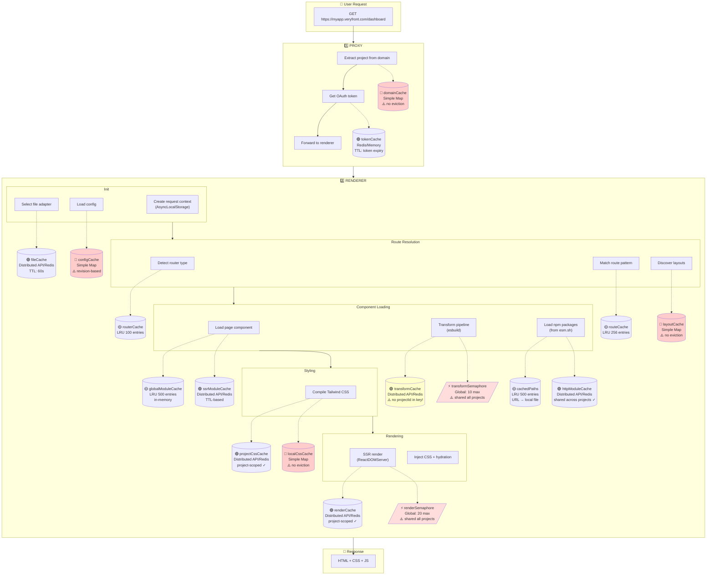
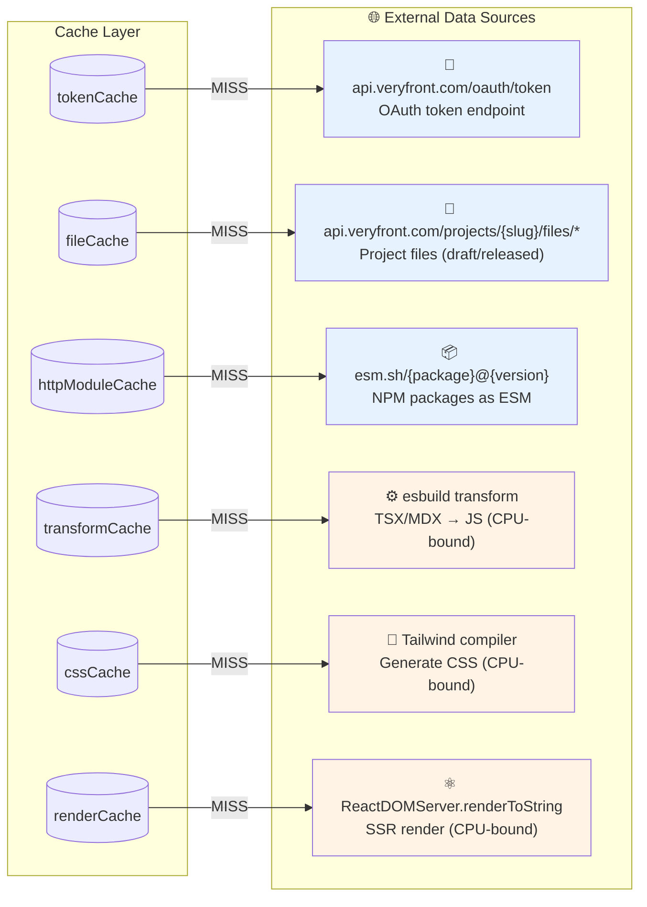

# Master Request Flow Diagram

Complete trace of a user request through every layer, cache, and adapter.

---

## Quick Visual (Mermaid)



**Legend:**
| Symbol | Type | Eviction | Risk |
|--------|------|----------|------|
| 🔴 | Simple Map | None | Memory leak, cross-project pollution |
| 🟡 | LRU | Size-based | Bounded, safe |
| 🟢 | Distributed (API/Redis) | TTL-based | Proper eviction |
| ⚡ | Semaphore | N/A | Global starvation risk |
| 🌐 | External Data Source | N/A | Network latency |

---

## Data Sources (On Cache Miss)



| Cache | On Miss → Source | Latency |
|-------|------------------|---------|
| `tokenCache` | `POST api.veryfront.com/oauth/token` | ~50ms |
| `fileCache` | `GET api.veryfront.com/projects/{slug}/files/{path}` | ~30-100ms |
| `httpModuleCache` | `GET esm.sh/{package}@{version}` | ~100-500ms |
| `transformCache` | esbuild transform (TSX/MDX → JS) | ~20-100ms |
| `cssCache` | Tailwind compiler scan + generate | ~50-200ms |
| `renderCache` | ReactDOMServer.renderToString() | ~20-100ms |

**Cache Types Explained:**
- **Distributed API**: `api.veryfront.com/projects/{slug}/cache/*` - cache-as-a-service
- **Distributed Redis**: Self-hosted Redis instance
- **LRU**: Least Recently Used with max entry count
- **Simple Map**: `new Map()` with no eviction strategy

---

## High-Level Overview

```
┌─────────────────────────────────────────────────────────────────────────────┐
│                            USER REQUEST                                      │
│                   GET https://myapp.veryfront.com/dashboard                 │
└─────────────────────────────────────────────────────────────────────────────┘
                                    │
                                    ▼
┌─────────────────────────────────────────────────────────────────────────────┐
│ 1. PROXY (OAuth + Routing)                                                   │
│    ├─ Token cache (Redis/Memory)                                            │
│    └─ Project lookup                                                         │
└─────────────────────────────────────────────────────────────────────────────┘
                                    │
                                    ▼
┌─────────────────────────────────────────────────────────────────────────────┐
│ 2. RENDERER (SSR/RSC)                                                        │
│    ├─ Domain lookup cache                                                    │
│    ├─ Config cache                                                           │
│    ├─ File adapter (Local/API/GitHub)                                       │
│    ├─ Router detection cache                                                 │
│    ├─ Layout discovery cache                                                 │
│    ├─ Transform caches (ESM, MDX, SSR)                                      │
│    ├─ HTTP module cache (npm packages)                                      │
│    ├─ Tailwind CSS cache                                                    │
│    └─ Render cache                                                          │
└─────────────────────────────────────────────────────────────────────────────┘
                                    │
                                    ▼
┌─────────────────────────────────────────────────────────────────────────────┐
│                              RESPONSE                                        │
│                        HTML + CSS + JS                                       │
└─────────────────────────────────────────────────────────────────────────────┘
```

---

## Detailed Flow: Every Step

```
┌─────────────────────────────────────────────────────────────────────────────┐
│                                                                              │
│  USER: GET https://myapp.veryfront.com/dashboard                            │
│                                                                              │
└─────────────────────────────────────────────────────────────────────────────┘
                                    │
════════════════════════════════════╪══════════════════════════════════════════
                          STEP 1: PROXY
════════════════════════════════════╪══════════════════════════════════════════
                                    │
                                    ▼
┌─────────────────────────────────────────────────────────────────────────────┐
│ 1.1 EXTRACT PROJECT FROM DOMAIN                                              │
├─────────────────────────────────────────────────────────────────────────────┤
│                                                                              │
│  Input: "myapp.veryfront.com"                                               │
│  Output: projectSlug = "myapp"                                              │
│                                                                              │
│  Domain patterns:                                                            │
│  ├─ {slug}.veryfront.com      → Production                                  │
│  ├─ {slug}.preview.veryfront.com → Preview                                  │
│  ├─ {slug}.lvh.me:8080        → Local dev                                   │
│  └─ Custom domain             → Lookup in database                          │
│                                                                              │
│  ┌─────────────────────────────────────────────────────────────────────┐    │
│  │ CACHE: domainCache (Simple Map)                                     │    │
│  │ Key: "myapp.veryfront.com"                                          │    │
│  │ Value: { slug: "myapp", env: "production" }                         │    │
│  │ Miss: Parse domain pattern                                          │    │
│  │ ⚠️ No eviction - memory leak risk                                   │    │
│  └─────────────────────────────────────────────────────────────────────┘    │
│                                                                              │
└─────────────────────────────────────────────────────────────────────────────┘
                                    │
                                    ▼
┌─────────────────────────────────────────────────────────────────────────────┐
│ 1.2 GET OAUTH TOKEN                                                          │
├─────────────────────────────────────────────────────────────────────────────┤
│                                                                              │
│  ┌─────────────────────────────────────────────────────────────────────┐    │
│  │ CACHE: Token cache (Redis in prod, Memory in dev)                   │    │
│  │ Key: "token:{projectSlug}"                                          │    │
│  │ TTL: Token expiry minus buffer                                      │    │
│  │                                                                      │    │
│  │ HIT:  Return cached token                                           │    │
│  │ MISS: OAuth flow with api.veryfront.com                             │    │
│  │       POST /oauth/token { client_id, client_secret, grant_type }    │    │
│  └─────────────────────────────────────────────────────────────────────┘    │
│                                                                              │
│  Adds headers to request:                                                   │
│  ├─ x-token: <oauth_token>                                                  │
│  ├─ x-project-slug: myapp                                                   │
│  └─ x-environment: production|preview                                       │
│                                                                              │
└─────────────────────────────────────────────────────────────────────────────┘
                                    │
                                    ▼
┌─────────────────────────────────────────────────────────────────────────────┐
│ 1.3 FORWARD TO RENDERER                                                      │
├─────────────────────────────────────────────────────────────────────────────┤
│                                                                              │
│  Production: HTTP to renderer pod (internal Kubernetes service)             │
│  Local dev:  Same process (combined mode)                                   │
│                                                                              │
└─────────────────────────────────────────────────────────────────────────────┘
                                    │
════════════════════════════════════╪══════════════════════════════════════════
                          STEP 2: RENDERER INIT
════════════════════════════════════╪══════════════════════════════════════════
                                    │
                                    ▼
┌─────────────────────────────────────────────────────────────────────────────┐
│ 2.1 CREATE REQUEST CONTEXT                                                   │
├─────────────────────────────────────────────────────────────────────────────┤
│                                                                              │
│  Extract from headers:                                                       │
│  ├─ token = req.headers["x-token"]                                          │
│  ├─ projectSlug = req.headers["x-project-slug"]                             │
│  └─ environment = req.headers["x-environment"]                              │
│                                                                              │
│  ┌─────────────────────────────────────────────────────────────────────┐    │
│  │ AsyncLocalStorage Context (per-request isolation)                   │    │
│  │ {                                                                    │    │
│  │   projectId: "uuid-xxx",                                            │    │
│  │   projectSlug: "myapp",                                             │    │
│  │   token: "eyJ...",                                                  │    │
│  │   environment: "production",                                        │    │
│  │   requestId: "req-123",                                             │    │
│  │ }                                                                    │    │
│  └─────────────────────────────────────────────────────────────────────┘    │
│                                                                              │
└─────────────────────────────────────────────────────────────────────────────┘
                                    │
                                    ▼
┌─────────────────────────────────────────────────────────────────────────────┐
│ 2.2 SELECT FILE ADAPTER                                                      │
├─────────────────────────────────────────────────────────────────────────────┤
│                                                                              │
│  Based on config.fs.type or environment:                                    │
│                                                                              │
│  ┌─────────────────────────────────────────────────────────────────────┐    │
│  │                                                                      │    │
│  │  LOCAL DEV (fs.type: "local")                                       │    │
│  │  ─────────────────────────────                                      │    │
│  │  LocalFSAdapter                                                     │    │
│  │  ├─ Reads from disk: /Users/dev/projects/myapp/                     │    │
│  │  ├─ Native Deno.readFile(), Deno.stat()                             │    │
│  │  ├─ File watcher for HMR                                            │    │
│  │  └─ No caching needed (disk is fast)                                │    │
│  │                                                                      │    │
│  │  ─────────────────────────────────────────────────────────────────  │    │
│  │                                                                      │    │
│  │  PRODUCTION (fs.type: "veryfront-api")                              │    │
│  │  ─────────────────────────────────────                              │    │
│  │  VeryfrontAPIAdapter                                                │    │
│  │  ├─ Fetches from: api.veryfront.com/projects/{slug}/files/*        │    │
│  │  ├─ Uses OAuth token from request context                          │    │
│  │  ├─ Draft content (preview) vs Released content (production)       │    │
│  │  │                                                                   │    │
│  │  │  ┌─────────────────────────────────────────────────────────┐     │    │
│  │  │  │ CACHE: File cache (Distributed - API/Redis)             │     │    │
│  │  │  │ Key: "file:{projectId}:{path}:{contentSourceId}"        │     │    │
│  │  │  │ TTL: 60 seconds                                         │     │    │
│  │  │  │ Miss: GET api.veryfront.com/projects/{slug}/files/{path}│     │    │
│  │  │  └─────────────────────────────────────────────────────────┘     │    │
│  │  │                                                                   │    │
│  │  └─ ⚠️ No walkDirectory() - layout bug source!                      │    │
│  │                                                                      │    │
│  │  ─────────────────────────────────────────────────────────────────  │    │
│  │                                                                      │    │
│  │  GITHUB (fs.type: "github")                                         │    │
│  │  ──────────────────────────                                         │    │
│  │  GitHubAdapter                                                      │    │
│  │  ├─ Fetches from: api.github.com/repos/{owner}/{repo}/contents/*   │    │
│  │  ├─ Uses GitHub token                                               │    │
│  │  └─ Similar caching to Veryfront API                                │    │
│  │                                                                      │    │
│  └─────────────────────────────────────────────────────────────────────┘    │
│                                                                              │
└─────────────────────────────────────────────────────────────────────────────┘
                                    │
                                    ▼
┌─────────────────────────────────────────────────────────────────────────────┐
│ 2.3 LOAD PROJECT CONFIG                                                      │
├─────────────────────────────────────────────────────────────────────────────┤
│                                                                              │
│  Load veryfront.config.ts from project root                                │
│                                                                              │
│  ┌─────────────────────────────────────────────────────────────────────┐    │
│  │ CACHE: configCacheByProject (Simple Map)                            │    │
│  │ Key: projectSlug                                                    │    │
│  │ Value: { revision, config: VeryfrontConfig }                        │    │
│  │ ⚠️ No eviction - uses revision check for invalidation               │    │
│  └─────────────────────────────────────────────────────────────────────┘    │
│                                                                              │
│  On MISS:                                                                   │
│  ┌─────────────────────────────────────────────────────────────────────┐    │
│  │                                                                      │    │
│  │  LOCAL:  Native import("file:///path/veryfront.config.ts")          │    │
│  │                                                                      │    │
│  │  API:    1. Fetch file content via adapter                          │    │
│  │          2. Write to temp file                                      │    │
│  │          3. Transpile with esbuild                                  │    │
│  │          4. Dynamic import temp file                                │    │
│  │          5. Delete temp file                                        │    │
│  │                                                                      │    │
│  │  ⚠️ SECURITY: Config executes with full renderer permissions!       │    │
│  │                                                                      │    │
│  └─────────────────────────────────────────────────────────────────────┘    │
│                                                                              │
│  Config affects everything downstream:                                      │
│  ├─ router: "app" | "pages"                                                 │
│  ├─ layout: "path/to/layout.tsx" | false                                   │
│  ├─ tailwind: { config: "tailwind.config.ts" }                             │
│  ├─ experimental: { rsc: true, ... }                                       │
│  └─ ...40+ options                                                          │
│                                                                              │
└─────────────────────────────────────────────────────────────────────────────┘
                                    │
════════════════════════════════════╪══════════════════════════════════════════
                          STEP 3: ROUTE RESOLUTION
════════════════════════════════════╪══════════════════════════════════════════
                                    │
                                    ▼
┌─────────────────────────────────────────────────────────────────────────────┐
│ 3.1 DETECT ROUTER TYPE                                                       │
├─────────────────────────────────────────────────────────────────────────────┤
│                                                                              │
│  Determine if project uses App Router or Pages Router                       │
│                                                                              │
│  ┌─────────────────────────────────────────────────────────────────────┐    │
│  │ CACHE: routerDetectionCache (LRU, 100 entries)                      │    │
│  │ Key: projectDir (path-based, not projectId!)                        │    │
│  │ Value: boolean (true = App Router)                                  │    │
│  │ ⚠️ Uses path not projectId - potential multi-tenant issue           │    │
│  └─────────────────────────────────────────────────────────────────────┘    │
│                                                                              │
│  On MISS:                                                                   │
│  ┌─────────────────────────────────────────────────────────────────────┐    │
│  │  1. Check config.router if explicitly set                           │    │
│  │  2. Check if app/ directory exists                                  │    │
│  │  3. Check if app/page.tsx exists                                    │    │
│  │  4. Fall back to Pages Router if none found                         │    │
│  └─────────────────────────────────────────────────────────────────────┘    │
│                                                                              │
└─────────────────────────────────────────────────────────────────────────────┘
                                    │
                                    ▼
┌─────────────────────────────────────────────────────────────────────────────┐
│ 3.2 MATCH ROUTE                                                              │
├─────────────────────────────────────────────────────────────────────────────┤
│                                                                              │
│  Input: /dashboard                                                          │
│  Output: { filePath, params, layouts }                                      │
│                                                                              │
│  ┌─────────────────────────────────────────────────────────────────────┐    │
│  │ CACHE: routeCache (LRU, 256 entries, per-matcher instance)          │    │
│  │ Key: "/dashboard"                                                   │    │
│  │ Value: RouteMatch { pattern, filePath, params }                     │    │
│  └─────────────────────────────────────────────────────────────────────┘    │
│                                                                              │
│  On MISS (route discovery):                                                 │
│  ┌─────────────────────────────────────────────────────────────────────┐    │
│  │                                                                      │    │
│  │  APP ROUTER:                                                        │    │
│  │  ├─ Look for app/dashboard/page.tsx                                 │    │
│  │  ├─ Check for dynamic segments: app/[id]/page.tsx                   │    │
│  │  └─ Check for route groups: app/(admin)/dashboard/page.tsx          │    │
│  │                                                                      │    │
│  │  PAGES ROUTER:                                                      │    │
│  │  ├─ Look for pages/dashboard.tsx                                    │    │
│  │  ├─ Or pages/dashboard/index.tsx                                    │    │
│  │  └─ Check for dynamic: pages/[id].tsx                               │    │
│  │                                                                      │    │
│  │  Both: Uses adapter.exists() for each candidate path                │    │
│  │        Each exists() call may hit file cache                        │    │
│  │                                                                      │    │
│  └─────────────────────────────────────────────────────────────────────┘    │
│                                                                              │
└─────────────────────────────────────────────────────────────────────────────┘
                                    │
                                    ▼
┌─────────────────────────────────────────────────────────────────────────────┐
│ 3.3 DISCOVER LAYOUTS                                                         │
├─────────────────────────────────────────────────────────────────────────────┤
│                                                                              │
│  Find all layout files from root to page                                    │
│                                                                              │
│  ┌─────────────────────────────────────────────────────────────────────┐    │
│  │ CACHE: layoutDiscoveryCache (Simple Map)                            │    │
│  │ Key: projectDir (not projectId!)                                    │    │
│  │ Value: LayoutItem[]                                                 │    │
│  │ ⚠️ No eviction - memory leak                                        │    │
│  │ ⚠️ No projectId - multi-tenant pollution possible                   │    │
│  └─────────────────────────────────────────────────────────────────────┘    │
│                                                                              │
│  On MISS:                                                                   │
│  ┌─────────────────────────────────────────────────────────────────────┐    │
│  │                                                                      │    │
│  │  LOCAL FS ADAPTER:                                                  │    │
│  │  ─────────────────                                                  │    │
│  │  Walk from root to page, collecting all layout.tsx files:           │    │
│  │  ├─ app/layout.tsx                    ← Root layout                 │    │
│  │  ├─ app/dashboard/layout.tsx          ← Nested layout               │    │
│  │  └─ app/dashboard/settings/layout.tsx ← Deeper nested              │    │
│  │                                                                      │    │
│  │  ─────────────────────────────────────────────────────────────────  │    │
│  │                                                                      │    │
│  │  VERYFRONT API ADAPTER:                                             │    │
│  │  ──────────────────────                                             │    │
│  │  ⚠️ BUG: Only checks config.layout and components/layout.tsx       │    │
│  │  ⚠️ DOES NOT walk directories!                                      │    │
│  │  ⚠️ Nested layouts (app/dashboard/layout.tsx) are IGNORED!         │    │
│  │                                                                      │    │
│  │  This is the "works locally, breaks in production" layout bug.      │    │
│  │                                                                      │    │
│  └─────────────────────────────────────────────────────────────────────┘    │
│                                                                              │
└─────────────────────────────────────────────────────────────────────────────┘
                                    │
════════════════════════════════════╪══════════════════════════════════════════
                          STEP 4: COMPONENT LOADING
════════════════════════════════════╪══════════════════════════════════════════
                                    │
                                    ▼
┌─────────────────────────────────────────────────────────────────────────────┐
│ 4.1 LOAD PAGE COMPONENT                                                      │
├─────────────────────────────────────────────────────────────────────────────┤
│                                                                              │
│  For: app/dashboard/page.tsx                                                │
│                                                                              │
│  ┌──────────────────────── CACHE LOOKUP ORDER ─────────────────────────┐    │
│  │                                                                      │    │
│  │  ┌─────────────────────────────────────────────────────────────┐    │    │
│  │  │ 1. globalModuleCache (LRU, 500 entries, in-memory)          │    │    │
│  │  │    Key: "ssr:v42:{projectId}:{contentSourceId}:{react}:{path}:{hash}"│ │
│  │  │    Value: { tempPath, contentHash }                         │    │    │
│  │  │    HIT: Use temp file path for import                       │    │    │
│  │  └─────────────────────────────────────────────────────────────┘    │    │
│  │                           │ MISS                                    │    │
│  │                           ▼                                         │    │
│  │  ┌─────────────────────────────────────────────────────────────┐    │    │
│  │  │ 2. SSR Module Cache (Distributed - API/Redis)               │    │    │
│  │  │    Key: "ssr-module:{projectId}:{path}:{contentHash}"       │    │    │
│  │  │    Value: Transformed JavaScript code                       │    │    │
│  │  │    HIT: Write to temp file, add to globalModuleCache        │    │    │
│  │  └─────────────────────────────────────────────────────────────┘    │    │
│  │                           │ MISS                                    │    │
│  │                           ▼                                         │    │
│  │  ┌─────────────────────────────────────────────────────────────┐    │    │
│  │  │ 3. Transform Cache (Distributed - API/Redis)                │    │    │
│  │  │    Key: "v42:{filePath}:{contentHash}:ssr"                  │    │    │
│  │  │    ⚠️ NO projectId in key!                                   │    │    │
│  │  │    Value: { code, hash, timestamp }                         │    │    │
│  │  └─────────────────────────────────────────────────────────────┘    │    │
│  │                           │ MISS                                    │    │
│  │                           ▼                                         │    │
│  │                    FRESH TRANSFORM                                  │    │
│  │                                                                      │    │
│  └─────────────────────────────────────────────────────────────────────┘    │
│                                                                              │
└─────────────────────────────────────────────────────────────────────────────┘
                                    │
                                    ▼
┌─────────────────────────────────────────────────────────────────────────────┐
│ 4.2 TRANSFORM PIPELINE (on cache miss)                                       │
├─────────────────────────────────────────────────────────────────────────────┤
│                                                                              │
│  Input: Raw TypeScript/TSX/MDX source code                                  │
│  Output: Browser-compatible JavaScript                                      │
│                                                                              │
│  ┌─────────────────────────────────────────────────────────────────────┐    │
│  │ SEMAPHORE: transformSemaphore (Global, 10 concurrent max)           │    │
│  │ ⚠️ SHARED across ALL projects!                                      │    │
│  │ ⚠️ One heavy project can starve others                              │    │
│  └─────────────────────────────────────────────────────────────────────┘    │
│                                                                              │
│  ┌─────────────────────────────────────────────────────────────────────┐    │
│  │ DEDUPLICATION: globalInProgress (Map)                               │    │
│  │ Key: contentCacheKey                                                │    │
│  │ Value: Promise<void>                                                │    │
│  │ ⚠️ Hanging transform can deadlock other requests                    │    │
│  └─────────────────────────────────────────────────────────────────────┘    │
│                                                                              │
│  Pipeline stages:                                                           │
│  ┌─────────────────────────────────────────────────────────────────────┐    │
│  │                                                                      │    │
│  │  1. READ SOURCE                                                     │    │
│  │     adapter.readFile("app/dashboard/page.tsx")                      │    │
│  │     → Uses file cache (distributed)                                 │    │
│  │                                                                      │    │
│  │  2. PARSE IMPORTS                                                   │    │
│  │     Extract: import { Button } from "../components/Button"          │    │
│  │              import lodash from "lodash"                            │    │
│  │                                                                      │    │
│  │  3. RESOLVE LOCAL IMPORTS (recursive)                               │    │
│  │     For each local import:                                          │    │
│  │     └─ Load and transform that file (recursion)                     │    │
│  │        └─ Same cache lookup sequence                                │    │
│  │                                                                      │    │
│  │  4. RESOLVE NPM IMPORTS                                             │    │
│  │     Rewrite: "lodash" → "https://esm.sh/lodash@4.17.21"            │    │
│  │     (See Step 4.3 for HTTP module loading)                          │    │
│  │                                                                      │    │
│  │  5. ESBUILD TRANSFORM                                               │    │
│  │     TSX → JS (strip types, transform JSX)                           │    │
│  │                                                                      │    │
│  │  6. MDX PROCESSING (if .mdx file)                                   │    │
│  │     MDX → JSX → JS                                                  │    │
│  │     ┌─────────────────────────────────────────────────────────┐     │    │
│  │     │ CACHE: MDX cache (Distributed)                          │     │    │
│  │     │ Key: "mdx:{mode}:{contentHash}"                         │     │    │
│  │     │ ⚠️ No dependency tracking!                               │     │    │
│  │     └─────────────────────────────────────────────────────────┘     │    │
│  │                                                                      │    │
│  │  7. WRITE TO TEMP FILE                                              │    │
│  │     /tmp/vf-ssr-{projectId}/{hash}.mjs                              │    │
│  │     ⚠️ Absolute paths stored in Redis cause cross-pod failures     │    │
│  │                                                                      │    │
│  │  8. CACHE RESULT                                                    │    │
│  │     → globalModuleCache (in-memory)                                 │    │
│  │     → SSR Module Cache (distributed)                                │    │
│  │     → Transform Cache (distributed)                                 │    │
│  │                                                                      │    │
│  └─────────────────────────────────────────────────────────────────────┘    │
│                                                                              │
└─────────────────────────────────────────────────────────────────────────────┘
                                    │
                                    ▼
┌─────────────────────────────────────────────────────────────────────────────┐
│ 4.3 LOAD HTTP MODULES (npm packages)                                         │
├─────────────────────────────────────────────────────────────────────────────┤
│                                                                              │
│  For: import lodash from "lodash"                                           │
│  Resolved to: https://esm.sh/lodash@4.17.21                                │
│                                                                              │
│  ┌──────────────────────── CACHE LOOKUP ORDER ─────────────────────────┐    │
│  │                                                                      │    │
│  │  ┌─────────────────────────────────────────────────────────────┐    │    │
│  │  │ 1. cachedPaths (LRU, 500 entries, in-memory)                │    │    │
│  │  │    Key: "https://esm.sh/lodash@4.17.21"                     │    │    │
│  │  │    Value: "/path/to/cache/lodash-abc123.mjs"                │    │    │
│  │  │    HIT: Return cached path                                  │    │    │
│  │  └─────────────────────────────────────────────────────────────┘    │    │
│  │                           │ MISS                                    │    │
│  │                           ▼                                         │    │
│  │  ┌─────────────────────────────────────────────────────────────┐    │    │
│  │  │ 2. HTTP Module Cache (Distributed - API/Redis)              │    │    │
│  │  │    Key: "http-module:{url-hash}"                            │    │    │
│  │  │    ⚠️ NO projectId - shared across all projects (intentional)│   │    │
│  │  │    Value: JavaScript code                                   │    │    │
│  │  │    HIT: Write to local file, add to cachedPaths             │    │    │
│  │  └─────────────────────────────────────────────────────────────┘    │    │
│  │                           │ MISS                                    │    │
│  │                           ▼                                         │    │
│  │  ┌─────────────────────────────────────────────────────────────┐    │    │
│  │  │ 3. FETCH FROM CDN                                           │    │    │
│  │  │    GET https://esm.sh/lodash@4.17.21                        │    │    │
│  │  │    → Timeout: 30 seconds                                    │    │    │
│  │  │    → Retry: 3 attempts                                      │    │    │
│  │  │    → Cache result in distributed cache                      │    │    │
│  │  │    → Write to local file cache                              │    │    │
│  │  └─────────────────────────────────────────────────────────────┘    │    │
│  │                                                                      │    │
│  └─────────────────────────────────────────────────────────────────────┘    │
│                                                                              │
│  Local file cache location:                                                 │
│  └─ .cache/veryfront-http-modules/{url-hash}.mjs                           │
│                                                                              │
└─────────────────────────────────────────────────────────────────────────────┘
                                    │
                                    ▼
┌─────────────────────────────────────────────────────────────────────────────┐
│ 4.4 CIRCUIT BREAKER (for failed components)                                  │
├─────────────────────────────────────────────────────────────────────────────┤
│                                                                              │
│  ┌─────────────────────────────────────────────────────────────────────┐    │
│  │ STATE: failedComponents (Simple Map, GLOBAL)                        │    │
│  │ Key: circuitKey (includes projectId)                                │    │
│  │ Value: { count, lastFailure }                                       │    │
│  │                                                                      │    │
│  │ If count >= 3 && lastFailure < 30s ago:                             │    │
│  │   → Component is "circuit-broken"                                   │    │
│  │   → Skip transform, return error immediately                        │    │
│  │   → Prevents repeated expensive failures                            │    │
│  │                                                                      │    │
│  │ ⚠️ No eviction - grows unbounded                                    │    │
│  └─────────────────────────────────────────────────────────────────────┘    │
│                                                                              │
└─────────────────────────────────────────────────────────────────────────────┘
                                    │
════════════════════════════════════╪══════════════════════════════════════════
                          STEP 5: STYLING
════════════════════════════════════╪══════════════════════════════════════════
                                    │
                                    ▼
┌─────────────────────────────────────────────────────────────────────────────┐
│ 5.1 TAILWIND CSS COMPILATION                                                 │
├─────────────────────────────────────────────────────────────────────────────┤
│                                                                              │
│  ┌──────────────────────── CACHE LOOKUP ORDER ─────────────────────────┐    │
│  │                                                                      │    │
│  │  ┌─────────────────────────────────────────────────────────────┐    │    │
│  │  │ 1. Project CSS Cache (Distributed - API/Redis)              │    │    │
│  │  │    Key: "{projectSlug}:{stylesheetHash}"                    │    │    │
│  │  │    ✓ Project-scoped                                         │    │    │
│  │  │    Value: Compiled CSS string                               │    │    │
│  │  └─────────────────────────────────────────────────────────────┘    │    │
│  │                           │ MISS                                    │    │
│  │                           ▼                                         │    │
│  │  ┌─────────────────────────────────────────────────────────────┐    │    │
│  │  │ 2. localCssCache (Simple Map, in-memory)                    │    │    │
│  │  │    Key: same                                                 │    │    │
│  │  │    ⚠️ No eviction                                            │    │    │
│  │  └─────────────────────────────────────────────────────────────┘    │    │
│  │                           │ MISS                                    │    │
│  │                           ▼                                         │    │
│  │                    COMPILE TAILWIND                                 │    │
│  │                                                                      │    │
│  └─────────────────────────────────────────────────────────────────────┘    │
│                                                                              │
│  Compilation (on cache miss):                                               │
│  ┌─────────────────────────────────────────────────────────────────────┐    │
│  │                                                                      │    │
│  │  1. GET COMPILER                                                    │    │
│  │     ┌─────────────────────────────────────────────────────────┐     │    │
│  │     │ STATE: compiler (Global, one per stylesheet content)    │     │    │
│  │     │ ⚠️ Hash collision = wrong compiler for project          │     │    │
│  │     └─────────────────────────────────────────────────────────┘     │    │
│  │                                                                      │    │
│  │  2. LOAD PLUGINS                                                    │    │
│  │     ┌─────────────────────────────────────────────────────────┐     │    │
│  │     │ CACHE: pluginCache (Simple Map, GLOBAL)                 │     │    │
│  │     │ Key: pluginName (no version!)                           │     │    │
│  │     │ ⚠️ Different projects may need different plugin versions│     │    │
│  │     └─────────────────────────────────────────────────────────┘     │    │
│  │     ┌─────────────────────────────────────────────────────────┐     │    │
│  │     │ STATE: pluginErrors (Simple Map, GLOBAL)                │     │    │
│  │     │ ⚠️ Plugin error in project A can affect project B       │     │    │
│  │     └─────────────────────────────────────────────────────────┘     │    │
│  │                                                                      │    │
│  │  3. SCAN CONTENT FOR CLASSES                                        │    │
│  │     Scan all .tsx/.jsx files for Tailwind class usage              │    │
│  │     ┌─────────────────────────────────────────────────────────┐     │    │
│  │     │ CACHE: cssInputsCache (Distributed)                     │     │    │
│  │     │ Key: "{projectSlug}:{filesHash}"                        │     │    │
│  │     │ Value: List of candidate classes                        │     │    │
│  │     └─────────────────────────────────────────────────────────┘     │    │
│  │                                                                      │    │
│  │  4. GENERATE CSS                                                    │    │
│  │     Tailwind compiler generates CSS for used classes               │    │
│  │                                                                      │    │
│  │  5. CACHE RESULT                                                    │    │
│  │     → Project CSS Cache (distributed)                               │    │
│  │     → localCssCache (in-memory)                                     │    │
│  │                                                                      │    │
│  └─────────────────────────────────────────────────────────────────────┘    │
│                                                                              │
└─────────────────────────────────────────────────────────────────────────────┘
                                    │
════════════════════════════════════╪══════════════════════════════════════════
                          STEP 6: RENDERING
════════════════════════════════════╪══════════════════════════════════════════
                                    │
                                    ▼
┌─────────────────────────────────────────────────────────────────────────────┐
│ 6.1 SSR RENDER                                                               │
├─────────────────────────────────────────────────────────────────────────────┤
│                                                                              │
│  ┌─────────────────────────────────────────────────────────────────────┐    │
│  │ SEMAPHORE: renderSemaphore (Global, 20 concurrent max)              │    │
│  │ ⚠️ SHARED across ALL projects - starvation risk                     │    │
│  └─────────────────────────────────────────────────────────────────────┘    │
│                                                                              │
│  ┌──────────────────────── CACHE CHECK ────────────────────────────────┐    │
│  │                                                                      │    │
│  │  ┌─────────────────────────────────────────────────────────────┐    │    │
│  │  │ Render Cache (Distributed - API/Redis)                      │    │    │
│  │  │ Key: "{projectId}:{path}:{contentHash}:{configHash}"        │    │    │
│  │  │ ✓ Project-scoped                                            │    │    │
│  │  │ Value: Rendered HTML                                        │    │    │
│  │  │ HIT: Return cached HTML                                     │    │    │
│  │  └─────────────────────────────────────────────────────────────┘    │    │
│  │                                                                      │    │
│  └─────────────────────────────────────────────────────────────────────┘    │
│                                                                              │
│  On MISS:                                                                   │
│  ┌─────────────────────────────────────────────────────────────────────┐    │
│  │                                                                      │    │
│  │  1. IMPORT COMPONENTS                                               │    │
│  │     Dynamically import page + layouts from temp files              │    │
│  │     import(`file:///tmp/vf-ssr-xxx/page-abc123.mjs`)               │    │
│  │                                                                      │    │
│  │  2. BUILD COMPONENT TREE                                            │    │
│  │     <RootLayout>                                                    │    │
│  │       <DashboardLayout>                                             │    │
│  │         <Page />                                                    │    │
│  │       </DashboardLayout>                                            │    │
│  │     </RootLayout>                                                   │    │
│  │                                                                      │    │
│  │  3. RENDER TO STRING                                                │    │
│  │     ReactDOMServer.renderToString(tree)                            │    │
│  │     ┌─────────────────────────────────────────────────────────┐     │    │
│  │     │ STATE: headCollector (should be per-request via ALS)    │     │    │
│  │     │ Collects: <title>, <meta>, <link> tags                  │     │    │
│  │     │ ⚠️ Currently global - can leak between projects!        │     │    │
│  │     └─────────────────────────────────────────────────────────┘     │    │
│  │                                                                      │    │
│  │  4. INJECT HEAD TAGS                                                │    │
│  │     Add collected head tags to HTML                                │    │
│  │                                                                      │    │
│  │  5. INJECT CSS                                                      │    │
│  │     Add compiled Tailwind CSS to <head>                            │    │
│  │                                                                      │    │
│  │  6. INJECT HYDRATION SCRIPT                                         │    │
│  │     Add React hydration bootstrap code                             │    │
│  │                                                                      │    │
│  │  7. CACHE RESULT                                                    │    │
│  │     → Render Cache (distributed)                                    │    │
│  │                                                                      │    │
│  └─────────────────────────────────────────────────────────────────────┘    │
│                                                                              │
└─────────────────────────────────────────────────────────────────────────────┘
                                    │
════════════════════════════════════╪══════════════════════════════════════════
                          STEP 7: RESPONSE
════════════════════════════════════╪══════════════════════════════════════════
                                    │
                                    ▼
┌─────────────────────────────────────────────────────────────────────────────┐
│ 7.1 SEND RESPONSE                                                            │
├─────────────────────────────────────────────────────────────────────────────┤
│                                                                              │
│  Response headers:                                                          │
│  ├─ Content-Type: text/html; charset=utf-8                                 │
│  ├─ Cache-Control: (based on config)                                       │
│  └─ X-Veryfront-Render-Time: 123ms                                         │
│                                                                              │
│  Response body: Full HTML document                                          │
│  ├─ <head> with meta tags, CSS                                             │
│  ├─ <body> with rendered React tree                                        │
│  └─ <script> with hydration code + client JS                               │
│                                                                              │
└─────────────────────────────────────────────────────────────────────────────┘
                                    │
                                    ▼
┌─────────────────────────────────────────────────────────────────────────────┐
│                                                                              │
│  USER SEES: Fully rendered page                                             │
│                                                                              │
└─────────────────────────────────────────────────────────────────────────────┘
```

---

## Cache Summary Table

| Step | Cache | Type | Scope | Key Includes ProjectId? | Eviction |
|------|-------|------|-------|------------------------|----------|
| 1.1 | domainCache | Map | Global | N/A | ❌ None |
| 1.2 | Token cache | Redis/Memory | Global | ✓ (in key) | TTL |
| 2.3 | configCacheByProject | Map | Global | ✓ (is key) | ❌ None |
| 3.1 | routerDetectionCache | LRU | Global | ❌ (path-based) | LRU |
| 3.2 | routeCache | LRU | Instance | N/A | LRU |
| 3.3 | layoutDiscoveryCache | Map | Global | ❌ (path-based) | ❌ None |
| 4.1 | globalModuleCache | LRU | Global | ✓ | LRU |
| 4.1 | SSR Module Cache | Distributed | Global | ✓ | TTL |
| 4.1 | Transform Cache | Distributed | Global | ❌ | TTL |
| 4.2 | transformSemaphore | Semaphore | Global | N/A | N/A |
| 4.2 | globalInProgress | Map | Global | ✓ | ❌ None |
| 4.3 | cachedPaths | LRU | Global | ❌ (shared OK) | LRU |
| 4.3 | HTTP Module Cache | Distributed | Global | ❌ (shared OK) | TTL |
| 4.4 | failedComponents | Map | Global | ✓ | ❌ None |
| 5.1 | Project CSS Cache | Distributed | Global | ✓ | TTL |
| 5.1 | localCssCache | Map | Global | ✓ | ❌ None |
| 5.1 | pluginCache | Map | Global | ❌ | ❌ None |
| 5.1 | pluginErrors | Map | Global | ❌ | ❌ None |
| 6.1 | renderSemaphore | Semaphore | Global | N/A | N/A |
| 6.1 | Render Cache | Distributed | Global | ✓ | TTL |
| 6.1 | headCollector | State | ⚠️ Global | ⚠️ Should be ALS | N/A |

---

## Environment Comparison

```
┌─────────────────────────────────────────────────────────────────────────────┐
│                           LOCAL DEVELOPMENT                                  │
├─────────────────────────────────────────────────────────────────────────────┤
│                                                                              │
│  Process: Single (proxy + renderer combined)                                │
│  File Adapter: LocalFSAdapter                                               │
│  Cache Backend: Memory (all caches in-process)                              │
│  Token: From .env.local (VERYFRONT_API_TOKEN)                               │
│                                                                              │
│  Differences from production:                                               │
│  ├─ ✓ walkDirectory() works (layouts discovered correctly)                  │
│  ├─ ✗ No Redis (cache not shared)                                          │
│  ├─ ✗ No pod-to-pod issues (single process)                                │
│  └─ ✗ No multi-tenant (usually single project)                             │
│                                                                              │
└─────────────────────────────────────────────────────────────────────────────┘

┌─────────────────────────────────────────────────────────────────────────────┐
│                           PREVIEW ENVIRONMENT                                │
├─────────────────────────────────────────────────────────────────────────────┤
│                                                                              │
│  URL: https://myapp.preview.veryfront.com                                   │
│  Process: Separate proxy + renderer pods                                    │
│  File Adapter: VeryfrontAPIAdapter (draft content)                          │
│  Cache Backend: API (api.veryfront.com/projects/{slug}/cache)              │
│  Token: OAuth via proxy                                                     │
│  Content: Draft (unpublished changes)                                       │
│                                                                              │
│  contentSourceId: "draft"                                                   │
│                                                                              │
└─────────────────────────────────────────────────────────────────────────────┘

┌─────────────────────────────────────────────────────────────────────────────┐
│                           PRODUCTION ENVIRONMENT                             │
├─────────────────────────────────────────────────────────────────────────────┤
│                                                                              │
│  URL: https://myapp.veryfront.com                                           │
│  Process: Separate proxy + renderer pods (scaled)                           │
│  File Adapter: VeryfrontAPIAdapter (released content)                       │
│  Cache Backend: API (api.veryfront.com/projects/{slug}/cache)              │
│  Token: OAuth via proxy                                                     │
│  Content: Released (published version)                                      │
│                                                                              │
│  contentSourceId: "release-{id}" or "production"                           │
│                                                                              │
│  ⚠️ Issues:                                                                 │
│  ├─ Nested layouts not discovered (API adapter bug)                        │
│  ├─ Absolute paths in Redis fail on different pods                         │
│  └─ Global semaphores cause cross-project starvation                       │
│                                                                              │
└─────────────────────────────────────────────────────────────────────────────┘
```

---

## File Adapter Comparison

```
┌─────────────────────────────────────────────────────────────────────────────┐
│                            FILE ADAPTER MATRIX                               │
├──────────────┬──────────────────┬──────────────────┬───────────────────────┤
│ Operation    │ LocalFSAdapter   │ VeryfrontAPI     │ GitHubAdapter         │
├──────────────┼──────────────────┼──────────────────┼───────────────────────┤
│ readFile()   │ Deno.readFile()  │ GET /files/{p}   │ GET /contents/{p}     │
│              │ Direct disk      │ HTTP + cache     │ HTTP + cache          │
├──────────────┼──────────────────┼──────────────────┼───────────────────────┤
│ exists()     │ Deno.stat()      │ HEAD /files/{p}  │ HEAD /contents/{p}    │
│              │ Direct disk      │ HTTP + cache     │ HTTP + cache          │
├──────────────┼──────────────────┼──────────────────┼───────────────────────┤
│ walkDir()    │ ✓ Deno.readDir() │ ❌ NOT IMPL      │ ❌ NOT IMPL           │
│              │ Recursive walk   │ Only lists root  │ Only lists root       │
│              │                  │ ⚠️ LAYOUT BUG    │ ⚠️ LAYOUT BUG         │
├──────────────┼──────────────────┼──────────────────┼───────────────────────┤
│ watch()      │ ✓ Deno.watchFs() │ ❌ N/A           │ ❌ N/A                │
│              │ HMR support      │ (no local files) │ (no local files)      │
├──────────────┼──────────────────┼──────────────────┼───────────────────────┤
│ Caching      │ None (disk fast) │ File cache       │ File cache            │
│              │                  │ (distributed)    │ (distributed)         │
├──────────────┼──────────────────┼──────────────────┼───────────────────────┤
│ Auth         │ None             │ OAuth token      │ GitHub token          │
└──────────────┴──────────────────┴──────────────────┴───────────────────────┘
```

---

## What Happens on Cold Start (Empty Caches)

```
Request: GET https://myapp.veryfront.com/dashboard (all caches empty)

Time breakdown (example, not actual measurements):

  0ms   ─┬─ Request received
         │
  5ms   ─┼─ Domain lookup (parse pattern, no cache)
         │
  50ms  ─┼─ OAuth token fetch (HTTP to api.veryfront.com)
         │
  10ms  ─┼─ Config file fetch (HTTP)
  20ms  ─┼─ Config transpile (esbuild)
  10ms  ─┼─ Config import (dynamic import)
         │
  5ms   ─┼─ Router detection (check app/ exists)
         │
  30ms  ─┼─ Route resolution (check file exists)
         │
  20ms  ─┼─ Layout discovery (API adapter: only root)
         │
         │  For each component (page + layouts):
  50ms  ─┼─ Fetch source (HTTP to API)
  30ms  ─┼─ Parse imports
         │    For each npm import:
  100ms ─┼─   Fetch from esm.sh (HTTP)
  20ms  ─┼─   Transform (esbuild)
  10ms  ─┼─   Write to cache
  50ms  ─┼─ Transform component (esbuild)
  10ms  ─┼─ Write to temp file
  10ms  ─┼─ Cache result (distributed)
         │
  100ms ─┼─ Tailwind CSS compilation
         │  ├─ Scan files for classes
         │  └─ Generate CSS
         │
  50ms  ─┼─ React SSR render
         │
  5ms   ─┼─ Assemble HTML
         │
  10ms  ─┼─ Send response
         │
 ≈600ms ─┴─ Total (cold start)

Subsequent request (warm caches): ≈50ms
```
